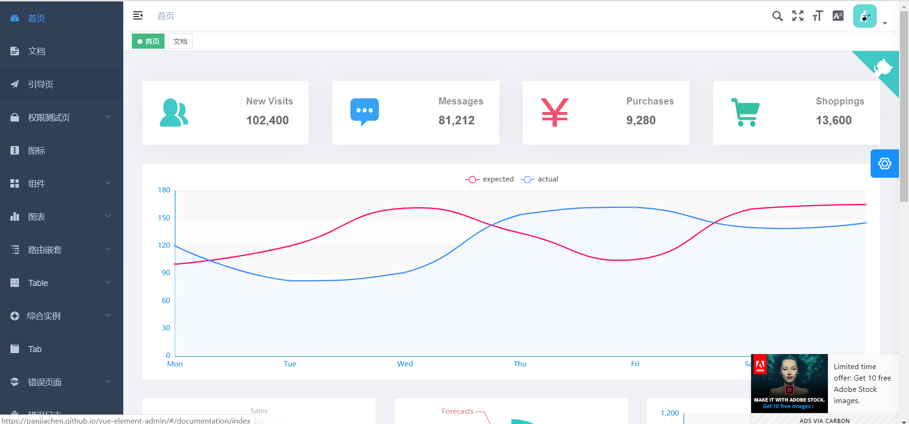
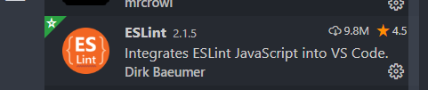
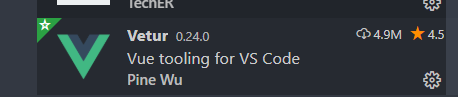
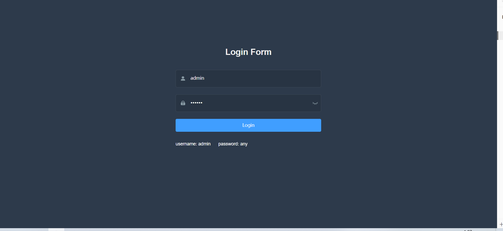
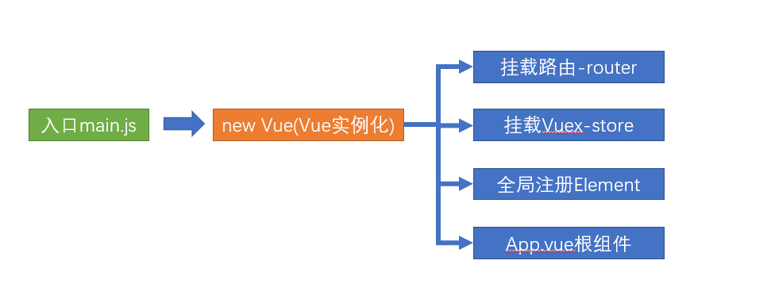
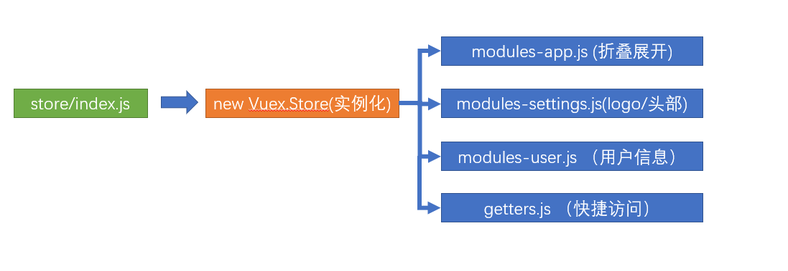
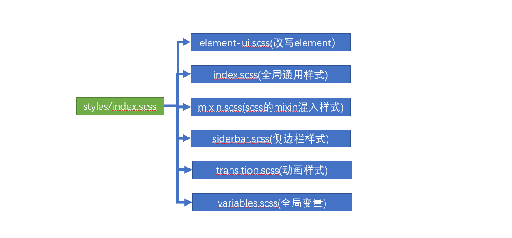
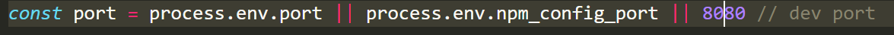
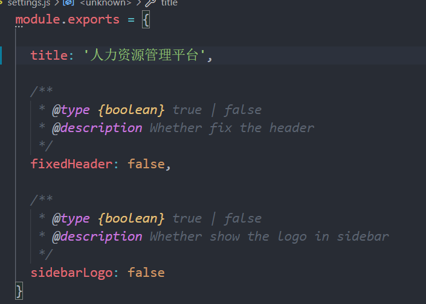

#   项目课整体设计


在线地址：http://ihrm-java.itheima.net/#/login

# 人力资源的环境搭建

## vue-element-admin的了解和介绍

**`目标`**: 学习和了解通用的 vue后台 集成方案**`vue-element-admin`**

[vue-element-admin](https://panjiachen.gitee.io/vue-element-admin-site/zh/) 是一个后台前端解决方案，它基于 [vue](https://github.com/vuejs/vue) 和 [element-ui](https://github.com/ElemeFE/element)实现。

它使用了最新的前端技术栈，内置国际化解决方案，动态路由，权限验证，提炼了典型的业务模型，提供了丰富的功能组件，

它可以帮助你快速搭建企业级中后台产品原型。

[vue-element-admin](http://panjiachen.github.io/vue-element-admin) 是一个后台集成方案, 集成了PC项目中很多的业务场景和功能, 我们可以从中获得很多成熟的解决方案.

> [vue-element-admin](http://panjiachen.github.io/vue-element-admin) 有一个成熟的[集成方案](https://github.com/PanJiaChen/vue-element-admin)，里面包含了所有的业务功能和场景,并不适合直接拿来进行二次开发,
>
> 但是可以通过该项目中的一个案例来进行学习和使用

这里是[官网地址](https://panjiachen.gitee.io/vue-element-admin-site/zh/)

这里是[线上demo地址](https://panjiachen.github.io/vue-element-admin/#/dashboard)



> 集成方案并不适合我们直接拿来进行二次开发，[基础模板](https://github.com/PanJiaChen/vue-admin-template)则是一个更好的选择

基础模板, 包含了基本的 **登录 / 鉴权 / 主页布局** 的一些基础功能模板, 我们可以直接在该模板上进行功能的扩展和项目的二次开发

**`小结`**： 浏览vue-element-admin，了解这个集成方案

## 搭建项目前的一些基本准备 

**`目标`**: 介绍搭建一个vue中台项目,需要环境和工具

>接下来要做的是一个大型的项目，我们需要更好的环境准备和资源前置，所以提前检查我们的环境和资源

**nodejs环境**

> nodejs是当下前端工程化开发必不可少的环境, 使用 nodejs的**`npm`**功能来管理依赖包

查看node 和 npm的版本

```bash
$ node -v #查看node版本
$ npm  -v #查看npm版本
```

**git版本控制**

查看git安装版本

```bash
$ git --version #查看git安装版本
```

**npm淘宝镜像** 

如果用 npm,  不用 yarn, 一定要配置淘宝镜像 

```bash
npm config set registry  https://registry.npm.taobao.org/  #设置淘宝镜像地址
npm config get registry  #查看镜像地址
```

**vscode编辑器**


> vscode编辑器是目前前端开发的编码利器， 以及丰富的插件系统，非常适合开发前端项目 

vscode编辑器插件 + **`vetur`** + **`eslint`**

> vetur是基于 单文件组件开发的支持插件, eslint是 基于代码校验的插件工具





除此之外, eslint需要在vscode中进行一些参数的配置

==注意：一定要把项目中的prettier的配置以及其他格式化工具的配置给关了==

```json
// "editor.formatOnSave": true,
// "prettier.semi": false,
// "prettier.singleQuote": true,
// "editor.defaultFormatter": "esbenp.prettier-vscode",
"editor.codeActionsOnSave": {
  "source.fixAll": true
}
```

> 本项目的技术栈 本项目技术栈基于 [ES2015+](http://es6.ruanyifeng.com/)、[vue](https://cn.vuejs.org/index.html)、[vuex](https://vuex.vuejs.org/zh-cn/)、[vue-router](https://router.vuejs.org/zh-cn/) 、[vue-cli](https://github.com/vuejs/vue-cli) 、[axios](https://github.com/axios/axios) 和 [element-ui](https://github.com/ElemeFE/element)

**`本节任务`**： 大家检查各自的开发环境和资源，尤其是npm的淘宝镜像额外需要注意


## 项目模板启动 和 目录介绍 

**`目标`**: 拉取基础模板的内容, 并对目录进行介绍

**提问:**  vue-element-admin的基础 模板和我们之前开发的项目一样吗 ？这一节, 我们对该项目目录进行一下介绍

**git拉取基础项目模板**   

```bash
git clone  https://github.com/PanJiaChen/vue-admin-template.git  hm-hr-88 #拉取基础模板到hrsaas目录
```

*如果拉取失败，直接从资料中解压下载好的包*

**安装项目依赖**（定位到项目目录下）

```bash
yarn  #安装依赖 yarn
```

**启动项目**

```bash
yarn dev
```



项目运行完毕，浏览器会自动打开基础模板的登录页，如上图


**目录结构**

本项目已经为你生成了一个基本的开发框架，提供了涵盖中后台开发的各类功能和坑位，下面是整个项目的目录结构。

```bash
├── build                      # 构建打包相关
├── mock                       # 项目mock 模拟数据
├── public                     # 静态资源
│   │── favicon.ico            # favicon图标
│   └── index.html             # html模板
├── src                        # 源代码
│   ├── api                    # 所有请求
│   ├── assets                 # 主题 字体等静态资源
│   ├── components             # 全局公用组件
│   ├── icons                  # 项目所有 svg icons
│   ├── layout                 # 全局 layout
│   ├── router                 # 路由
│   ├── store                  # 全局 store管理
│   ├── styles                 # 全局样式
│   ├── utils                  # 全局公用方法
│   ├── vendor                 # 公用vendor
│   ├── views                  # views 所有页面
│   ├── App.vue                # 入口页面
│   ├── main.js                # 入口文件 加载组件 初始化等
│   └── permission.js          # 权限管理
│   └── settings.js          # 配置文件
├── tests                      # 测试
├── .env.xxx                   # 环境变量配置
├── .eslintrc.js               # eslint 配置项
├── .babelrc                   # babel-loader 配置
├── .travis.yml                # 自动化CI配置
├── vue.config.js              # vue-cli 配置
├── postcss.config.js          # postcss 配置
└── package.json               # package.json
```

此时,你可能会**眼花缭乱**, 因为生成的目录里面有太多的文件 我们在做项目时 其中最关注的就是**`src`**目录, 里面是所有的源代码和资源, 至于其他目录, 都是对项目的环境和工具的配置

**`本节任务`**： 按照操作和讲解步骤，进行拉取代码，安装依赖，运行项目，阅读目录和文件的操作


## 项目运行机制和代码注释

**`目标`**: 了解当前模板的基本运行机制和基础架构

> 眼花缭乱的目录和文件到底是怎么工作的？ 我们进行一下最基本的讲解，帮助大家更好的去理解和开发

```bash
├── src                        # 源代码
│   ├── api                    # 所有请求
│   ├── assets                 # 主题 字体等静态资源
│   ├── components             # 全局公用组件
│   ├── icons                  # 项目所有 svg icons
│   ├── layout                 # 全局 layout
│   ├── router                 # 路由
│   ├── store                  # 全局 store管理
│   ├── styles                 # 全局样式
│   ├── utils                  # 全局公用方法
│   ├── vendor                 # 公用vendor
│   ├── views                  # views 所有页面
│   ├── App.vue                # 入口页面
│   ├── main.js                # 入口文件 加载组件 初始化等
│   └── permission.js          # 权限管理
│   └── settings.js            # 配置文件
```

### **main.js**

> 删除项目中的mock



我们开发的时候用不到模拟数据 (有线上接口)

1. 删除 main.js **`mock数据`**的部分，

2. 删除`mock`文件夹

3. 删除掉**`vue.config.js`**中 devServer 中配的, 约 39 行的  **before: require('./mock/mock-server.js')**

### **App.vue**

不用动，渲染了路由出口

### **permission.js**

1. **`permission.js`** 是控制页面登录权限(路由访问)的文件，配置了导航守卫， 之前我们是写在router/index.js中

2. 我们可以先将此处的代码进行注释或删除，现在还没做登录拦截，等我们构建权限功能时，再从0到1进行构建。

### setting.js

**`settings.js`**则是对于一些项目信息的配置，里面有三个属性 

+ **`title`**(项目名称)
+ **`fixedHeader`**（固定头部），
+ **`sidebarLogo`**（显示左侧菜单logo）

```js
module.exports = {
  // 修改项目的标题
  title: '黑马人资管理系统',

  /**
   * 控制头部是否固定
   * @type {boolean} true | false
   * @description Whether fix the header
   */
  fixedHeader: true,

  /**
   * 是否显示侧边栏的logo
   * @type {boolean} true | false
   * @description Whether show the logo in sidebar
   */
  sidebarLogo: true
}

```


### **Vuex结构**

> 当前的Vuex结构采用了模块形式进行管理共享状态，其架构如下



> 其中app.js模块和settings.js模块，功能已经完备，不需要再进行修改。 user.js模块是我们后期需要重点开发的内容，所以这里我们将user.js里面的内容删除，并且导出一个默认配置

```js
export default {
  namespaced: true,
  state: {},
  mutations: {},
  actions: {}
}
```

同时，由于getters中引用了user中的状态，所以我们将getters中的状态改为

```js
const getters = {
  sidebar: state => state.app.sidebar,
  device: state => state.app.device
}
export default getters
```

### scss

> 该项目还使用了[scss](https://www.sass.hk/)作为css的扩展语言，在**`styles`**目录下，我们可以发现scss的相关文件

这些样式都已经集成好了，我们不需要修改

### **icons**

> icons的结构如下


> 以上就是vue-element-admin的基础和介绍,希望大家在这过程中体会 一个基础的模板运行机制

```js
// 如何使用项目中的字体图标

<svg-icon icon-class="eye" class="aa" />
<svg-icon icon-class="chart" />
```

**`本节任务`**： 大家根据目录结构和设计图，对以上的内容进行了解

## 建立远程Git仓库并完成初始提交

https://gitee.com/hucongcong/hm-hr-88

**`目标`** 在[码云](https://gitee.com/)或者[github](https://github.com/)上建立相应的远程仓库,并将代码分支提交

**建立远程仓库**

> 远程仓库建立只需要在网站上直接操作即可

**本地项目提交**

**`注意`**: 由于我们之前的项目是直接 **`克隆`**而来,里面拥有原来的提交记录, 需要先将原来的**`.git`**文件夹删除掉

并且对项目进行git初始化

```bash
$ git init  #初始化项目
```

```bash
$  git add . #将修改添加到暂存
$  git commit -m '人资项目初始化' #将暂存提到本地仓库
```

**查看版本日志**

```bash 
$ git log #查看版本日志
```

**推送到远程仓库**

推送到远程仓库一般先将**`远程仓库地址`**用本地仓库别名代替

```bash 
$ git remote add origin <远程仓库地址>  #添加远程仓库地址
```

> 当我们不清楚自己的仓库对应的origin地址时, 我们可以通过命令查看当前的远程仓库地址

```bash
$ git remote -v #查看本地仓库的远程仓库地址映射
```

**推送master分支到远程仓库**

```bash
$ git push -u origin master #将master分支推送到origin所代表的远程仓库地址
```

**`本节任务`**: 根据以上操作,将拉取下的项目提交到自己的仓库里面

## API模块 和 请求封装模块介绍

http://ihrm-java.itheima.net

**`目标`** 介绍API模块的单独请求和 request模块的封装

axios作为网络请求的第三方工具, 可以进行请求和响应的拦截

**通过create创建了一个新的axios实例**

```js
// 创建了一个新的axios实例
const service = axios.create({
  baseURL: process.env.VUE_APP_BASE_API, // url = base url + request url
  // withCredentials: true, // send cookies when cross-domain requests
  timeout: 5000 // 超时时间
})
```

**请求拦截器**

请求拦截器主要处理 token的**`统一注入问题`**

```js
// axios的请求拦截器
service.interceptors.request.use(
  config => {
    // do something before request is sent

    if (store.getters.token) {
      // let each request carry token
      // ['X-Token'] is a custom headers key
      // please modify it according to the actual situation
      config.headers['X-Token'] = getToken()
    }
    return config
  },
  error => {
    // do something with request error
    console.log(error) // for debug
    return Promise.reject(error)
  }
)
```

**响应拦截器**

响应拦截器主要处理 返回的**`数据异常`** 和**`数据结构`**问题

```js
// 响应拦截器
service.interceptors.response.use(
  response => {
    const res = response.data

    // if the custom code is not 20000, it is judged as an error.
    if (res.code !== 20000) {
      Message({
        message: res.message || 'Error',
        type: 'error',
        duration: 5 * 1000
      })
      if (res.code === 50008 || res.code === 50012 || res.code === 50014) {
        // to re-login
        MessageBox.confirm('You have been logged out, you can cancel to stay on this page, or log in again', 'Confirm logout', {
          confirmButtonText: 'Re-Login',
          cancelButtonText: 'Cancel',
          type: 'warning'
        }).then(() => {
          store.dispatch('user/resetToken').then(() => {
            location.reload()
          })
        })
      }
      return Promise.reject(new Error(res.message || 'Error'))
    } else {
      return res
    }
  },
  error => {
    console.log('err' + error) // for debug
    Message({
      message: error.message,
      type: 'error',
      duration: 5 * 1000
    })
    return Promise.reject(error)
  }
)
```

> 这里为了后续更清楚的书写代码,我们将原有代码注释掉,换成如下代码

```js
import axios from 'axios'

// 创建axios实例
const service = axios.create({
  baseURL: process.env.VUE_APP_BASE_API,
  timeout: 5000
})

export default service

```

### 环境变量的介绍

https://cli.vuejs.org/zh/guide/mode-and-env.html

在开发中，开发环境和生产环境的接口地址是不一样，为了方便后期维护，不能把请求地址写死。就会用到环境变量。

```
baseURL: process.env.VUE_APP_BASE_API
//每个阶段的接口地址是不一样的
如果是 yarn serve，会自动读取 .env.development 文件
如果是 yarn build:prod, 会自动读取 .env.producation 文件
如果是 yarn build:stage 会自动读取 .env.staging 文件
```

(1)封装了request.js

```js
//使用全局属性process来访问全局变量
const service = axios.create({
  baseURL: process.env.VUE_APP_BASE_API,
  timeout: 5000
})
```

(2)提供两个环境变量`.env.development` 和 `.env.production`

修改`.env.development`

```js
# base api
VUE_APP_BASE_API = 'http://ihrm-java.itheima.net'

```

修改`.env.production`

```js
# base api
VUE_APP_BASE_API = '换成真正上线的地址'

```


### **api模块的单独封装**

我们习惯性的将所有的网络请求 放置在 api 目录下统一管理, 按照模块进行划分

**单独封装代码**

```js
import request from '@/utils/request'

export function login(data) {
  return request({
    url: '/vue-admin-template/user/login',
    method: 'post',
    data
  })
}

export function getInfo(token) {
  return request({
    url: '/vue-admin-template/user/info',
    method: 'get',
    params: { token }
  })
}

export function logout() {
  return request({
    url: '/vue-admin-template/user/logout',
    method: 'post'
  })
}

```

上面代码中,使用了封装的request工具,每个接口的请求都单独**`导出`**了一个方法,这样做的好处就是,任何位置需要请求的话,可以直接引用我们导出的请求方法

为了后续更好的开发，我们可以先将**user.js**代码的方法设置为空，后续在进行更正

==删除api文件夹下， table.js和user.js中的内容==

**提交代码**

**`本节任务`**： 将request和用户模块的代码进行清理，理解request和模块封装

## 公共资源图片和公共样式

**`目标`** 将一些公共的图片和样式资源放入到 规定目录中

> 我们已经将整体的基础模块进行了简单的介绍，接下来，我们需要将该项目所用到的图片和样式进行统一的处理

 **图片资源**

> 图片资源在课程资料的图片文件中，我们只需要将**`common`**文件夹拷贝放置到 **`assets`**目录即可

**样式**

> 样式资源在  资源/样式目录下

修改**`variables.scss`**

新增**`common.scss`**

我们在**`variables.scss`**添加了一些基础的变量值

我们提供了 一份公共的**`common.scss`**样式,里面内置了一部分内容的样式,在开发期间可以帮助我们快速的实现页面样式和布局

将两个文件放置到**styles**目录下，然后在**`index.scss`**中引入该样式

```scss
@import './common.scss'; //引入common.scss样式表 
```

**提交代码**

**`本节注意`**：注意在scss文件中，通过**@import** 引入其他样式文件，需要注意最后加分号，否则会报错

**`本节任务`** 将公共资源的图片和样式放置到规定位置

## 设置固定的本地访问端口和网站名称

**`目标`**: 设置统一的本地访问端口和网站title

在正式开发业务之前，先将项目的**本地端口**和**网站名称**进行一下调整

**本地服务端口**:  在**`vue.config.js`**中进行设置

**`vue.config.js`** 就是vue项目相关的编译，配置，打包，启动服务相关的配置文件，它的核心在于**webpack**，但是又不同于webpack，相当于改良版的webpack， [文档地址](https://cli.vuejs.org/zh/)

> 如图，是开发环境服务端口的位置


我们看到上面的 **`process.env.port`**实际上是一个nodejs服务下的环境变量，该变量在哪里设置呢？



**网站名称**

网站名称实际在**configureWebpack**选项中的**name**选项,通过阅读代码,我们会发现name实际上来源于src目录下

**`settings.js`**文件

所以,我们可以将网站名称改成"**`人力资源管理平台`**"



**提交代码**

**`本节注意`**:修改服务的配置文件,想要生效的话,必须要重新启动服务，值‘8888’后面不能留有空格

**`本节任务`**：完成网站的开发服务端口设置和网站名称设置

