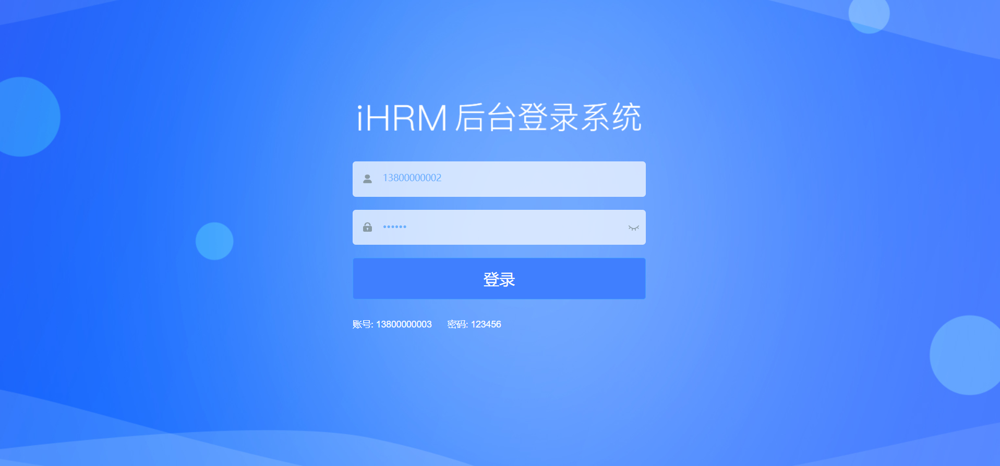
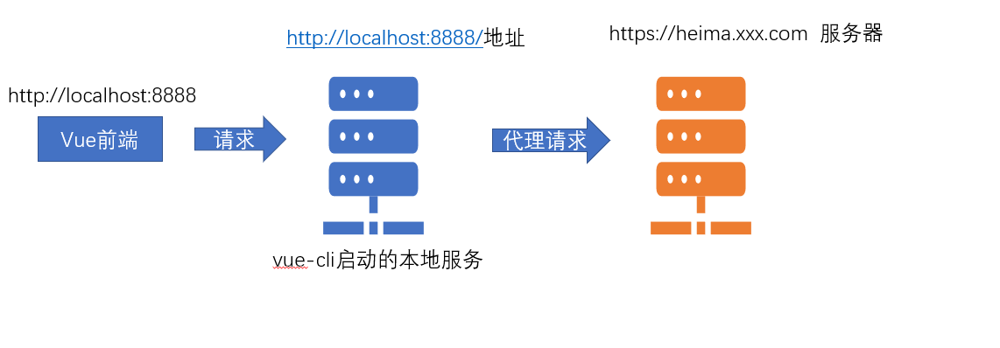

# 登录模块

[线上地址](http://ihrm-java.itheima.net/#/login)

本章节，我们将在现有模板的基础上，完成如图的登录模块的功能



## 开启登录分支

```
git checkout -b dev
git checkout -b login
```

## 登录页面的基础布局

**`目标`**完成登录页面的基础布局

首先要实现以上的页面效果, 我们可以直接将当前的登录页面进行相应的改造

**设置头部背景**

```diff
<div class="title-container">
  <h3 class="title">
-    Login Form
+    
  </h3>
</div>
```

**`注意`**： `@`是我们在vue.config.js中设置的一个路径别名，指定src根目录，这样可以很方便的寻找文件

**设置背景图片**

> login.vue 145行处

```css
/* reset element-ui css */
.login-container {
  background-image: url('~@/assets/common/login.jpg'); // 设置背景图片
  background-position: center; // 将图片位置设置为充满整个屏幕
}
```

**`注意`**： 如需要在样式表中使用**`@`**别名的时候，需要在@前面加上一个**`~`**符号，否则不识别

**设置手机号和密码的字体颜色**

```css
$light_gray: #407ffe; // 修改输入框字体颜色
$cursor: #407ffe;  // 修改光标的颜色
```

**设置输入表单整体背景色**

```css
  .el-form-item {
    border: 1px solid rgba(255, 255, 255, 0.1);
    background: rgba(255, 255, 255, 0.9); // 输入登录表单的背景色
    border-radius: 5px;
    color: #454545;
  }
```

**设置错误信息的颜色**【深度作用选择器  ---  路由懒加载】

```css
::v-deep {
  .el-form-item__error {
    color: #fff;
    font-size: 14px;
  }
}
```

**设置登录按钮的样式**

> 需要给el-button 增加一个loginBtn的class样式

```css
.loginBtn {
  background: #407ffe;
  height: 64px;
  line-height: 32px;
  font-size: 24px;
}
```

**修改显示的提示文本和登录文本**

```htmL
<div class="tips">
  <span style="margin-right:20px;">账号: 13800000002</span>
  <span> 密码: 123456</span>
</div>
```

经过以上的改动, 我们得到了一个比较完善的登录页面


> 解释:我们该项目的侧重点在于更多的介绍Vue中台项目所应用的技术
>
> 所以对于一些过于细节的样式或者布局,我们采用直接粘贴或者拷贝成型代码的方式, 实际工作可以慢慢调整

**提交代码**

**`本节注意`**： 如需要在样式表中使用**`@`**别名的时候，需要在@前面加上一个**`~`**符号，否则不识别

**`本节任务`**： 完成登录首页的基本布局


## 登录表单的校验

**`目标`**对登录表单进行规则校验

> 基础模板已经有了基础校验的代码,我们只需在此基础上修改即可

### **el-form表单校验的必要条件**


### 登录表单校验

```jsx
<el-input
  ref="mobile"
  v-model="loginForm.mobile"
  placeholder="请输入手机号"
  name="mobile"
  type="text"
  tabindex="1"
  auto-complete="off"
/>

<el-input
  :key="passwordType"
  ref="password"
  v-model="loginForm.password"
  :type="passwordType"
  placeholder="请输入密码"
  name="password"
  tabindex="2"
  auto-complete="off"
  @keyup.enter.native="handleLogin"
/>


loginForm: {
  mobile: '',
  password: ''
},
loginRules: {
  mobile: [
    { required: true, message: '手机号不能为空' },
    { pattern: /^1[3-9]\d{9}$/, message: '手机号格式错误' }
  ],
  password: [
    { required: true, message: '密码不能为空' },
    { min: 6, max: 12, message: '密码长度为6-12位' }
  ]
},
    
    
    
handleLogin() {
  this.$refs.loginForm.validate(valid => {
    if (valid) {
      this.loading = true
      console.log('我需要发送请求')
    } else {
      console.log('error submit!!')
      return false
    }
  })
}
```


## 测试登录功能

点击登录 - 发送登录请求,  基地址:  http://ihrm-java.itheima.net/api

```jsx
handleLogin() {
  this.$refs.loginForm.validate(valid => {
    if (valid) {
      this.loading = true
			// 校验通过发送登录请求
      const loginUrl = 'http://ihrm-java.itheima.net/api/sys/login'
      request.post(loginUrl, this.loginForm).then(res => {
        console.log(res)
      })
    } else {
      console.log('error submit!!')
      return false
    }
  })
}
```

3 这里明显跨域了,  但是后台设置了 `access-control-allow-origin: *`,  允许了跨域


如果后台开发过程中, 没有配置 cors,  前端可以利用 webpack 开发服务器进行代理, 解决跨域问题 

## Vue-Cli配置跨域代理 

**`目标`**: 通过配置vue-cli的代理解决跨域访问的问题

### 为什么会出现跨域？

只要域名端口协议有一个不同, 就是跨域了~

当下, 最流行的就是**`前后分离`**开发项目,也就是**`前端项目`**和**`后端接口`**并不在一个域名之下，

那么前端项目开发时, 去访问后端接口就会存在**`跨域`**的行为.


**`请注意`**，我们所遇到的这种跨域是位于**开发环境** (webpack代理服务器)，真正部署上线时的跨域是**生产环境** (nginx服务器, 或者后台配cors)


### 解决开发环境的跨域问题

**开发环境的跨域** 

开发环境的跨域，也就是在**`vue-cli脚手架环境`**下开发启动服务时，我们访问接口所遇到的跨域问题，

vue-cli为我们在本地**`开启了一个服务`**,可以通过这个服务帮我们**`代理请求`**,解决跨域问题

这就是vue-cli配置**webpack的反向代理**



> 采用vue-cli的代理配置

vue-cli的配置文件即**`vue.config.js`**,这里有我们需要的 [代理选项](https://cli.vuejs.org/zh/config/#devserver-proxy)

```js
module.exports = {
  devServer: {
   // 代理配置
    proxy: {
        // 这里的api 表示如果我们的请求地址有/api的时候,就出触发代理机制
        '/aa': {
          target: 'www.baidu.com', // 我们要代理请求的地址
           // 路径重写
          pathRewrite: {
              // 路径重写  localhost:8888/api/login  => www.baidu.com/api/login
              '^/aa': '' // 假设我们想把 localhost:8888/api/login 变成www.baidu.com/login 就需要这么做 
          }
      },
    }
  }
}
```

### 项目中的配置

> 接下来,我们在代码中将要代理的后端地址变成 [后端接口地址](http://ihrm-java.itheima.net)

+ `vue.config.js`

```js
 // 代理跨域的配置
proxy: {
  // 当我们的本地的请求 有/api的时候，就会代理我们的请求地址向另外一个服务器发出请求
  '/api': {
    target: 'http://ihrm-java.itheima.net/', // 跨域请求的地址
  }
}
```

`.env.development`  yarn dev 加载

```txt
# base api
# 最终请求地址 /api/sys/login => http://ihrm-java.itheima.net/api/sys/login
VUE_APP_BASE_API = '/api'
```

**提交代码**

**`本节注意`**：我们并没有进行**`pathRewrite`**,因为后端接口就是**`ihrm-java.itheima.net/api`**这种格式,所以不需要重写

**`本节任务`**： 配置vue-cli的反向代理，实现后端接口的跨域访问

## 封装单独的登录接口

**`目标`** 在单独请求模块中,单独封装登录接口

> 完成登录模块之后，我们需要对登录接口进行封装, 登录请求应该单独封装到一个模块中, 便于维护和管理

首先，查阅接口文档中的登录接口

### 基本封装

（1）`api/user.js` 封装请求

```js
import request from '@/utils/request'

/**
 * 登录接口
 * @param {*} data 请求对象 需要 mobile 和 password
 * @returns Promise
 */
export function login(data) {
  return request({
    method: 'post',
    url: '/sys/login',
    data
  })
}

```

(2)在login/index.vue中发送请求

```jsx
import { login } from '@/api/user'

handleLogin() {
  this.$refs.loginForm.validate(async valid => {
    if (valid) {
      this.loading = true
      // 测试登录功能是否可用
      const res = await login(this.loginForm)
      if (res.data.success) {
        this.$message.success('登录成功')
      } else {
        this.$message.error(res.data.message)
      }
      this.loading = false
    } else {
      console.log('error submit!!')
      return false
    }
  })
}
```

## 响应拦截器统一处理失败

成功正确响应, 肯定是正常走我们的逻辑, 

但是如果失败出错, 那应该要`给用户提示`

整个系统接口有个特征, 如果是请求操作有误, 都会在响应中标记 success 为false,

所以一旦 success 为 false 了, 就需要提示错误, 并将错误 reject 抛出

```jsx
// 响应拦截器
service.interceptors.response.use(response => {
  // axios默认加了一层data
  const { success, message, data } = response.data
  //   要根据success的成功与否决定下面的操作
  if (success) {
    return data
  } else {
    // 业务已经错误了 还能进then ? 不能 ！ 应该进catch
    Message.error(message) // 提示错误消息
    return Promise.reject(message)
  }
}, error => {
  Message.error(error.message) // 提示错误信息
  return Promise.reject(error) // 返回执行错误 让当前的执行链跳出成功 直接进入 catch
})
```

==如果success为false，需要返回一个错误的promise，不然代码还会继续往下执行==

修改登录代码

```jsx
handleLogin() {
  this.$refs.loginForm.validate(async valid => {
    if (valid) {
      this.loading = true
      // 测试登录功能是否可用
      try {
        const data = await login(this.loginForm)
        console.log(data)
        this.$message.success('登录成功')
        this.$router.push('/')
      } finally {
        this.loading = false
      }
    } else {
      console.log('error submit!!')
      return false
    }
  })
}
```

## vuex 管理 token

**`目标 `** 封装获取token的登录action, 在vuex中存储token  

tips: 之前, 我们是在页面中发送登录请求, 获取到token后, 通过提交mutation的方式, 将token存到 vuex 中

这里希望将`登录获取token`的异步操作, 也封装成 action, 封装到 vuex 中, 集中管理关于token操作 

###  vuex封装action存token

1 `store/modules/user.js`准备状态

```js
const state = {
  token: null // token字符串
}
const mutations = {}
const actions = {}
const getters = {}

export default {
    //开启命名空间
  namespaced: true,
  state,
  mutations,
  actions,
  getters
}
```

2 `store/modules/user.js` 封装 action 和 对应的 mutation

```jsx
const mutations = {
  setToken(state, token) {
    state.token = token
  }
}
actions: {
  // 登录的action
  async login({ commit }, data) {
    const res = await login(data)
    commit('setToken', res)
  }
}

```

3 页面中导入, 调用

```jsx
handleLogin() {
  this.$refs.loginForm.validate(async valid => {
    if (valid) {
      this.loading = true
      try {
        await this.$store.dispatch('user/login', this.loginForm)
        this.$router.push('/')
        this.$message.success('登录成功')
      } finally {
        this.loading = false
      }
    } else {
      console.log('error submit!!')
      return false
    }
  })
}
```

最终效果图:


### 登陆功能-代码优化

```js
async handleLogin() {
  // 1. 表单校验
  try {
    await this.$refs.loginForm.validate()
  } catch {
    return
  }
  // 2. 调用actions 登陆
  try {
    this.loading = true
    await this.$store.dispatch('user/login', this.loginForm)
    // 成功的
    this.$router.push('/')
    this.$message.success('登录功能')
    this.loading = false
  } catch {
    this.loading = false
  }
```

### vuex持久化

刚才在登录时, 已经可以成功的将token存到 vuex 中了, 但是 vuex 刷新会丢失, 所以需要结合web存储进行持久化

之前我们是用的localStorage存的token, 这里用cookie 也能存token ,也可以存储在sesstionStorage

且在**`utils/auth.js`**中,基础模板已经为我们提供了**`获取token`**,**`设置token`**,**`删除token`**的方法,可以直接使用

只需要将存储的key放置成特定值即可 utils/auth.js

```jsx
import Cookies from 'js-cookie'

const TokenKey = 'hrsaas_hm_83_token'

export function getToken() {
  return Cookies.get(TokenKey) || null
}

export function setToken(token) {
  return Cookies.set(TokenKey, token)
}

export function removeToken() {
  return Cookies.remove(TokenKey)
}
```

1 一进来优先从缓存cookie中取

```jsx
const state = {
  // 一进来优先从缓存中取
  token: getToken() // token字符串
}
```

2 vuex中存token时, 也同步存到cookie中

```jsx
const mutations = {
  // 设置token
  setToken(state, newToken) {
    state.token = newToken
    // 设置了 token 的同时, 同步到本地cookies中
    setToken(newToken)
  },
  removeToken(state) {
    state.token = ''
    removeToken()
  }
}
```

效果: 刷新后, token 还是有的, 持久化存储了


