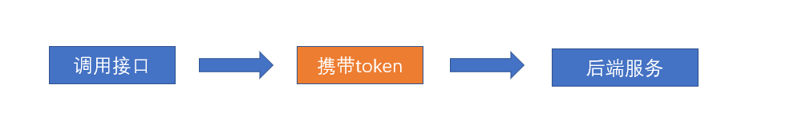
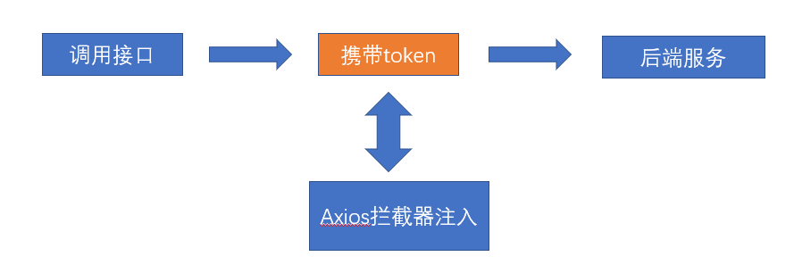
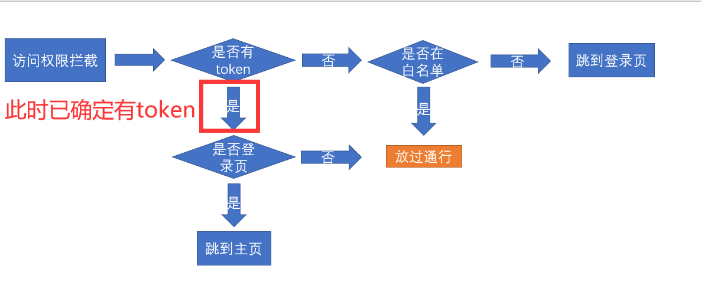
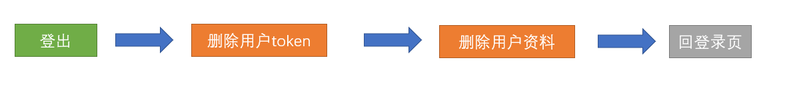
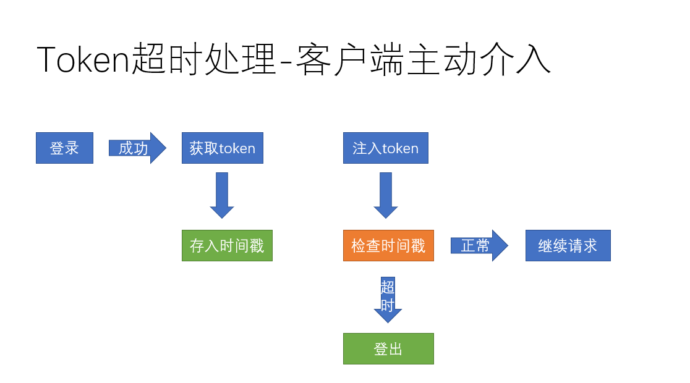

## 主页的token拦截处理

**`目标`**：根据token处理主页的访问权限问题

### 权限拦截的流程图

> 我们已经完成了登录的过程，并且存储了token，但是此时主页并没有因为token的有无而被控制访问权限

接下来我们需要实现以下如下的流程图


> 在基础框架阶段，我们已经知道**`src/permission.js`**是专门处理路由权限的，所以我们在这里处理

### 流程图转化代码

**流程图转化的代码**

```js
// 前置导航守卫
// to: Route: 即将要进入的目标 路由对象
// from: Route: 当前导航正要离开的路由
const whiteList = ['/login', '/404']
router.beforeEach((to, from, next) => {
  const token = store.state.user.token
  // 1. 判断是否有token
  if (token) {
    // 2. 如果有token
    // 2.1 如果访问的是登录页面,跳转到首页
    if (to.path === '/login') {
      next('/')
    } else {
      // 2.2 如果访问的是其他页面，允许正常访问
      next()
    }
  } else {
    // 3. 如果没有token
    // 3.1 如果访问的页面在白名单中,允许正常访问
    if (whiteList.includes(to.path)) {
      next()
    } else {
      // 3.1 如果访问的页面不在白名单，跳转到登录
      next('/login')
    }
  }
})
```

### 进度条

在导航守卫的位置，我们添加了NProgress的插件，可以完成进入时的进度条效果

https://ricostacruz.com/nprogress/

https://www.cnblogs.com/xiaoxiao2017/p/11317939.html

```js
安装
yarn add nprogress

import router from '@/router'
import store from '@/store'
import NProgress from 'nprogress'
import 'nprogress/nprogress.css'

// 前置导航守卫
// to: Route: 即将要进入的目标 路由对象
// from: Route: 当前导航正要离开的路由
const whiteList = ['/login', '/404']
router.beforeEach((to, from, next) => {
  console.log('进入了')
  // 开启进度条
  NProgress.start()
  const token = store.getters.token
  // 1. 判断是否有token
  if (token) {
    // 2. 如果有token
    // 2.1 如果访问的是登录页面,跳转到首页
    if (to.path === '/login') {
      next('/')
      NProgress.done()
    } else {
      // 2.2 如果访问的是其他页面，允许正常访问
      next()
    }
  } else {
    // 3. 如果没有token
    // 3.1 如果访问的页面在白名单中,允许正常访问
    if (whiteList.includes(to.path)) {
      next()
    } else {
      // 3.1 如果访问的页面不在白名单，跳转到登录
      next('/login')
      NProgress.done()
    }
  }
})

// 后置导航守卫
router.afterEach((to, from) => {
  console.log('离开了')
  NProgress.done()
})

```

**提交代码**

**`本节任务`**：完成主页中根据有无token，进行页面访问的处理

## 主页的左侧导航样式

**`目标`**设置左侧的导航样式

> 接下来我们需要将左侧导航设置成如图样式


> 主页的布局组件位置**`src/layout`**

**主页布局架构**


**左侧导航组件的样式文件**`styles/siderbar.scss`

**设置背景渐变色**

```css
sideboard-container {
      background: linear-gradient(to bottom, #3d6df8, #5b8cff);
}
```

**设置左侧导航背景图片**

```scss
.scrollbar-wrapper { 
    background: url('~@/assets/common/leftnavBg.png') no-repeat 0 100%;
}
```

**`注意`**：在scss中，如果我们想要使用**`@`**别名，需要在前面加上一个**`~`**才可以

**设置菜单选中颜色**

```less
.el-menu {
  border: none;
  height: 100%;
  width: 100% !important;
  a{
    li{
      .svg-icon{
        color: #fff;
        font-size: 18px;
        vertical-align: middle;
        .icon{
          color:#fff;
        }
      }
      span{
        color: #fff;
      }
      &:hover{
        .svg-icon{
          color: #43a7fe
        }
        span{
          color: #43a7fe;
        }
      }
    }
  }
}
```

**`注意`**：因为我们后期没有二级菜单，所以这里暂时不用对二级菜单的样式进行控制

**显示左侧logo图片** **`src/setttings.js`**

```js
module.exports = {

  title: '人力资源管理平台',

  /**
   * @type {boolean} true | false
   * @description Whether fix the header
   */
  fixedHeader: false,

  /**
   * @type {boolean} true | false
   * @description Whether show the logo in sidebar
   */
  sidebarLogo: true // 显示logo
}

```

**设置头部图片结构** **`src/layout/components/Sidebar/Logo.vue`**

```jsx
data() {
  return {
    title: '人力资源管理系统',
    logo: require('@/assets/common/logo-64.png')
  }
}
```


**去除logo的背景色**


**提交代码**

**`本节任务`**： 完成主页的左侧导航样式

**`本节注意`**：我们该项目中没有二级显示菜单，所以二级菜单的样式并没有做过多处理，同学们不必在意

## 设置头部内容的布局和样式

**`目标`**设置头部内容的布局和样式

> 我们需要把页面设置成如图样式


**头部组件位置** **`layout/components/Navbar.vue`**

**添加公司名称**，**注释面包屑**

```html
  <div class="app-breadcrumb">
      江苏传智播客教育科技股份有限公司
      <span class="breadBtn">体验版</span>
  </div>
 <!-- <breadcrumb class="breadcrumb-container" /> -->

```

**公司样式**

```scss
.app-breadcrumb {
  display: inline-block;
  font-size: 18px;
  line-height: 50px;
  margin-left: 10px;
  color: #ffffff;
  cursor: text;
  .breadBtn {
    background: #84a9fe;
    font-size: 14px;
    padding: 0 10px;
    display: inline-block;
    height: 30px;
    line-height: 30px;
    border-radius: 10px;
    margin-left: 15px;
  }
}
```

**头部背景渐变色**

```scss
.navbar {
    background-image: linear-gradient(to left, #3d6df8, #5b8cff);
}
```

**汉堡组件图标颜色**  **`src/components/Hamburger/index.vue`**

**`注意`**这里的图标我们使用了**`svg`**，设置颜色需要使用svg标签的**`fill属性`**

> 设置svg图标为白色

```css
.hamburger {
  display: inline-block;
  vertical-align: middle;
  width: 20px;
  height: 20px;
  fill: currentColor;
  color: #fff;
}

```

**右侧下拉菜单设置**

> 将下拉菜单调节成**`首页/项目地址/退出登录`**

```vue
<div class="right-menu">
  <el-dropdown class="avatar-container" trigger="click">
    <div class="avatar-wrapper">
      
      <span class="name">管理员</span>
      <i class="el-icon-caret-bottom" />
    </div>
    <template #dropdown>
      <el-dropdown-menu class="user-dropdown">
        <router-link to="/">
          <el-dropdown-item>
            Home
          </el-dropdown-item>
        </router-link>
        <a target="_blank" href="https://gitee.com/hucongcong/hrsaas-76">
          <el-dropdown-item>Github</el-dropdown-item>
        </a>
        <el-dropdown-item divided @click.native="logout">
          <span style="display:block;">Log Out</span>
        </el-dropdown-item>
      </el-dropdown-menu>
    </template>
  </el-dropdown>
</div>
```

**头像和下拉菜单样式**

```css
.avatar-container {
  margin-right: 30px;
  cursor: pointer;

  .avatar-wrapper {
    position: relative;

    .user-avatar {
      margin-right: 5px;
      width: 30px;
      height: 30px;
      border-radius: 15px;
      vertical-align: middle;
    }
    .name {
      color: #fff;
    }
    .el-icon-caret-bottom {
      color: #fff;
      margin-left: 5px;
      font-size: 18px;
    }
  }
}
```

用户名和头像我们先用了假数据进行，下小章节，会进行这份数据的获取

**提交代码**

##  获取用户资料接口和token注入

**`目标`** 封装获取用户资料的资料信息

> 上小节中，我们完成了头部菜单的基本布局，但是用户的头像和名称并没有，我们需要通过接口调用的方式获取当前用户的资料信息

**获取用户资料接口**

在**`src/api/user.js`**中封装获取用户资料的方法

```js
/**
 * 获取用户资料
 */
export function getUserInfo() {
  return request({
    url: '/sys/profile',
    method: 'post'
  })
}
```

> 我们忽略了一个问题！我们的headers参数并没有在这里传入，为什么呢

headers中的**Authorization**相当于我们**开门**（**调用接口**）时**`钥匙(token)`**，我们在打开任何带安全权限的门的时候都需要**`钥匙(token)`** 如图



每次在接口中携带**`钥匙（token）`**很麻烦，所以我们可以在axios拦截器中统一注入token 



**统一注入token** **`src/utils/request.js`**

```js
// 添加请求拦截器
service.interceptors.request.use(function(config) {
  // 在发送请求之前做些什么
  const token = store.state.user.token
  if (token) {
    // 如果有token,添加到headers
    config.headers.Authorization = 'Bearer ' + token
  }
  return config
}, function(error) {
  // 对请求错误做些什么
  return Promise.reject(error)
})
```

**`本节任务`**： 完成获取用户资料接口和token注入

## 封装获取用户资料的action并共享用户状态

**`目标`**： 在用户的vuex模块中封装获取用户资料的action，并设置相关状态

> 用户状态会在后续的开发中，频繁用到，所以我们将用户状态同样的封装到action中


（1）提供state

```js
const state = {
  token: getToken(),
  userInfo: {}
}
```

==定义一个空的对象 不是null，因为发送请求是异步的，没有数据的时候，如果访问userInfo.xxx是会报错的==

（2）提供设置和删除的mutations

```js
const mutations = {
  // 设置用户信息
  setUserInfo(state, userInfo) {
    state.userInfo = userInfo
  }
}
```

（3）封装修改用户资料的actions

```js
// 获取用户资料action
async getUserInfo(context) {
  const result = await getUserInfo()
  context.commit('setUserInfo', result)
}
```

**提交代码**

**`本节任务`**封装获取用户资料的action并共享用户状态

## 权限拦截处调用获取资料action

**`目标`**在权限拦截处调用aciton

### 权限拦截器调用action

> 在上小节中，我们完成了用户资料的整个流程，那么这个action在哪里调用呢？

用户资料有个硬性要求，**`必须有token`**才可以获取，那么我们就可以在确定有token的位置去获取用户资料



> 由上图可以看出，一旦确定我们进行了放行，就可以获取用户资料


（1）获取用户资料的代码

```jsx
router.beforeEach(async(to, from, next) => {
  NProgress.start()
  const token = store.state.user.token
  if (token) {
    // 有token
    // 有token，就可以发送请求，获取用户信息
    // 判断，如果vuex中是否有用户信息，如果有用户信息，不需要发送请求
    // 如果没有，才发送请求获取用户信息
    if (!store.state.user.userInfo.userId) {
      await store.dispatch('user/getUserInfo')
    }
    if (to.path === '/login') {
      // 拦截到首页
      next('/')
      NProgress.done()
    } else {
      // 放行
      next()
    }
  } else {
    // 没有token
    if (whiteList.includes(to.path)) {
      next()
    } else {
      next('/login')
      NProgress.done()
    }
  }
})
```

（2）渲染用户名`navBar.vue`

```jsx
computed: {
  ...mapGetters([
    'sidebar',
    'avatar',
    'name'
  ])
},
  
<span class="name">{{ name }}</span>
```

（3）修改首页的用户名`dashboard/index.vue`

```jsx
computed: {
  ...mapGetters([
    'name'
  ])
}

<div class="dashboard-text">name: {{ name }}</div>
```

### 获取头像接口合并数据

**头像怎么办？**

> 我们发现头像并不在接口的返回体中（接口原因），我们可以通过另一个接口来获取头像，并把头像合并到当前的资料中

**封装获取用户信息接口**  **`src/api/user.js`**

```js
/** *
 *
 * 获取用户的基本信息  现在写它 完全是为了显示头像
 * **/
export function getUserById(id) {
  return request({
    url: `/sys/user/${id}`
  })
}
```

> 这个接口需要用户的userId，在前一个接口处，我们已经获取到了，所以可以直接在后面的内容去衔接

```js
import { login, getUserInfo, getUserById } from '@/api/user'
 
// 获取用户资料action
 async getUserInfo(context) {
    const result = await getUserInfo() // result就是用户的基本资料
    const baseInfo = await getUserDetailById(result.userId) // 为了获取头像
    const baseResult = { ...result, staffPhoto: res2.staffPhoto } // 将两个接口结果合并
    // 此时已经获取到了用户的基本资料 迫不得已 为了头像再次调用一个接口
    context.commit('setUserInfo', baseResult) // 提交mutations
  }
```

> 为了更好地获取头像，同样可以把头像放于getters中

```js
  photo: state => state.user.userInfo.staffPhoto // 建立用户头像的映射
```

此时，我们的头像和名称已经获取到了，可以直接将之前的假数据换成真正的头像和名称

**用户名**  **`layout/components/Navbar.vue`**

```js
 ...mapGetters([
      'sidebar',
      'name',
      'photo'
    ])
     
     <span class="name">{{ name }}</span>

```

## 自定义指令-处理图片加载失败

问题: 获取的图片为空和图片加载失败, 不是只有这一边会失败, 其实很多地方图片都可能会加载失败, 需要我们处理

之前 vant 中, 图片加载失败, 我们用的是组件库中内置的效果, 这里我们自己封装自定义指令实现 **(原理进阶)**

**`目标`**： 通过自定义指令处理图片加载失败

全局注册自定义指令来处理图片加载失败的情况

```jsx
import Vue from 'vue'

// 自定义图片加载失败的指令
Vue.directive('imgerror', {
    //dom渲染的时候调用
  inserted(el, binding) {
    // 判断el是否有src
    if (!el.src) {
      el.src = binding.value
    }
    // 判断el的图片是否加载失败,如果加载失败，显示默认的地址
    el.onerror = function() {
      el.src = binding.value
    }
  },
  update(el, binding) {
    // 判断el是否有src
    if (!el.src) {
      el.src = binding.value
    }
    // 判断el的图片是否加载失败,如果加载失败，显示默认的地址
    el.onerror = function() {
      el.src = binding.value
    }
  }
})

```


## 实现登出功能

**`目标`**：实现用户的登出操作

> 登出仅仅是跳到登录页吗？

不，当然不是，我们要处理如下



同样的，登出功能，我们在vuex中的用户模块中实现对应的**action**

**登出action**  **`src/store/modules/user.js`**

```js
removeToken(state) {
  // 删除token
  state.token = null
  // 删除本地token
  removeToken()
},
removeUserInfo(state) {
  state.userInfo = {}
}

// 登出的action
  logout(context) {
    // 删除token
    context.commit('removeToken') // 不仅仅删除了vuex中的 还删除了缓存中的
    // 删除用户资料
    context.commit('removeUserInfo') // 删除用户信息
  }
```

**头部菜单调用action**  **`src/layout/components/Navbar.vue`**

```js
async logout() {
  try {
    await this.$confirm('你确定要退出吗?', '温馨提示', {
      type: 'warning'
    })
  } catch {
    return
  }
  this.$store.dispatch('user/logout')
  // 提示消息
  this.$message.success('退出成功')
  this.$router.push('/login')
}
```

**`注意`**我们这里也可以采用vuex中的模块化引入辅助函数

```js
import { mapGetters, createNamespacedHelpers  } from 'vuex'
const {  mapActions } = createNamespacedHelpers('user') // 这是的mapAction直接对应模块下的action辅助函数
  methods: {
    ...mapActions(['lgout']),
  }
```

以上代码，实际上直接对user模块下的action进行了引用，

**提交代码**

**`本节任务`**： 实现登出功能

## Token失效的主动介入

**`目标`**： 处理当token失效时业务

### 主动介入token处理的业务逻辑

> 开门的钥匙不是一直有效的，如果一直有效，会有安全风险，所以我们尝试在客户端进行一下token的时间检查

具体业务图如下



### 流程图转化代码

**流程图转化代码** **`src/utils/auth.js`**

```js
const TimeKey = 'hrsaas_88_time'

export function setTime(time) {
  Cookies.set(TimeKey, time)
}

export function getTime() {
  return Cookies.get(TimeKey)
}
```

设置token的时候需要保存一个当前的时间

```jsx
setToken(state, token) {
  // 存储到vuex
  state.token = token
  // 存储到Cookie
  setToken(token)
  // 存储当时的时间戳
  setTime(Date.now())
},
```

配置请求拦截器的时候，如果有token，我们还需要判断token是否过期

```js
const token = store.getters.token
if (token) {
  const oldTime = getTime()
  if (Date.now() - oldTime >= 2 * 60 * 60 * 1000) {
    // 过期了
    store.dispatch('user/logout')
    // 提示消息
    Message.error('登录信息过期')
  } else {
    config.headers.Authorization = 'Bearer ' + token
  }
}
```

**提交代码**

> 有主动处理就有被动处理，也就是后端告诉我们超时了，我们被迫做出反应，如果后端接口没有做处理，主动介入就是一种简单的方式

**`本节任务`**：完成token超时的主动介入

## Token失效的被动处理

**`目标`**： 实现token失效的被动处理  

> 除了token的主动介入之外，我们还可以对token进行被动的处理，如图


token超时的错误码是**`10002`**

**代码实现**  **`src/utils/request.js`**

```js
// 添加响应拦截器
service.interceptors.response.use(function(response) {
  const { success, message, data } = response.data
  if (success) {
    // 如果成功，直接返回data
    return data
  } else {
    // 如果失败，直接提示错误信息
    Message.error(message)
    // 会返回一个错误的promise
    return Promise.reject(message)
  }
}, function(error) {
  // console.dir(error)
  if (!error.response) {
    // 如果没有response,网络的问题
    Message.error('网络繁忙，请稍后重试')
    return
  }
  // 对响应错误做点什么
  if (error.response.status === 401) {
    // token过期了
    store.dispatch('user/logout')
    Message.error('登录信息过期了')
  }
  return Promise.reject(error)
})

```

> 无论是主动介入还是被动处理，这些操作都是为了更好地处理token，减少错误异常的可能性

**`本节任务`**  Token失效的被动处理

## 总结

本章节我们一步步实现了如下的效果


实际的业务走向


实际上，我们的主页功能有一个重要的**`角色权限`**功能还没有完成，此功能等到我们完成基本业务之后再进行展开

中台大型后端平台的深入是一个**`抽丝剥茧`**的过程，循序渐进的明白每一步的操作是非常关键的。

  