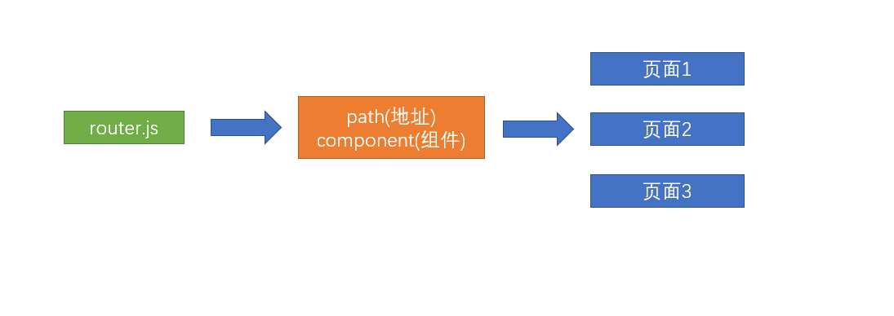
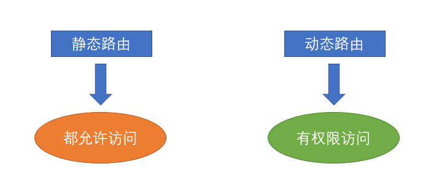
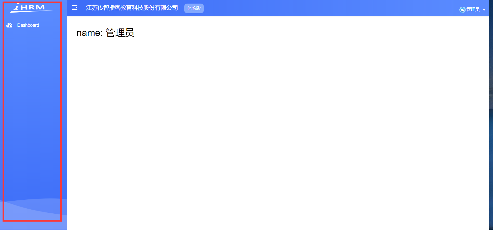

# 路由基本配置

## 了解路由设计思想

**`目标`** 了解这种大型中台项目的路由设计思想

首先，我们需要知道类似这种大型中台项目的页面路由是如何设置的。

**简单项目**



**当前项目结构**: 将路由进行了模块拆分, 同模块的路由规则将来会放到一起


> 为什么要拆成若干个路由模块呢？ 

因为复杂中台项目的页面众多，不可能把所有的业务都`集中在一个文件上`进行管理和维护，

**并且还有最重要的，前端的页面中主要分为两部分**

1. 一部分是所有人都可以访问的，(`静态路由` - 一直都有的路由)  比如: 登录页, 首页, 404
2.  一部分是只有有权限的人才可以访问的 (`动态路由` - 动态新增或移除的路由)  比如: 薪资管理, 人员管理

**拆分多个模块便于更好的控制 和 维护**



**`注意`**这里的动态路由并不是 **路由传参**的动态路由

**小结:** 

拆分成不同的路由规则模块,  好处: 

1. 便于维护, 同模块的三个四个路由都放到一起了  
2. 方便进行权限控制

概念: 

1. 动态路由: 需要有权限的人, 才能访问的路由 (有权限, 给你新增, 没权限, 给你移除)
2. 静态路由: 所有人都能访问到的, 一直都有的路由


## 路由页面整理

**`目标`** 删除基础模板中附带的多余页面

> 基础模板帮我们提前内置了一些页面，本章节我们进行一下整理

**删除多余的路由表**   **`src/router/index.js`**

```js
// 静态路由表 =>  静态路由(不需要权限即可访问的)
export const constantRoutes = [
  {
    path: '/login',
    component: () => import('@/views/login/index'),
    hidden: true
  },

  {
    path: '/404',
    component: () => import('@/views/404'),
    hidden: true
  },

  {
    path: '/',
    component: Layout,
    redirect: '/dashboard',
    children: [
      {
        path: 'dashboard',
        name: 'Dashboard',
        component: () => import('@/views/dashboard/index'),
        meta: { title: 'Dashboard', icon: 'dashboard' }
      }
    ]
  },
  // 没有匹配到的页面, 走404
  { path: '*', redirect: '/404', hidden: true }
]
```

> 上面代码，我们只对登录页/404/主页进行了保留

并且我们发现，删除了其他页面之后，左侧导航菜单的数据也只剩下了首页



**这是因为左侧导航菜单的数据来源于路由信息, 将来菜单是动态根据路由表的信息渲染的, 目前先不纠结**

**删除多余的路由组件**


> 只保留以上三个路由组件的内容，后续慢慢增加

同样的在api目录下，存在多余的api-table.js 一并删除

**提交代码**

**`本节任务`**：完成业务路由 和 页面的整理


## 业务模块页面的快速搭建

### 新建模块页面文件夹

**`目标`**： 快速搭建 - 人资项目的常规业务模块 - 主页面

>截止到现在，我们已经完成了一个中台系统的基本轮廓

接下来，我们可以快速`搭建模块的主页面` (新建模块文件夹, 新建index.vue) 一个模块不是只有一个页面, 我们先只建主页面

```bash
├──views
  ├── approvals           # 审批
  ├── attendances         # 考勤
  ├── dashboard           # 首页 -- 已有
  ├── departments         # 组织架构
  ├── employees           # 员工
  ├── login               # 登录 -- 已有
  ├── permission          # 权限管理
  ├── salarys             # 工资
  ├── setting             # 公司设置
  ├── social              # 社保
  ├── 404                 # 404 -- 已有
```

根据上图中的结构，在views目录下，建立对应的目录，给每个模块新建一个**`index.vue`**，作为每个模块的主页面

**快速新建文件夹**:  打开git bash(linux环境) 命令,(其里面可以运行一些linux的命令)

```bash
$ mkdir approvals attendances departments employees permission salarys setting social   
```

每个模块的内容，可以先按照标准的模板建立，如

```vue
<template>
  <div class="dashboard-container">
    <div class="app-container">
      <h2>
        首页
      </h2>
    </div>
  </div>
</template>

<script>
export default {

}
</script>

<style>

</style>

```


### 配置模块路由规则测试

根据以上的标准建立好对应页面之后，接下来`建立模块的路由规则`, 

我们`先不管静态,  动态`, 先简单配一个路由看看

---

按照我们之前的习惯, 是把路由配置到布局路由 `/` 的 `children `下, 但是这样就是将`所有模块的路由都放到一起`了

而我们一个模块还会有`多个路由`,   比如: 员工模块首页, 员工模块详情页, 员工模块编辑页等, 且将来要控制路由的开放与否

所以我们这边会拆分出来, 每个模块一个路由规则, 以组织架构 departments 为例~

```jsx
// 首页模块
{
  path: '/',
  component: Layout,
  redirect: '/dashboard',
  children: [
    {
      path: 'dashboard',
      name: 'dashboard',
      component: () => import('@/views/dashboard/index'),
      meta: { title: '首页', icon: 'dashboard' }
    }
  ]
},
// 组织架构模块
{
  path: '/departments',
  component: Layout,
  children: [
    {
      path: '',
      name: 'departments',
      component: () => import('@/views/departments'),
      meta: { title: '组织架构', icon: 'dashboard' }
    }
  ]
},
```

效果图: 


很奇怪, 路由配好了, 导航自动就出来了? 我们下一节研究一下~


## 左侧菜单定制设置

**`目标`**  解析左侧菜单的显示逻辑，  设置左侧导航菜单的图标内容

### 源码解读

上小节中，我们多配了一个路由规则，菜单就显示一个导航内容了，这是为什么 ？

如果每多配一个规则, 就多显示一个导航, 那么 404 和 login 为什么不显示导航 ?

**阅读左侧菜单代码**: **`src/layout/components/Sidebar/SidebarItem.vue`**

1. 只要配了一个规则, 就多出来一个菜单, 是因为菜单的项, 是遍历路由规则动态渲染出来的


2. 路由规则上, 可以配置一个 hidden 属性, 配置 true,  就是将来不渲染菜单


对应源码:


3. 这里菜单的渲染, 处理了`一级导航菜单` 和 `二级导航菜单`,  二级导航我们这边不需要, `可以注释掉`


即如图的逻辑


`注意`: 由于，该项目不需要二级菜单的显示，所以对代码进行一下处理，只保留一级菜单路由

`重点`: 如何拿到当前项目中, 现在的所有路由表信息,  `this.$router.options.routes`


### 配置菜单文字和icon图标

`目标`: 配置菜单文字 和 菜单图标

阅读源码 `SidebarItem.vue`:


1. 左侧菜单的文字读取的是meta属性的title属性, 直接改即可

2. 左侧菜单的图标读取的是meta属性的icon，这个icon需要我们提前放置在**`src/icons/svg`**目录下

修改步骤:

1. **拷贝svg图标到项目中**:  该资源已经在资料svg目录中提供，请将该目录下的所有svg放到**`src/icons/svg`**目录下

2. **修改icon名字**: 具体的icon名称可参考[线上地址](https://panjiachen.github.io/vue-element-admin/#/icon/index)

```jsx
{
  path: '/departments',
  component: Layout,
  children: [
    {
      path: '',
      name: 'departments',
      component: () => import('@/views/departments'),
      meta: { title: '组织架构', icon: 'tree' }
    }
  ]
},
```

**模块对应icon参照表**

```txt
├── dashboard           # dashboard
├── departments         # tree
├── employees           # people
├── setting             # setting
├── salarys             # money
├── social              # table
├── attendances         # skill
├── approvals           # tree-table
├── permission          # lock
```

效果图:


**`本节任务：`** 理解左侧菜单的生成逻辑，并设置左侧菜单的图标


## 新建路由模块

`目标`:  新建拆分路由模块

按刚才的方式, 成功新增了一个路由模块, 但是如果所有的路由全都写在一个文件中肯定不合适, 所以要拆模块

业务路由模块目录结构

```bash
├── router               # 路由目录
 ├── index.js            # 路由主文件
 ├── modules             # 模块目录
  ├── approvals.js       # 审批  			图标: tree-table
  ├── attendances.js     # 考勤  			图标: skill
  ├── departments.js     # 组织架构 	 图标: tree
  ├── employees.js       # 员工 			图标: people
  ├── permission.js      # 权限管理		 图标: lock
  ├── salarys.js         # 工资				图标: money
  ├── setting.js         # 公司设置		 图标: setting
  ├── social.js          # 社保			  图标: table 
```

快速创建命令

```bash
$ touch approvals.js attendances.js departments.js employees.js permission.js setting.js salarys.js salarys.js social.js 
```

改造文件内容:

```jsx
// 组织架构模块
import Layout from '@/layout'

export default {
  path: '/departments',
  component: Layout,
  children: [
    {
      path: '',
      name: 'departments',
      component: () => import('@/views/departments'),
      meta: { title: '组织架构', icon: 'tree' }
    }
  ]
}
```

**`本节任务`**：完成其他模块的页面和路由的快速搭建


## 静态路由和动态路由临时合并，形成左侧菜单

**`目标`**： 将静态路由和动态路由的路由表进行临时合并

> 什么叫临时合并？

在第一个小节中，我们讲过了，动态路由是需要权限进行访问的，但是权限的动态路由访问是比较复杂的，

我们后面再进行讲解，所以为了更好地看到效果，我们可以先将 静态路由和动态路由进行合并, 也就是默认开放所有路由权限

**路由主文件**  **`src/router/index.js`**

```js
// 引入多个模块的规则
import approvalsRouter from './modules/approvals'
import departmentsRouter from './modules/departments'
import employeesRouter from './modules/employees'
import permissionRouter from './modules/permission'
import attendancesRouter from './modules/attendances'
import salarysRouter from './modules/salarys'
import settingRouter from './modules/setting'
import socialRouter from './modules/social'

// 动态路由表 => 动态路由(需要权限才可以访问的) 我们这里准备一个数组存放
export const asyncRoutes = [
  approvalsRouter,
  departmentsRouter,
  employeesRouter,
  permissionRouter,
  attendancesRouter,
  salarysRouter,
  settingRouter,
  socialRouter
]

const createRouter = () => new Router({
  // mode: 'history', // require service support
  scrollBehavior: () => ({ y: 0 }), // 管理滚动行为, 让页面切换时回到顶部
  routes: [...constantRoutes, ...asyncRoutes] // 临时合并动态路由和静态路由
})
```

> 通过上面的操作，我们将静态路由和动态路由进行了合并

效果图:


**提交代码**

**`本节任务`**： 将静态路由和动态路由临时合并，形成左侧菜单 


## 处理高亮激活 (可选)

左侧菜单被选中时, 会加上一个 is-active 类, 可以在 sidebar.scss 覆盖下样式


代码如下:

```scss
li.is-active {
  background-color: #fff!important;
  .svg-icon {
    color: #43a7fe;
  }
  span {
    color: #43a7fe;
  }
}
```

效果图:

