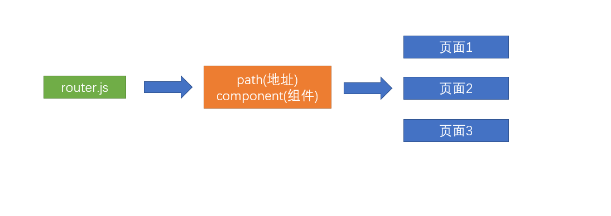
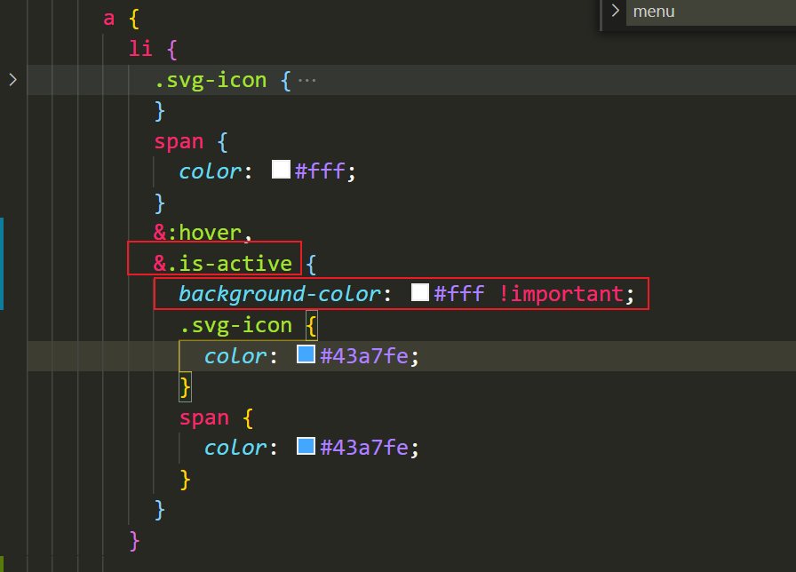
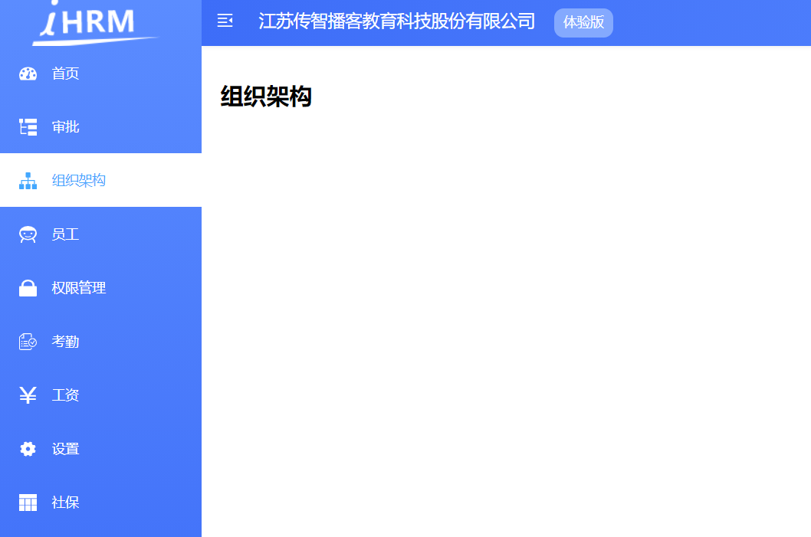

# 路由基本配置

## 了解路由设计思想

**`目标`** 了解这种大型中台项目的路由设计思想

首先，我们需要知道类似这种大型中台项目的页面路由是如何设置的。

**简单项目**



**当前项目结构**: 将路由进行了模块拆分, 同模块的路由规则将来会放到一起


> 为什么要拆成若干个路由模块呢？ 

因为复杂中台项目的页面众多，不可能把所有的业务都`集中在一个文件上`进行管理和维护，

**并且还有最重要的，前端的页面中主要分为两部分**

1. 一部分是所有人都可以访问的，(`静态路由` - 一直都有的路由)  比如: 登录页, 首页, 404
2.  一部分是只有有权限的人才可以访问的 (`动态路由` - 动态新增或移除的路由)  比如: 薪资管理, 人员管理

**拆分多个模块便于更好的控制 和 维护**


**`注意`**这里的动态路由并不是 **路由传参**的动态路由

**小结:** 

拆分成不同的路由规则模块,  好处: 

1. 便于维护, 同模块的三个四个路由都放到一起了  
2. 方便进行权限控制

概念: 

1. 动态路由: 需要有权限的人, 才能访问的路由 (有权限, 给你新增, 没权限, 给你移除)
2. 静态路由: 所有人都能访问到的, 一直都有的路由


## 路由页面整理

**`目标`** 删除基础模板中附带的多余页面

> 基础模板帮我们提前内置了一些页面，本章节我们进行一下整理

**删除多余的路由表**   **`src/router/index.js`**

```js
// 静态路由表 =>  静态路由(不需要权限即可访问的)
export const constantRoutes = [
  {
    path: '/login',
    component: () => import('@/views/login/index'),
    hidden: true
  },

  {
    path: '/404',
    component: () => import('@/views/404'),
    hidden: true
  },

  {
    path: '/',
    component: Layout,
    redirect: '/dashboard',
    children: [
      {
        path: 'dashboard',
        name: 'Dashboard',
        component: () => import('@/views/dashboard/index'),
        meta: { title: 'Dashboard', icon: 'dashboard' }
      }
    ]
  },
  // 没有匹配到的页面, 走404
  { path: '*', redirect: '/404', hidden: true }
]
```

> 上面代码，我们只对登录页/404/主页进行了保留

并且我们发现，删除了其他页面之后，左侧导航菜单的数据也只剩下了首页


**这是因为左侧导航菜单的数据来源于路由信息, 将来菜单是动态根据路由表的信息渲染的, 目前先不纠结**

**删除多余的路由组件**


> 只保留以上三个路由组件的内容，后续慢慢增加

同样的在api目录下，存在多余的api-table.js 一并删除

**提交代码**

**`本节任务`**：完成业务路由 和 页面的整理

## 配置项目中的动态路由

### 如何配置一个路由，并且该路由能够在左侧生成

```jsx
{
  path: '/approvals',
  component: () => import('@/layout'),
  children: [
    {
      path: '',
      component: () => import('@/views/approvals'),
      meta: { title: '审批', icon: 'tree-table' }
    }
  ]
}
```

按照对应的规则配置好8个

```
├── router               # 路由目录
 ├── index.js            # 路由主文件
 ├── modules             # 模块目录
  ├── approvals.js       # 审批  			图标: tree-table
  ├── attendances.js     # 考勤  			图标: skill
  ├── departments.js     # 组织架构 	 图标: tree
  ├── employees.js       # 员工 			图标: people
  ├── permission.js      # 权限管理		 图标: lock
  ├── salarys.js         # 工资				图标: money
  ├── setting.js         # 公司设置		 图标: setting
  ├── social.js          # 社保			  图标: table 
```

### 动态路由分模块

+ 在`router/modules/approvals.js`

```jsx
export default {
  path: '/approvals',
  component: () => import('@/layout'),
  children: [
    {
      path: '',
      component: () => import('@/views/approvals'),
      meta: { title: '审批', icon: 'tree-table' }
    }
  ]
}

```

**依葫芦画瓢，准备另外7个**

+ 在`router/index.js`中统一导入

```jsx
import approvals from './modules/approvals'
//  其余7个
```

+ 把这8个动态的路由放到一个数组中

```jsx
// 动态路由数组
const asyncRoutes = [approvals, attendances]
```

+ 把静态的路由和动态的路由合并

```jsx
const createRouter = () => new Router({
  // mode: 'history', // require service support
  scrollBehavior: () => ({ y: 0 }),
  routes: [...constantRoutes, ...asyncRoutes]
})
```


## 处理高亮激活 

左侧菜单被选中时, 会加上一个 is-active 类, 可以在 sidebar.scss 覆盖下样式



效果图:

