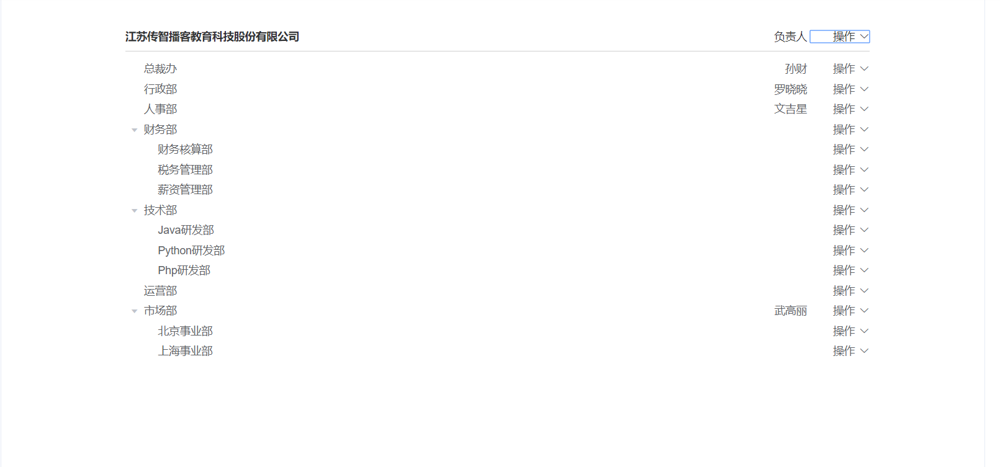

# 组织架构

## 组织架构树形结构布局

**`目标`**：使用element-UI组件布局组织架构的基本布局

### 认识组织架构


> 一个企业的组织架构是该企业的灵魂，组织架构多常采用树形金字塔式结构，本章节，我们布局出页面的基本结构

 

### 实现组织架构的头部内容

首先实现头部的结构，采用element的**行列布局**

```vue
<el-card class="tree-card">
  <el-row type="flex" align="middle" style="height: 40px;">
    <el-col :span="20">
      江苏传智播客教育科技股份有限公司
    </el-col>
    <el-col :span="4">
      <el-row type="flex" justify="end">
        <el-col>负责人</el-col>
        <el-col>
          <el-dropdown>
            <span class="el-dropdown-link">
              操作<i class="el-icon-arrow-down el-icon--right" />
            </span>
            <template #dropdown>
              <el-dropdown-menu>
                <el-dropdown-item>添加子部门</el-dropdown-item>
                <el-dropdown-item>查看部门</el-dropdown-item>
                <el-dropdown-item>删除部门</el-dropdown-item>
              </el-dropdown-menu>
            </template>
          </el-dropdown>
        </el-col>
      </el-row>
    </el-col>
  </el-row>
</el-card>
```

**样式**

```css
<style scoped>
.tree-card {
  padding: 30px  140px;
  font-size:14px;
}
</style>

```


### 树形组件认识

接下来，实现树形的结构，采用element的**[tree组件](https://element.eleme.cn/#/zh-CN/component/tree)**， 如图效果


树形组件关键属性

| 参数  | 说明                 | 类型   | 可选值 | 默认值 |
| :---- | :------------------- | :----- | :----- | :----- |
| data  | 展示数据             | array  | —      | —      |
| props | 配置选项，具体看下表 | object | —      | —      |

默认展开节点属性 default-expand-all

| 参数               | 说明                 | 类型    | 可选值 | 默认值 |
| :----------------- | :------------------- | :------ | :----- | :----- |
| default-expand-all | 是否默认展开所有节点 | boolean | —      | —      |

注意: data 中默认 `label` 为节点标签的文字, `children` 为子节点  (可以通过 props 修改默认配置 )

**data**是组成树形数据的关键，如下的数据便能构建树形数据

```jsx
export default {
  name: 'Departments',
  data() {
    return {
      list: [
        {
          label: '企业部',
          children: [
            { label: '策划部' },
            { label: '游戏部' }
          ]
        },
        { label: '事件部' },
        { label: '小卖部' }
      ]
    }
  }
}
```

那万一后台给的树形数据, 不是label 和 children 字段名呢 ?

解决方案: 可以通过 props 修改默认配置


```jsx
<el-tree :data="list" :props="defaultProps" />

data() {
  return {
    list: [
      {
        name: '企业部',
        children: [
          { name: '策划部' },
          { name: '游戏部' }
        ]
      },
      { name: '事件部' },
      { name: '小卖部' }
    ],
    defaultProps: {
      label: 'name',
      children: 'children'
    }
  }
}
```


### 实现树形的静态组织架构

由此，我们首先实现静态数据的组织架构

```jsx
<el-tree :data="data" :props="defaultProps" default-expand-all></el-tree>

export default {
  name: 'Departments',
  data() {
    return {
      data: [
        {
          name: '蜀国',
          child: [
            {
              name: '赵云'
            },
            {
              name: '马超'
            }
          ]
        },
        {
          name: '吴国',
          child: [
            { name: '大乔' },
            { name: '小乔' }
          ]
        }

      ],
      defaultProps: {
        children: 'child',
        label: 'name'
      }
    }
  }
}
```

> 接下来，对每个层级节点增加显示内容，此时需要用到tree的作用域插槽

```jsx
<!-- 树形菜单 -->
<el-tree :data="data" :props="defaultProps" default-expand-all>
  <template v-slot="{ data }">

    <el-row type="flex" align="middle" style="height: 40px;width: 100%;">
      <el-col :span="20">
        {{ data.name }}
      </el-col>
      <el-col :span="4">
        <el-row type="flex" justify="end">
          <el-col>负责人</el-col>
          <el-col>
            <el-dropdown>
              <span class="el-dropdown-link">
                操作<i class="el-icon-arrow-down el-icon--right" />
              </span>
              <template #dropdown>
                <el-dropdown-menu>
                  <el-dropdown-item>添加子部门</el-dropdown-item>
                  <el-dropdown-item>查看部门</el-dropdown-item>
                  <el-dropdown-item>删除部门</el-dropdown-item>
                </el-dropdown-menu>
              </template>
            </el-dropdown>
          </el-col>
        </el-row>
      </el-col>
    </el-row>
  </template>
</el-tree>
```

最终形成静态结构效果


**提交代码**

**`本节任务`**：完成树形结构的显示

## 获取组织架构数据，并进行树形处理

**`目标`**获取真实的组织架构数据，并将其转化成树形数据显示在页面上

### 封装API接口，获取组织架构数据

> 现在基本的静态结构已经形成，接下来需要获取真实的数据

（1）封装获取组织架构的请求 `src/api/departments.js`

```js
/**
 * 获取组织架构数据
 */
export function getDepartmentList() {
  return request({
    url: '/company/department'
  })
}
```

（2）在`departments/index.vue`组件中导入

```jsx
import { getDepartmentList } from '@/api/departments'
```

（3）在created钩子函数中调用方法，获取数据

```jsx
created() {
  this.getDeparts()
},
methods: {
  async getDeparts() {
    const result = await getDepartmentList()
    // 保存部门数据
    this.list = result.depts
  }
}
```

### 递归算法-将列表数据转成树形数据

我们需要将列表型的数据，转化成树形数据，这里需要用到**递归算法**


（1）准备如下数据

```js
const list = [
  {id: '1', pid: '', name: '总裁办'},
  {id: '2', pid: '', name: '行政部'},
  {id: '3', pid: '', name: '人事部'},
  {id: '4', pid: '', name: '财务部'},
  {id: '5', pid: '4', name: '出纳'},
  {id: '6', pid: '4', name: '审计'},
  {id: '7', pid: '2', name: '学工'},
  {id: '8', pid: '1', name: '教研部'},
  {id: '9', pid: '8', name: 'java'},
  {id: '10', pid: '8', name: '前端'},
  {id: '11', pid: '8', name: 'python'}
]

```

（2）目标数据

```jsx
const list = [
  {
    "id": "1",
    "pid": "",
    "name": "总裁办",
    "children": [
      {
        "id": "8",
        "pid": "1",
        "name": "教研部",
        "children": [
          {
            "id": "9",
            "pid": "8",
            "name": "java"
          },
          {
            "id": "10",
            "pid": "8",
            "name": "前端"
          },
          {
            "id": "11",
            "pid": "8",
            "name": "python"
          }
        ]
      }
    ]
  },
  {
    "id": "2",
    "pid": "",
    "name": "行政部",
    "children": [
      {
        "id": "7",
        "pid": "2",
        "name": "学工"
      }
    ]
  },
  {
    "id": "3",
    "pid": "",
    "name": "人事部"
  },
  {
    "id": "4",
    "pid": "",
    "name": "财务部",
    "children": [
      {
        "id": "5",
        "pid": "4",
        "name": "出纳"
      },
      {
        "id": "6",
        "pid": "4",
        "name": "审计"
      }
    ]
  }
]
```

（3）实现

```html
<!DOCTYPE html>
<html lang="en">
<head>
  <meta charset="UTF-8">
  <meta name="viewport" content="width=device-width, initial-scale=1.0">
  <title>Document</title>
</head>
<body>
<script>
  var list = [
    {id: '1', pid: '', name: '总裁办'},
    {id: '2', pid: '', name: '行政部'},
    {id: '3', pid: '', name: '人事部'},
    {id: '4', pid: '', name: '财务部'},
    {id: '5', pid: '4', name: '出纳'},
    {id: '6', pid: '4', name: '审计'},
    {id: '7', pid: '2', name: '学工'},
    {id: '8', pid: '1', name: '教研部'},
    {id: '9', pid: '8', name: 'java'},
    {id: '10', pid: '8', name: '前端'},
    {id: '11', pid: '8', name: 'python'}
  ]
  // 转成树状的数据
  function listToTree (list, pid = '') {
    const arr = []
    list.forEach(item => {
      if (item.pid === pid) {
        arr.push(item)
        const children = listToTree(list, item.id)
        if (children.length) {
          item.children = children
        }
      }
    })
    return arr
  }

  const result = listToTree(list)
  console.log(result)
</script>
</body>
</html>

```

### 将数组数据转化成树形结构

封装一个工具方法，**`src/utils/index.js`**

```js
/**
 * 将列表转成树形数据
 * @param {Array} list 数组
 * @param {String} pid 父组件id
 */
export function listToTree(list, pid = '') {
  const arr = []
  list.forEach(item => {
    if (item.pid === pid) {
      arr.push(item)
      const children = listToTree(list, item.id)
      if (children.length) {
        item.children = children
      }
    }
  })
  return arr
}
```

调用转化方法，转化树形结构

```js
import { listToTree } from '@/utils'

methods: {
  async getDeparts() {
    const result = await getDepartmentList()
    this.company = { name: result.companyName, manager: '负责人' }
    this.departs = listToTree(result.depts) // 需要将其转化成树形结构
  }
}
```


##  将树形的操作内容单独抽提成组件

**`目标`**： 将树形的操作内容单独抽提成组件

### 封装单独的树操作栏组件

> 通过第一个章节，我们发现，树形的顶级内容实际和子节点的内容是一致的，此时可以将该部分抽提成一个组件，节省代码

组件 **`src/views/departments/components/TreeTools.vue`**

```vue
<template>
  <el-row type="flex" align="middle" style="height: 40px;width: 100%;">
    <el-col :span="20">
      {{ nodeData.name }}
    </el-col>
    <el-col :span="4">
      <el-row type="flex" justify="end">
        <el-col>{{ nodeData.manager }}</el-col>
        <el-col>
          <el-dropdown>
            <span class="el-dropdown-link">
              操作<i class="el-icon-arrow-down el-icon--right" />
            </span>
            <template #dropdown>
              <el-dropdown-menu>
                <el-dropdown-item>添加子部门</el-dropdown-item>
                <el-dropdown-item>查看部门</el-dropdown-item>
                <el-dropdown-item>删除部门</el-dropdown-item>
              </el-dropdown-menu>
            </template>
          </el-dropdown>
        </el-col>
      </el-row>
    </el-col>
  </el-row>
</template>

<script>
export default {
  props: {
    nodeData: {
      type: Object,
      required: true
    }
  }
}
</script>

<style>

</style>

```

### 在组织架构中应用操作栏组件

（1）在`departments/index.vue`中导入组件

```js
import TreeTools from './components/TreeTools'
```

（2）局部注册组件

```jsx
components: {
  TreeTools
},
```

（3）使用treetools组件简化树形菜单的数据

```jsx
<!-- 树形结构 -->
<el-tree :data="departs" :props="defaultProps">
  <template v-slot="{data}">
    <tree-tools :node-data="data" />
  </template>
</el-tree>
```

（4）使用tree-tools组件简化头部布局

```jsx
<el-card class="tree-card">
  <!-- 头部布局 -->
  <tree-tools :node-data="company" />
  ...
</el-card>

// 在data中提供company公司的数据
data() {
  return {
    company: {
      name: '江苏传智播客教育科技股份有限公司',
      manager: '负责人'
    },
  }
}
```

==问题：由于在两个位置都使用了该组件，但是放置在最上层的组件是不需要显示 **`删除部门`**和**`编辑部门`**的==

（5）增加一个新的属性 **`isRoot（是否根节点）`**进行控制

在顶层组件中传入一个isRoot属性

```jsx
<el-card class="tree-card">
  <!-- 头部布局 -->
  <tree-tools :tree-node="company" :is-root="true"/>
  ...
</el-card>
```

在`tree-tools`组件中增加一个props

```jsx
props: {
  treeNode: {
    required: true, // 设置当前数据为必填
    type: Object // 类型是Object
  },
  isRoot: {
    type: Boolean,
    default: false
  }
} 
```

组件中， 根据isRoot判断显示

```vue
<!-- 编辑部门和删除部门只会在子节点上显示 -->
<el-dropdown-item v-if="!isRoot">编辑部门</el-dropdown-item>
<el-dropdown-item v-if="!isRoot">删除部门</el-dropdown-item>
```


## 给数据获取添加加载进度条

**`目标`**  给当前组织架构添加加载进度条

由于获取数据的延迟性，为了更好的体验，可以给页面增加一个Loading进度条，采用element的指令解决方案即可

**定义loading变量**

```js
loading: false // 用来控制进度弹层的显示和隐藏
```

**赋值变量给指令**

```vue
  <div v-loading="loading" class="dashboard-container">
```

**获取方法前后设置变量**

```js
async getDeparts() {
  this.loading = true
  const result = await getDepartmentList()
  this.company.name = result.companyName
  this.departs = listToTree(result.depts) // 需要将其转化成树形结构
  this.loading = false
},
```

# 删除部门

**`目标`**实现部门管理中的删除功能

## 调用删除接口删除部门

（1）封装删除功能模块 **`src/api/departments.js`**

```js

/**
 * 删除部门
 * @param {string} id
 */
export function delDepartment(id) {
  return request({
    method: 'delete',
    url: `/company/department/${id}`
  })
}
```

（2）弹窗提醒

```js
async del() {
  console.log('删除')
  console.log(this.nodeData)
  try {
    await this.$confirm('你确定要删除该部门吗', '温馨提示', {
      type: 'warning'
    })
  } catch {
    return
  }
}
```

（4）发送请求删除部门

```jsx
async del() {
  console.log('删除')
  console.log(this.nodeData)
  try {
    await this.$confirm('你确定要删除该部门吗', '温馨提示', {
      type: 'warning'
    })
  } catch {
    return
  }
  // 删除部门
  await delDepartment(this.nodeData.id)
  // 提示删除功能
  this.$message.success('删除成功')
}
```

## 通知父组件更新数据

> 上面代码中，我们已经成功删除了员工数据，但是怎么通知父组件进行更新呢，需要子传父

（1）触发事件通知父组件

```diff
async del() {
  try {
    await this.$confirm('你确定要删除部门吗', '温馨提示', {
      type: 'warning'
    })
  } catch {
    return
  }
  // 点击确定，发送请求删除
  await delDepartment(this.nodeData.id)
  // 提示消息
  this.$message.success('删除部门成功')
  // 重新渲染
+  this.$emit('getDeparts')
}
```

（2）父组件给子组件注册事件 

```vue
<TreeTools :node-data="data" @getDeparts="getDeparts" />
```

**提交代码。**

**`本节任务`**：删除部门功能实现

# 新增部门

> 新增部门功能功能比较复杂，为了方便后期维护，会把所有功能封装到一个独立的组件`add-dept.vue`中

## 创建组件与渲染

（1）创建`departments/components/AddDept.vue`组件

```js
<template>
  <div class="add-dept">新增部门</div>
</template>

<script>
export default {

}
</script>

<style>

</style>

```

（2）在`departments/index.vue`中引入并局部注册

```jsx
import AddDept from './components/AddDept'

export default {
  components: {
    AddDept
  }
}
```

（3）在`departments/index.vue`中渲染组件

```diff
<div class="dashboard-container">
  <div class="app-container">
    <el-card class="tree-card">
      <!-- 头部布局 -->
      <tree-tools :tree-node="company" is-root />
      <!-- 树形结构 -->
      <el-tree :data="departs" :props="defaultProps" default-expand-all>
        <template v-slot="{data}">
          <tree-tools :tree-node="data" />
        </template>
      </el-tree>
    </el-card>
+  <add-dept />
  </div>
</div>
```

## 组件基本结构

（1）对话框基本使用

[dialog 对话框](https://element.eleme.cn/#/zh-CN/component/dialog)

```jsx
<!--
  visible: 用于控制对话框显示隐藏
  title: 对话框标题
  width: 指定对话框的宽度
  footer插槽：用于指定对话框底部内容
  -->
<el-dialog :visible="true" title="添加部门" width="40%">
  添加部门
  <template #footer>
    <el-button type="primary">确定</el-button>
    <el-button>取消</el-button>
  </template>
</el-dialog>
```

（2）让按钮居中

[layout 布局](https://element.eleme.cn/#/zh-CN/component/layout)

```jsx
<template #footer>
  <el-row type="flex" justify="center">
    <el-button type="primary">确定</el-button>
    <el-button>取消</el-button>
  </el-row>
</template>
```

（3）表单基本结构

[form 表单](https://element.eleme.cn/#/zh-CN/component/form)

```jsx
<el-form label-width="100px">
  <el-form-item label="部门名称">
    <el-input placeholder="请输入部门名称" />
  </el-form-item>
  <el-form-item label="部门编码">
    <el-input placeholder="请输入部门编码" />
  </el-form-item>
  <el-form-item label="部门负责人">
    <el-select placeholder="请选择部门负责人" />
  </el-form-item>
  <el-form-item label="部门介绍">
    <el-input type="textarea" placeholder="请输入部门介绍" :rows="3" />
  </el-form-item>
</el-form>
```

（4）数据双向绑定

结构

```jsx
<template>
  <el-dialog title="添加部门" :visible="true" width="40%">
    <el-form :model="form" :rules="rules" label-width="100px">
      <el-form-item label="部门名称" prop="name">
        <el-input v-model="form.name" placeholder="请输入部门名称" />
      </el-form-item>
      <el-form-item label="部门编码" prop="code">
        <el-input v-model="form.code" placeholder="请输入部门编码" />
      </el-form-item>
      <el-form-item label="部门负责人" prop="manager">
        <el-select v-model="form.manager" placeholder="请选择部门负责人" />
      </el-form-item>
      <el-form-item label="部门介绍" prop="introduce">
        <el-input v-model="form.introduce" placeholder="请输入部门介绍" />
      </el-form-item>
    </el-form>
    <template #footer>
      <el-button>取 消</el-button>
      <el-button type="primary">确 定</el-button>
    </template>
  </el-dialog>
</template>
```

提供数据

```jsx
export default {
  data() {
    return {
      form: {
        name: '',
        code: '',
        manager: '',
        introduce: ''
      },
      rules: {
        name: [
          { required: true, message: '部门名称不能为空' }
        ],
        code: [
          { required: true, message: '部门编码不能为空' }
        ]
      }
    }
  }
}
```

## 控制dialog显示隐藏

> 交互逻辑分析
> 1. 父组件department提供`showDialog`属性用于控制对话框的显示隐藏
> 2. 父传子的方式将`showDialog`传递给`add-dept.vue`组件
> 3. 点击添加部门的时候，通过子传父的方式，修改`showDialog`的值


（1）父组件department提供`showDialog`属性用于控制对话框的显示隐藏

```jsx
data() {
  return {
    // ...
    showDialog: false
  }
},
```

（2）父传子的方式传递给`add-dept.vue`组件

```jsx
<add-dept :show-dialog="showDialog" />
```

（3）`add-dept`组件接收`showDialog`

```jsx
props: {
  showDialog: {
    type: Boolean,
    default: false
  }
},
```

（4）控制对话框的显示隐藏

```jsx
<el-dialog :visible="showDialog" title="添加部门" width="40%">
```

## 点击添加部门-显示弹窗

在`tree-tool.vue`组件中，点击添加部门的时候，通过子传父的方式，修改`showDialog`的值，还需要传递`treeNode`数据

（1）在`tree-tool.vue`组件中触发事件

```jsx
add() {
  this.$emit('addDepart', this.nodeData.id)
},
```

（2）在`department`父组件中，监听事件

```diff
<el-card class="tree-card">
  <!-- 头部布局 -->
-  <tree-tools :tree-node="company" is-root/>
+  <tree-tools :tree-node="company" is-root @addDepart="addDepart" />
  <!-- 树形结构 -->
  <el-tree :data="departs" :props="defaultProps" default-expand-all>
    <template v-slot="{data}">
-      <tree-tools :tree-node="data"/>
+      <tree-tools :tree-node="data" @addDepart="addDepart" />
    </template>
  </el-tree>
</el-card>
```

（3）在`department`父组件中，提供`addDepart`方法，修改`showDialog`

```jsx
methods: {
  addDepart(id) {
    this.showDialog = true
    
  }
}
```

## 隐藏dialog

（1）需要给dialog注册close事件

```jsx
<el-dialog :visible="showDialog" title="添加部门" width="40%" @close="handleClose">
```

（2）点击取消也需要关闭

```jsx
<el-button size="small" @click="handleClose">取消</el-button>
```

（3）需要通过子传父的方式，关闭dialog

```jsx
methods: {
  handleClose() {
    this.$emit('close')
  }
}
```

（4）父组件关闭dialog

```jsx
<add-dept :show-dialog="showDialog" @close="showDialog = false" />
```


## 新增部门的表单基本校验

> 新增部门的表单校验要求如下：

1. 部门名称（name）：必填 1-50个字符  / 同级部门中禁止出现重复部门
2. 部门编码（code）：必填 1-50个字符  / 部门编码在整个模块中都不允许重复
3. 部门负责人（manager）：必填
4. 部门介绍 ( introduce)：必填 1-300个字符

（1）给表单提供rules属性

```diff
<el-form
  label-width="100px"
  :model="form"
+  :rules="rules"
>
```

（2）在data中通过rules提供校验规则

```jsx
// 定义校验规则
rules: {
  name: [
    { required: true, message: '部门名称不能为空', trigger: 'blur' },
    { min: 1, max: 50, message: '部门名称要求1-50个字符', trigger: 'blur' }
  ],
  code: [
    { required: true, message: '部门编码不能为空', trigger: 'blur' },
    { min: 1, max: 50, message: '部门编码要求1-50个字符', trigger: 'blur' }
  ],
  manager: [
    { required: true, message: '部门负责人不能为空', trigger: 'blur' }
  ],
  introduce: [
    { required: true, message: '部门介绍不能为空', trigger: 'blur' },
    { min: 1, max: 300, message: '部门介绍要求1-50个字符', trigger: 'blur' }
  ]
}
```

（3）给form-item提供prop属性

```jsx
<el-form-item label="部门名称" prop="name">
  <el-input v-model="form.name" placeholder="请输入部门名称(1-50个字符)" />
</el-form-item>
<el-form-item label="部门编码" prop="code">
  <el-input v-model="form.code" placeholder="请输入部门编码(1-50个字符)" />
</el-form-item>
<el-form-item label="部门负责人" prop="manager">
  <el-select v-model="form.manager" placeholder="请选择部门负责人" />
</el-form-item>
<el-form-item label="部门介绍" prop="introduce">
  <el-input v-model="form.introduce" type="textarea" placeholder="请输入部门介绍(1-300个字符)" :rows="3" />
</el-form-item>
```

## 新增部门的自定义校验

- 部门名称（name）：同级部门中禁止出现重复部门

- 部门编码（code）：部门编码在整个模块中都不允许重复

**`注意`**：部门名称和部门编码的规则 有两条我们需要通过**`自定义校验函数validator`**来实现, 

且判断部门名称和编码是否存在, 需要遍历, 推荐将来校验用 `blur`, 失去焦点校验一次即可

（1）给部门名称和部门编码提供自定义校验函数

```jsx
data() {
  const checkNameRepeat = (rule, value, callback) => {

  }
  const checkCodeRepeat = (rule, value, callback) => {

  }
  return {
    rules: {
      name: [
        // ...
        { validator: checkNameRepeat, trigger: 'blur' }
      ],
      code: [
        // ...
        { validator: checkCodeRepeat, trigger: 'blur' }
      ]
    }
  }
}
```

（2）父组件`department`将`currentNode`传递给`add-dept`组件

```jsx
addDepart(id) {
  // 显示添加部门
  this.showDialog = true
  this.currentId = id
},

<AddDept :show-dialog="showDialog" :current-id="currentId" @close="close" />
```

（3）add-dept组件接收treeNode数据

```jsx
showDialog: {
  type: Boolean,
  default: false
},
currentId: {
  type: String,
  default: ''
}
```

（4）校验时发送请求，并且判断部门数据是否重复

```jsx
const validateName = async(rule, value, callback) => {
  // console.log('校验部门名称', value, this.currentId)
  const res = await getDepartmentList()
  // 判断value在同级部门中是否有相同的名字
  // 同级部门
  console.log(this.currentId)
  const depts = res.depts.filter(item => item.pid === this.currentId)
  console.log(depts)
  // 判断名字是否重复
  depts.some(item => item.name === value) ? callback(new Error(`${value}在同级部门中重复`)) : callback()
}
```

（5）同理判断部门编码是否重复

```JSX
const validateCode = async(rule, value, callback) => {
  const res = await getDepartmentList()
  // 判断value在所有部门中的code是否是存在的
  res.depts.some(item => item.code === value) ? callback(new Error(`${value}编码重复了`)) : callback()
}
```

## 关闭弹窗的时候，需要重置校验

（1）给form添加ref属性

```jsx
<el-form ref="form" label-width="100px" :model="form" :rules="rules">
```

（2）在关闭弹窗的时候，调用方法

```jsx
methods: {
  close() {
    this.$emit('close')
    // 清空表单的内容以及校验的结果
    this.$refs.form.resetFields()
  }
}
```


## 部门负责人数据

**`目标`**：获取新增表单中的部门负责人下拉数据

> 在上节的表单中，部门负责人是下拉数据，我们应该从**`员工接口`**中获取该数据

（1）封装获取简单员工列表的模块 **`src/api/employees.js`**

```js
import request from '@/utils/request'

/**
 *  获取员工的简单列表
 * **/
export function getEmployeeSimple() {
  return request({
    url: '/sys/user/simple'
  })
}

```

（2）在**`add-dept.vue`**中的select聚焦事件**`focus`**中调用该接口，因为我们要获取实时的最新数据

```vue
<el-select
  v-model="form.manager"
  placeholder="请选择部门负责人"
  @focus="getEmployees"
/>
```

（3）获取员工列表

```js
import { getEmployeeSimple } from '@/api/emplyees'

data() {
  return {
		// 员工数据
    employees: []
  }
}

methods: {
  async getEmployees() {
    const data = await getEmployeeSimple()
    this.employees = data
  }
}

```

（4）渲染部门负责人数据

```jsx
<el-select
  v-model="form.manager"
  placeholder="请选择负责人"
  @focus="getEmployees"
>
  <el-option
    v-for="item in employees"
    :key="item.id"
    :label="item.username"
    :value="item.username"
  />
</el-select>
```


## 新增功能-校验表单并提交

> 当点击新增页面的确定按钮时，我们需要完成对表单的整体校验，如果校验成功，进行提交

首先，在点击确定时，校验表单

（1）给el-form定义一个ref属性

```vue
<el-form
  ref="form"
  label-width="100px"
  :model="form"
  :rules="rules"
>
```

（2）给确定按钮注册点击事件

```jsx
<el-button type="primary" @click="add">确定</el-button>
```

（3）点击确定时表单校验

```jsx
async add() {
  // 对整个表单进行校验
  try {
    await this.$refs.form.validate()
  } catch {
    return
  }
}
```

（4）封装添加部门接口

```jsx
/**
 *  新增部门接口
 *
 * ****/
export function addDepartment(data) {
  return request({
    url: '/company/department',
    method: 'post',
    data
  })
}
```

（5）然后，在校验通过时，调用新增接口

> 因为是添加子部门，所以我们需要将新增的部门pid设置成当前部门的id，新增的部门就成了自己的子部门

```js
async add() {
  // 对整个表单进行校验
  try {
    await this.$refs.form.validate()
  } catch {
    return
  }
  // 校验通过
  await addDepartment({
    ...this.form,
    pid: this.currentId
  })
}
```

（6）同样，在新增成功之后，调用告诉父组件，重新拉取数据

```js
// 1. 提示
this.$message.success('添加成功')
// 2. 关闭对话框
this.$emit('close')
// 3. 让父组件重新渲染
this.$emit('getDeparts')
```

（7）父组件

```vue
<AddDept
  :show-dialog="showDialog"
  :current-id="currentId"
  @close="close"
  @getDeparts="getDeparts"
/>
```

## 新增功能-sync修饰符基本使用

> 这里我们学习一个新的技巧，**`sync修饰符`**

 按照常规，想要让父组件更新**`showDialog`**的话，需要这样做   

```js
// 子组件
this.$emit('changedialog', false) //触发事件
// 父组件
<child @changedialog="method" :showDialog="showDialog" />
 method(value) {
    this.showDialog = value
}
```

> 但是，vuejs为我们提供了**`sync修饰符`**，它提供了一种简写模式 也就是

```js
// 子组件 update:固定写法 (update:props名称, 值)
this.$emit('update:showDialog', false) //触发事件
// 父组件 sync修饰符
<child  :showDialog.sync="showDialog" />

```

只要用sync修饰，就可以省略父组件的监听和方法，直接将值赋值给showDialog

## 新增功能-sync修饰符关闭弹层

（1）使用sync修饰符

```jsx
<add-dept
  :show-dialog.sync="showDialog"
  :node="currentNode"
  @getDepartments="getDepartmentList"
/>
```

（2）点击确实时关闭

```jsx
add() {
  this.$refs.form.validate(async valid => {
    if (!valid) return
    // 调用新增接口 添加父部门的id
    await addDepartment({ ...this.form, pid: this.treeNode.id })
    // 通知父组件更新数据
    this.$emit('updateDepartmentList')
    // 关闭弹层
    this.$emit('update:showDialog', false)
  })
}
```

**取消按钮关闭**

```js
<el-dialog title="新增部门" :visible="showDialog" @close="btnCancel">
<el-button @click="close">取消</el-button>
```

### 取消时重置数据和校验

```js
close() {
  // 关闭弹层
  this.$emit('update:showDialog', false)
  // 重置表单
  this.$refs.form.resetFields()
}
```


# 编辑部门

## 显示弹窗

> 编辑部门功能实际上和新增窗体采用的是一个组件，只不过我们需要将新增场景变成编辑场景


（1）点击编辑部门时子传父 **`tree-tools.vue`**

```js
edit() {
  // console.log('修改')
  this.$emit('editDepart', this.nodeData.id)
},
```

（2）父组件给`tree-tools`注册事件

```vue
<tree-tools
  :node-data="data"
  @getDepartments="getDepartmentList"
  @addDepart="addDepart"
  @editDepart="editDepart"
/>
```

（3）显示弹窗

```jsx
editDepart(id) {
  this.showDialog = true
  this.currentId = id
}
```

## 数据回显

> 数据回显，我们只需要给`add-dept.vue`组件中的form对象赋值，就可以完成数据的回显操作

(1)  封装了一个接口

```jsx
/**
 * 获取部门详情
 * @param {*} id
 * @returns
 */
export function getDepartmentDetail(id) {
  return request({
    url: `/company/department/${id}`
  })
}
```

(2) 子组件提供一个方法，用于发请求获取数据  *这个方法不在子组件中调用，在父组件点编辑的时候调用*

```jsx
async getDepartmentDetail(id) {
  const res = await getDepartmentDetail(id)
  this.form = res
}
```

（3）给对话框添加ref属性

```jsx
<tree-tools
  ref="add"
  :node-data="data"
  @getDepartments="getDepartmentList"
  @addDepart="addDepart"
  @editDepart="editDepart"
/>
```

（4）给`add-dept组件`的form属性赋值

```jsx
// 编辑部门
editDepart(id) {
  this.showDialog = true
  this.currentId = id
  // 应该在这个地方发请求，获取部门信息
  this.$refs.add.getDepartmentDetail(id)
}

```

## 数据回显-优化

> 我们已经完成了数据回显，但是这么做有一些缺点，如果在页面上停留了比较长的时间，此时部门信息已经发生了修改，那么回显的就是不是最新的数据，因此需要在点击编辑的时候，实时的发送请求获取最新的部门信息。

（1）封装获取部门信息的模块 **`src/api/departments.js`**

```js
/** *
 * 获取部门详情
 * ***/
export function getDepartDetail(id) {
  return request({
    url: `/company/department/${id}`
  })
}

```

（2）在`add-dept.vue`中提供方法

```js
import { getDepartmentList, addDepartment, getDepartDetail } from '@/api/departments'

// 获取部门详情
async  getDepartDetail(id) {
  this.form = await getDepartDetail(id)
}
```

（3）点击编辑按钮的时候，调用方法发送请求

```jsx
// 修改部门
editDepart(nodeData) {
  this.showDialog = true
  this.currentNode = nodeData
  // 回显
  // console.log(nodeData)
  // this.$refs.add.form = nodeData
  this.$refs.add.getDepartDetail(nodeData.id)
}
```

## 根据计算属性显示控制标题

> 需要根据当前的场景区分显示的标题

（1）计算属性

> 如何判断新增还是编辑

```js
computed: {
  showTitle() {
    return this.form.id ? '编辑部门' : '新增子部门'
  }
},
```

*bug: 编辑部门后，新增部门，会发现还是编辑部门，原因是因为在关闭对话框时，resetFields方法并不会把非表单数据给重置，因此需要自己重置*

```jsx
close() {
  this.form = {
    name: '',
    code: '',
    manager: '',
    introduce: ''
  }
  // 关闭弹层
  this.$emit('update:showDialog', false)
  // 重置表单
  this.$refs.form.resetFields()
},
```


## 自定义校验规则-name修改

+ 数据回显的时候，把原来的名字和code保存起来

```jsx
return {
  oldName: '',
  oldCode: ''
}


async getDepartmentDetail(id) {
  const res = await getDepartmentDetail(id)
  this.form = res
  this.oldName = res.name
  this.oldCode = res.code
}
```

+ 修改校验逻辑

```jsx
const validateName = async(rule, value, callback) => {
  const res = await getDepartmentList()

  if (this.form.id) {
    // 修改功能
    if (this.oldName === value) {
      // 说明部门名称和原来是一样
      return callback()
    }
    // 判断当前value和同级部门的名字是否重复
    const depts = res.depts.filter(item => item.pid === this.form.pid)
    depts.some(item => item.name === value) ? callback(new Error(`${value}在同级部门中重复`)) : callback()
  } else {
    // 添加功能
    // 判断value在子级部门中是否有相同的名字
    const depts = res.depts.filter(item => item.pid === this.currentId)
    console.log(depts)
    // 判断名字是否重复
    depts.some(item => item.name === value) ? callback(new Error(`${value}在同级部门中重复`)) : callback()
  }
}
```

## 自定义校验规则-code修改

>除此之外，我们发现原来的校验规则实际和编辑部门有些冲突，所以需要进一步处理

```js
const validateCode = async(rule, value, callback) => {
  const res = await getDepartmentList()
  // 判断value在所有部门中的code是否是存在的
      if (`) {
    return callback()
  }
  res.depts.some(item => item.code === value) ? callback(new Error(`${value}编码重复了`)) : callback()
}
```


## 同时支持编辑和新增场景

接下来，需要在点击确定时，同时支持新增部门和编辑部门两个场景，我们可以根据formData是否有id进行区分

**（1）封装编辑部门接口**   **`src/api/departments.js`**

```js
/**
 * 修改部门
 * @param {*} data
 */
export function updateDepartment(data) {
  return request({
    method: 'PUT',
    url: `/company/department/${data.id}`,
    data
  })
}
```

> 点击确定时，进行场景区分

```js
import {
  getDepartmentList,
  addDepartment,
  getDepartDetail,
  updateDepartments
} from '@/api/departments'

add() {
  this.$refs.form.validate(async valid => {
    if (!valid) return
    if (this.form.id) {
      await updateDepartments(this.form)
    } else {
      // 调用新增接口 添加父部门的id
      await addDepartment({ ...this.form, pid: this.treeNode.id })
    }
    // 通知父组件更新数据
    this.$emit('updateDepartmentList')
    // 关闭弹层
    this.$emit('update:showDialog', false)
  })
},
```


## 自定义图标

```scss
<style>
.el-col {
  height: 30px;
  line-height: 30px;
}
.el-icon-caret-right:before {
  content: "\e723";
  color: #000;
}
.el-tree-node__expand-icon.expanded {
  transform: rotate(0deg);
}
.el-tree-node__expand-icon.expanded::before {
  content: "\e722";
  color: #000;
}

.el-tree-node__expand-icon.is-leaf::before {
  content: "\e7a5";
  color: #000;
}

</style>
```

