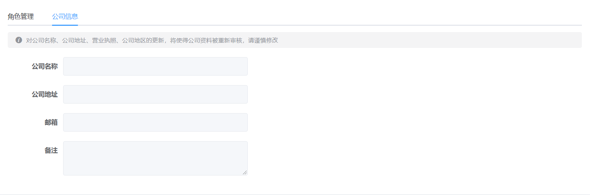

# 目标

> 完成公司信息与角色管理功能




# 角色列表展示

## 基本结构

根据以上的结构，我们采用element-ui的组件实现

（1）tab栏机构`src/views/setting/index.vue`

```vue
<template>
  <div class="dashboard-container">
    <div class="app-container">
      <el-card>
        <el-tabs>
          <el-tab-pane label="角色管理">角色管理</el-tab-pane>
          <el-tab-pane label="公司信息">公司信息</el-tab-pane>
        </el-tabs>
      </el-card>
    </div>
  </div>
</template>
```

（2）角色管理结构

```jsx
<el-tab-pane label="角色管理">
  <!-- 新增按钮 -->
  <el-button
    type="primary"
    icon="el-icon-plus"
    size="small"
  >新增角色</el-button>
  <el-table>
    <el-table-column label="序号" />
    <el-table-column label="角色名称" />
    <el-table-column label="描述" />
    <el-table-column label="操作" />
  </el-table>
</el-tab-pane>
```

## 角色列表数据渲染

（1）封装读取角色的信息的请求 **`src/api/setting.js`**

```js
/**
 * 获取角色列表
 * @param {*} page
 * @param {*} pagesize
 */
export function getRoleList(page = 1, pagesize = 10) {
  return request({
    method: 'get',
    url: '/sys/role',
    params: {
      page,
      pagesize
    }
  })
}
```

（2）在`src/views/setting/index.vue`组件中引入并调用接口

```js
import { getRoleList } from '@/api/setting'
export default {
  name: 'Setting',
  data() {
    return {
      // 存放角色列表数据
      list: []
    }
  },
  created() {
    this.getRoleList() // 获取角色列表
  },
  methods: {
    async getRoleList() {
      const { rows } = await getRoleList()
      this.list = rows
    }
  }
}
```

（3）通过表格渲染数据

```vue
<el-table :data="list">
  <el-table-column label="序号" type="index" />
  <el-table-column label="角色名称" prop="name" />
  <el-table-column label="描述" prop="description" />
  <el-table-column align="center" label="操作">
    <el-button size="small" type="success">分配权限</el-button>
    <el-button size="small" type="primary">编辑</el-button>
    <el-button size="small" type="danger">删除</el-button>
  </el-table-column>
</el-table>
```

（4）优化表格样式

```jsx
<el-table :data="list" border>
  <el-table-column width="120" align="center" label="序号" type="index" />
  <el-table-column
    width="240"
    align="center"
    label="角色名称"
    prop="name"
    />
  <el-table-column align="center" label="描述" prop="description" />
  <el-table-column align="center" label="操作">
    <el-button size="small" type="success">分配权限</el-button>
    <el-button size="small" type="primary">编辑</el-button>
    <el-button size="small" type="danger">删除</el-button>
  </el-table-column>
</el-table>
```

## 分页功能

（1）基本结构

```jsx
<!-- 分页 -->
<el-row style="height: 50px;" type="flex" justify="end" align="middle">
  <!--
    total: 总数量
    page-size: 每页的数量  分页组件会自动计算有多少页
    current-page: 当前页时第几页
  -->
  <el-pagination
    background
    layout="prev, pager, next"
    :total="500"
    :page-size="20"
    :current-page="3"
  />
</el-row>
```

（2）data中提供提供3个数据

```diff
data() {
  return {
    // 存放角色列表数据
    list: [],
+    page: 1,
+    pagesize: 5,
+    total: 0
  }
},
```

（3）修改`getRoleList`方法，传递参数

```js
async getRoleList() {
  const { rows, total } = await getRoleList({
    page: this.page,
    pagesize: this.pagesize
  })
  this.list = rows
  this.total = total
}
```

（4）动态渲染分页

```jsx
<el-pagination
  background
  layout="prev, pager, next"
  :total="total"
  :page-size="pagesize"
  :current-page="page"
  @current-change="handleCurrentChange"
/>
```

（5）提供`handleCurrentChange`函数进行分页

```jsx
<el-pagination
  background
  layout="prev, pager, next"
  :total="500"
  :page-size="20"
  :current-page="3"
  @current-change="handleCurrentChange"
/>

handleCurrentChange(value) {
  this.page = value
  this.getRoleList()
}
```

## 下标优化

> 分页时，发现每页的下表都是一样，不合理，需要自定义下标的显示

（1）提供index属性

```jsx
<el-table-column
  width="120"
  align="center"
  label="序号"
  type="index"
  :index="indexMethod"
/>
```

（2）通过indexMethod控制下标的下标的显示

```jsx
indexMethod(index) {
  return (this.page - 1) * this.pagesize + index + 1
}
```

## 加载效果

（1）提供loading

```jsx
data() {
  return {
		// ...
    loading: false
  }
},
```

（2）给table提供`v-loading`指令

```jsx
<el-table v-loading="loading" :data="list" border>
```

（3）修改loading状态

```jsx
async getRoleList() {
  this.loading = true
  const { rows, total } = await getRoleList({
    page: this.page,
    pagesize: this.pagesize
  })
  this.list = rows
  this.total = total
  this.loading = false
},
```


# 删除角色功能

（1）封装删除角色的api

```js
/** **
 *  删除角色
 *
 * ****/
export function deleteRole(id) {
  return request({
    url: `/sys/role/${id}`,
    method: 'delete'
  })
}
```

（2）给删除按钮注册点击事件并且通过**作用域插槽**获取id

```jsx
<el-table-column align="center" label="操作">
  <template v-slot="{ row }">
    <el-button size="small" type="success">分配权限</el-button>
    <el-button size="small" type="primary">编辑</el-button>
    <el-button size="small" type="danger" @click="delRole(row.id)">删除</el-button>
  </template>
</el-table-column>
```

（3）删除功能实现

```js
import { getRoleList, deleteRole } from '@/api/setting'

async delRole(id) {
  console.log(id)
  try {
    await this.$confirm('确认删除该角色吗')
  } catch {
    return false
  }
  // 发送请求删除角色
  await deleteRole(id) // 调用删除接口
  this.getRoleList() // 重新加载数据
  this.$message.success('删除角色成功')
}
```

（4）当当前页只有一条数据的时候，应该获取上一页的数据

```jsx
// 重新渲染
if (this.list.length === 1 && this.page > 1) {
  this.page--
}
this.getRoleList()
```

# 新增角色

## 基本结构

（1）提供dialog组件

```jsx
<el-dialog title="添加角色" :visible="showDialog">
  我是弹层
  <template #footer>
    <el-row type="flex" justify="center">
      <el-button>取消</el-button>
      <el-button type="primary">确定</el-button>
    </el-row>
  </template>
</el-dialog>


data() {
  return {
    // 控制对话框的显示
    showDialog: false
  }
},
```

（2）点击添加按钮显示弹层

```jsx
<!-- 新增按钮 -->
<el-button
  type="primary"
  icon="el-icon-plus"
  size="small"
  style="margin-bottom: 10px;"
  @click="showAdd"
>新增角色</el-button>

showAdd() {
  this.showDialog = true
}
```

（3）关闭弹层功能

```jsx
<el-dialog title="添加角色" :visible="showDialog" @close="closeDialog">
  我是弹层
  <template #footer>
    <el-row type="flex" justify="center">
      <el-button @click="closeDialog">取消</el-button>
      <el-button type="primary">确定</el-button>
    </el-row>
  </template>
</el-dialog>

closeDialog() {
  this.showDialog = false
}
```

## 弹窗表单结构与表单校验

（1）表单基本结构

```jsx
<el-form :model="form" :rules="rules" label-width="100px">
  <el-form-item label="角色名称" prop="name">
    <el-input v-model="form.name" placeholder="请输入角色名称" />
  </el-form-item>
  <el-form-item label="角色描述" prop="description">
    <el-input v-model="form.description" placeholder="请输入角色描述" />
  </el-form-item>
</el-form>
```

（2）data中提供数据与表单校验

```jsx
data() {
  return {
    form: {
      name: '',
      description: ''
    },
    rules: {
      name: [
        { required: true, message: '请输入角色名称', trigger: 'blur' }, 
      ],
      description: [
        { required: true, message: '请输入角色描述', trigger: 'blur' }
      ]
    }
  }
```

## 添加功能

（1）封装添加角色接口

```jsx

/** *
 * 新增角色
 * ***/
export function addRole(data) {
  return request({
    url: '/sys/role',
    data,
    method: 'post'
  })
}

```

（2）给确定按钮注册点击事件

```jsx
<el-button type="primary" @click="addRole">确定</el-button>
```

（3）添加功能

```jsx
async addRole() {
  try {
    await this.$refs.form.validate()
  } catch {
    return false
  }
  // 发送请求
  await addRole(this.form)
  // 关闭弹框
  this.showDialog = false
  // 重新渲染
  this.getRoleList()
  // 添加成功
  this.$message.success('添加成功')
}
```

（4）关闭弹窗时，需要重置表单的数据

```jsx
closeDialog() {
  this.showDialog = false
  // 重置表单数据
  this.$refs.form.resetFields()
  this.form = {
    name: '',
    description: ''
  }
},
```

# 编辑角色功能

## 封装编辑接口

**封装编辑角色的功能api**

```js
/** *
 * 修改角色
 * ***/
export function updateRole(data) {
  return request({
    url: `/sys/role/${data.id}`,
    data,
    method: 'put'
  })
}
/**
 * 获取角色详情
 * **/
export function getRoleDetail(id) {
  return request({
    url: `/sys/role/${id}`
  })
}
```

## 回显数据

1 点击编辑按钮

```jsx
<el-table-column label="操作" width="360" align="center">
  <template v-slot="{ row }">
    <el-button size="small" type="success">分配权限</el-button>
    <el-button size="small" type="primary" @click="showEdit(row)">编辑</el-button>
    <el-button size="small" type="danger">删除</el-button>
  </template>
</el-table-column>
```

2 显示弹层, 获取数据回显

```jsx
import {
  getRoleList,
  deleteRole,
  addRole,
  updateRole,
  getRoleDetail
} from '@/api/setting'

async showEdit({id}) {
  const data = await getRoleDetail(id)
  this.form = data
  this.showDialog = true
}
```

3 计算属性 - 控制标题

```jsx
computed: {
  showTitle() {
    return this.form.id ? '编辑角色' : '添加角色'
  }
},
```

4 关闭时要重置数据

```jsx
btnCancel() {
  this.showDialog = false
  this.form = {
    name: '',
    description: ''
  }
  this.$refs.roleForm.resetFields()
},
```

## 编辑功能完成

（1）根据id判断是添加还是删除

```jsx
async addRole() {
  // 1. 对整个表单进行校验
  try {
    await this.$refs.form.validate()
  } catch {
    return
  }
  if (this.form.id) {
    // 更新
    await updateRole(this.form)
  } else {
    // 新增
    await addRole(this.form)
  }
  this.$message.success('操作成功')
  // 关闭弹窗
  this.showDialog = false
  // 重新渲染
  this.getRoleList()
},
```

## 新增角色的时候，显示最后一页

```jsx
if (this.form.id) {
  // 更新
  await updateRole(this.form)
} else {
  // 新增
  await addRole(this.form)
  // 跳转到最后一页
  this.total++
  this.page = Math.ceil(this.total / this.pagesize)
}
```

# 公司信息

（1）基本结构

```jsx
<el-tab-pane label="公司信息">
  <!-- 警告信息 -->
  <el-alert
    title="对公司名称、公司地址、营业执照、公司地区的更新，将使得公司资料被重新审核，请谨慎修改"
    type="info"
    show-icon
    :closable="false"
  />
  <!-- 表单 -->
  <el-form label-width="120px" style="margin-top:50px">
    <el-form-item label="公司名称">
      <el-input disabled style="width:400px" />
    </el-form-item>
    <el-form-item label="公司地址">
      <el-input disabled style="width:400px" />
    </el-form-item>
    <el-form-item label="邮箱">
      <el-input disabled style="width:400px" />
    </el-form-item>
    <el-form-item label="备注">
      <el-input type="textarea" :rows="3" disabled style="width:400px" />
    </el-form-item>
  </el-form>
</el-tab-pane>
```

（2）封装接口

```jsx
// 根据 id 查询企业
export const getCompanyById = (id) => {
  return request({
    method: 'get',
    url: `/company/${id}`
  })
}
```

（3）从vuex中获取公司的companyId

```jsx
import { mapState } from 'vuex'

computed: {
  ...mapState('user', ['userInfo']),
},
```

（4）发送请求，获取个人信息

```jsx
data() {
  return {
    companyForm: {}
  }
},
created() {
  this.getRoleList() // 获取角色列表
  this.getCompanyInfo()
},
  
async getCompanyInfo() {
  const data = await getCompanyById(this.userInfo.companyId)
  this.companyForm = data
}
```

（5）渲染公司信息

```jsx
<el-form label-width="120px" style="margin-top:50px">
  <el-form-item label="公司名称">
    <el-input v-model="companyForm.name" disabled style="width:400px" />
  </el-form-item>
  <el-form-item label="公司地址">
    <el-input v-model="companyForm.companyAddress" disabled style="width:400px" />
  </el-form-item>
  <el-form-item label="邮箱">
    <el-input v-model="companyForm.mailbox" disabled style="width:400px" />
  </el-form-item>
  <el-form-item label="备注">
    <el-input v-model="companyForm.remarks" type="textarea" :rows="3" disabled style="width:400px" />
  </el-form-item>
</el-form>
```

