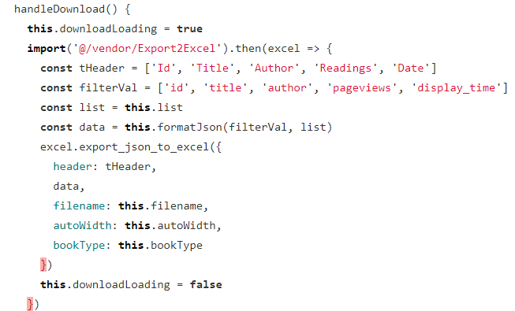

# 封装一个通用的工具栏

**`目标`**：封装一个通用的工具栏供大家使用

## 通用工具栏的组件结构

> 在后续的业务开发中，经常会用到一个类似下图的工具栏，作为公共组件，进行一下封装


（1）基本结构：组件 **`src/components/PageTools/index.vue`**

```jsx
<template>
  <div class="page-tools">
    <el-card>
      <el-row type="flex" justify="space-between" align="center">
        <!-- 左侧 -->
        <div class="left">
          <div class="tips">
            <i class="el-icon-info" />
            <span>本月: 社保在缴 公积金在缴</span>
          </div>
        </div>
        <div class="right">
          <!-- 右侧 -->
          <el-button type="primary" size="small">历史归档</el-button>
          <el-button type="primary" size="small">导出</el-button>
        </div>
      </el-row>
    </el-card>
  </div>
</template>

<script>
export default {
  name: "PageTools"
}
</script>

<style lang="scss" scoped>
.page-tools {
  .tips {
    line-height: 34px;
    padding: 0px 15px;
    border-radius: 5px;
    border: 1px solid rgba(145, 213, 255, 1);
    background: rgba(230, 247, 255, 1);
    i {
      margin-right: 10px;
      color: #409eff;
    }
  }
}
</style>

```

（2）`main.js`统一注册

```jsx
import PageTools from '@/components/PageTools'
Vue.component('PageTools', PageTools)
```

（3）基本渲染`src/employees`

```jsx
<template>
  <div class="dashboard-container">
    <div class="app-container">
      <page-tools />
    </div>
  </div>
</template>
```

## 插槽处理

> 左侧和左侧的内容目前都是写死的，应该有插槽动态控制

（1）使用左右两个插槽

```jsx
<template>
  <div class="page-tools">
    <el-card>
      <el-row type="flex" justify="space-between" align="center">
        <!-- 左侧 -->
        <div class="left">
          <div class="tips">
            <i class="el-icon-info" />
            <slot name="tips" />
          </div>
        </div>
        <div class="right">
          <!-- 右侧 -->
          <slot />
        </div>
      </el-row>
    </el-card>
  </div>
</template>
```

（2）左侧插槽可以为空，如果为空，则不显示左侧内容

```jsx
<div v-if="$slots.tips" class="tips">
```

（3）使用pageTools组件

```jsx
<page-tools>
  <el-button type="primary" size="small">导入</el-button>
  <el-button type="primary" size="small" icon="el-icon-plus">新增员工</el-button>
</page-tools>
```

## 插件机制优化全局注册

如果希望在所有页面都要用, 那么就要全局注册组件   组件 

```jsx
import PageTools from '@/components/PageTools'
Vue.component('PageTools', PageTools)
```

但是, 如果有很多个组件, 都要全局注册, 那么又会在main.js 中写很多内容

`思考`: 我们能在所有组件中, 使用 element-ui 的组件,  他是让我们一个个去全局注册的嘛 ?  (它让我们 Vue.use 一下即可)

---

`目标`: 利用 `Vue.use` 统一全局注册组件

文档:  https://cn.vuejs.org/v2/api/#Vue-use

说明:  

1. Vue.use 可以接收一个对象, Vue.use(obj)  
2. 对象中需要提供一个 install 函数
3. install 函数可以拿到参数 Vue, 且将来会在 Vue.use 时, 自动调用该 install 函数

---

提供统一注册的入口文件 **`src/componets/index.js`**

```js
// 该文件负责所有的公共组件的全局注册
// vue插件机制: Vue.use
import PageTools from './PageTools'

export default {
  install(Vue) {
    Vue.component('PageTools', PageTools)
  }
}

```

在入口处进行注册 **`src/main.js`** Vue.use 注册使用自己的插件模块

```js
import Components from './components'
Vue.use(Components)
```

# 员工列表展示

**`目标`**：实现员工列表页面的基本布局和结构


## 基本结构

**结构代码** **`src/employees/index.vue`**

```jsx
<template>
  <div class="dashboard-container">
    <div class="app-container">
      <PageTools>
        <el-button type="primary" size="small">历史归档</el-button>
        <el-button type="primary" size="small">导出</el-button>
      </PageTools>
      <el-card>
        <el-table border>
          <el-table-column label="序号" sortable />
          <el-table-column label="姓名" sortable />
          <el-table-column label="工号" sortable />
          <el-table-column label="聘用形式" sortable />
          <el-table-column label="部门" sortable />
          <el-table-column label="入职时间" sortable />
          <el-table-column label="账户状态" sortable />
          <el-table-column label="操作" sortable width="280">
            <template>
              <el-button type="text" size="small">查看</el-button>
              <el-button type="text" size="small">转正</el-button>
              <el-button type="text" size="small">调岗</el-button>
              <el-button type="text" size="small">离职</el-button>
              <el-button type="text" size="small">角色</el-button>
              <el-button type="text" size="small">删除</el-button>
            </template>
          </el-table-column>
        </el-table>
        <!-- 分页 -->
      </el-card>
    </div>
  </div>
</template>

<script>
export default {
  name: 'Employees'
}
</script>

<style>

</style>

```

## 列表渲染与分页

（1）封装员工的加载请求 **`src/api/employees.js`**

```jsx

/**
 * 获取员工列表
 * @param {*} page
 * @param {*} size
 */
export function getEmployeeList(page = 1, size = 10) {
  return request({
    method: 'get',
    url: '/sys/user',
    params: {
      page,
      size
    }
  })
}
```

（2）实现加载数据和分页的逻辑

```js
export default {
  name: 'Employees',
  data() {
    return {
      // 员工列表
      list: [],
      total: 0,
      page: 1,
      size: 10
    }
  },
  created() {
    this.getEmployees()
  },
  methods: {
    async getEmployees() {
      const { rows, total } = await getEmployeeList(this.page, this.size)
      this.list = rows
      this.total = total
      console.log(this.list)
    }
  }
}
```

（3）列表渲染

```vue
<el-table border :data="list">
  <el-table-column
    label="序号"
    type="index"
    width="100"
    align="center"
  />
  <el-table-column label="姓名" prop="username" align="center" />
  <el-table-column
    label="工号"
    prop="workNumber"
    align="center"
    sortable
  />
  <el-table-column
    label="聘用形式"
    prop="formOfEmployment"
    sortable
    align="center"
  />
  <el-table-column
    label="部门"
    prop="departmentName"
    align="center"
  />
  <el-table-column
    label="入职时间"
    prop="timeOfEntry"
    align="center"
    sortable
  />
  <el-table-column
    label="账户状态"
    prop="enableState"
    align="center"
  />
  <el-table-column label="操作" sortable width="280">
    <template>
      <el-button type="text" size="small">查看</el-button>
      <el-button type="text" size="small">转正</el-button>
      <el-button type="text" size="small">调岗</el-button>
      <el-button type="text" size="small">离职</el-button>
      <el-button type="text" size="small">角色</el-button>
      <el-button type="text" size="small">删除</el-button>
    </template>
  </el-table-column>
</el-table>
```

（4）注册分页事件

```jsx
handleCurrentChange(value) {
  this.page = value
  this.getEmployeeList()
}
```

（5）添加loading效果

```jsx
<el-table v-loading="loading" border :data="list">

data() {
  return {
		// ...
    loading: false
  }
},

async getEmployeeList() {
  this.loading = true
  const { total, rows } = await getEmployeeList(this.page, this.size)
  this.total = total
  this.list = rows
  this.loading = false
},
```

## 聘用形式格式化

那么聘用形式中**1**代表什么含义，这实际上是我们需要的枚举数据，这类数据是开发过程中预先和后端定义好的一系列常量。

该数据的存放文件位于我们提供的**`资源/枚举`**中，可以将枚举下的文件夹放于**`src/api`**文件夹下

针对**聘用形式**，可以使用**el-table-column**的**formatter**属性进行设置

（1）导入枚举数据

```jsx
import Employees from '@/api/constant/employees'
```

（2）给聘用形式提供`formatter属性`

```jsx
<el-table-column
  label="聘用形式"
  sortable
  prop="formOfEmployment"
  :formatter="formatEmployment"
/>
```

（3）提供格式化函数

```jsx
formatEmployment(row, column, cellValue, index) {
  const obj = Employees.hireType.find(item => item.id === cellValue)
  return obj ? obj.value : ''
}
```

## 入职时间格式化

针对入职时间，我们可以采用**作用域插槽**进行处理

```vue
<el-table-column
  label="入职时间"
  prop="timeOfEntry"
  align="center"
  sortable
>
  <template v-slot="{row}">
    {{ row.timeOfEntry | dateFilter }}
  </template>
</el-table-column>
```

在**`components/index.js`插件中将工具方法转化成过滤器， 需要安装moment的依赖包

```js
import moment from 'moment'

// 定义全局的过滤器
Vue.filter('dateFilter', (value) => {
  return moment(value).format('YYYY-MM-DD')
})
```


## 账户状态格式化

对于账户状态，我们可以采用**作用域插槽**进行处理

```jsx
<el-table-column
  label="账户状态"
  prop="enableState"
  align="center"
>
  <template v-slot="{row}">
    <el-switch
      v-model="row.enableState"
      active-color="#13ce66"
      inactive-color="#ff4949"
      :active-value="1"
      :inactive-value="0"
    />
  </template>
</el-table-column>
```


# 删除员工功能

**`目标`**实现删除员工的功能

（1）封装 删除员工的请求

```js
/**
 * 删除员工接口
 * ****/

export function delEmployee(id) {
  return request({
    url: `/sys/user/${id}`,
    method: 'delete'
  })
}
```

（2）注册点击事件

```vue
<el-table-column align="center" label="操作" sortable width="280">
  <template v-slot="{ row }">
    <el-button type="text" size="small">查看</el-button>
    <el-button type="text" size="small">转正</el-button>
    <el-button type="text" size="small">调岗</el-button>
    <el-button type="text" size="small">离职</el-button>
    <el-button type="text" size="small">角色</el-button>
    <el-button type="text" size="small" @click="del(row.id)">删除</el-button>
  </template>
</el-table-column>
```

（3）删除功能实现

```jsx
async del(id) {
  try {
    await this.$confirm('你确定要删除该员工吗', '温馨提示', {
      type: 'warning'
    })
  } catch {
    return
  }
  await delEmployee(id)
  // 提示
  this.$message.success('删除成功')
  // 考虑如果就剩一条
  if (this.list.length === 1 && this.page > 1) {
    this.page--
  }
  this.getEmployees()
}
```

# 新增员工功能

**`目标`**：实现新增员工的功能

## 基本结构

> 当我们点击新增员工时，我们需要一个类似的弹层


（1）新建一个添加员工的组件 **`src/views/employees/components/AddEmployee.vue`**

```vue
<template>
  <el-dialog title="新增员工" :visible="true" width="40%">
    <!-- 表单 -->
    <el-form label-width="120px">
      <el-form-item label="姓名">
        <el-input placeholder="请输入姓名" />
      </el-form-item>
      <el-form-item label="手机">
        <el-input placeholder="请输入手机号" />
      </el-form-item>
      <el-form-item label="入职时间">
        <el-date-picker placeholder="请选择入职时间" />
      </el-form-item>
      <el-form-item label="聘用形式">
        <el-select placeholder="请选择" />
      </el-form-item>
      <el-form-item label="工号">
        <el-input placeholder="请输入工号" />
      </el-form-item>
      <el-form-item label="部门">
        <el-input placeholder="请选择部门" />
      </el-form-item>
      <el-form-item label="转正时间">
        <el-date-picker placeholder="请选择转正时间" />
      </el-form-item>
    </el-form>
    <!-- footer插槽 -->
    <template v-slot:footer>
      <el-row type="flex" justify="center">
        <el-button size="small">取消</el-button>
        <el-button type="primary" size="small">确定</el-button>
      </el-row>
    </template>
  </el-dialog>
</template>

<script>
export default {

}
</script>

<style>

</style>


```

（2）渲染添加员工组件

父组件中引用并且渲染弹出层

```jsx
import AddEmployee from './components/add-employee'
components: {
  AddEmployee
},
  

<!-- 放置新增组件 -->
<add-employee />
```

## 控制弹出层的显示隐藏

（1）父组件`employee`组件提供状态，用于控制对话框显示隐藏

```jsx
data() {
  return {
    // ...
    showDialog: false
  }
},
```

（2）父传子传给子组件`add-employee`组件

```jsx
<add-employee :show-dialog.sync="showDialog" />
```

（3）子组件接收,并且渲染

```jsx
props: {
  showDialog: {
    type: Boolean,
    default: false
  }
},
  
<el-dialog
  title="新增员工"
  :visible="showDialog"
  width="40%"
  @close="close"
>
```

（5）点击添加员工的时候，显示对话框

```jsx
<el-button
  type="primary"
  size="small"
  icon="el-icon-plus"
  @click="showDialog = true"
>新增员工</el-button>
```

（6）关闭对话框

```jsx
// 注册close事件
<el-dialog
  title="新增员工"
  :visible="showDialog"
  width="40%"
  @close="close"
>

<!-- 给取消注册点击事件 -->
<el-button size="small" @click="closeDialog">取消</el-button>
  
methods: {
  close() {
    this.$emit('update:showDialog', false)
  }
}
```

## 新增员工的表单校验

（1）根据接口文档，在data中提供数据

```js
data() {
  return {
    form: {
      username: '',
      mobile: '',
      formOfEmployment: '',
      workNumber: '',
      departmentName: '',
      timeOfEntry: '',
      correctionTime: ''
    }
  }
},
```

（2）给表单绑定数据和校验

```vue
<!-- 表单 -->
<el-form label-width="120px" :model="form" :rules="rules">
  <el-form-item label="姓名" prop="username">
    <el-input v-model="form.username" placeholder="请输入姓名" />
  </el-form-item>
  <el-form-item label="手机" prop="mobile">
    <el-input v-model="form.mobile" placeholder="请输入手机号" />
  </el-form-item>
  <el-form-item label="入职时间" prop="timeOfEntry">
    <el-date-picker v-model="form.timeOfEntry" placeholder="请选择入职时间" />
  </el-form-item>
  <el-form-item label="聘用形式" prop="formOfEmployment">
    <el-select v-model="form.formOfEmployment" placeholder="请选择" />
  </el-form-item>
  <el-form-item label="工号" prop="workNumber">
    <el-input v-model="form.workNumber" placeholder="请输入工号" />
  </el-form-item>
  <el-form-item label="部门" prop="departmentName">
    <el-input v-model="form.departmentName" placeholder="请选择部门" />
  </el-form-item>
  <el-form-item label="转正时间" prop="correctionTime">
    <el-date-picker v-model="form.correctionTime" placeholder="请选择转正时间" />
  </el-form-item>
</el-form>
```

（4）提供校验规则

```jsx
rules: {
    username: [
      { required: true, message: '用户姓名不能为空', trigger: ['blur', 'change'] },
      { pattern: /^[\u4e00-\u9fa5]{2,4}$/, message: '用户姓名为2-4位', trigger: ['blur', 'change'] }
    ],
    mobile: [
      { required: true, message: '手机号不能为空', trigger: ['blur', 'change'] },
      { pattern: /^1[3-9]\d{9}$/, message: '手机号格式不正确', trigger: ['blur', 'change'] }
    ],
    formOfEmployment: [
      { required: true, message: '聘用形式不能为空', trigger: ['blur', 'change'] }
    ],
    workNumber: [
      { required: true, message: '工号不能为空', trigger: ['blur', 'change'] }
    ],
    departmentName: [
      { required: true, message: '部门不能为空', trigger: ['blur', 'change'] }
    ],
    timeOfEntry: [
      { required: true, message: '请选择入职时间', trigger: ['blur', 'change'] }
    ]
  }
}
```

## 聘用形式的处理

> 聘用形式的数据直接从常量中获取即可,不需要发送请求

（1）从`/api/constant/employees`中导入员工相关的常量

```jsx
import Employees from '@/api/constant/employees'
```

（2）在data中提供聘用形式数据，**只有data中的数据才能在模板中渲染**

```jsx
data() {
  return {
    hireType: Employees.hireType,
    ...
  }
}
```

（3）动态渲染

```jsx
<el-select v-model="form.formOfEmployment" placeholder="请选择">
  <el-option
    v-for="item in hireType"
    :key="item.id"
    :label="item.value"
    :value="item.id"
  />
</el-select>
```

## 部门数据处理

### 获取部门数据，转化为树形

> 获取部门数据之前已经封装过了，需要重复封装该接口

（1）导入获取部门数据的接口

```jsx
import { getDepartmentList } from '@/api/departments'
```

（2）给输入框注册聚焦事件，获取焦点时，实时获取部门数据

```jsx
<el-input
  v-model="form.departmentName"
  placeholder="请选择部门"
  @focus="getDepartmentList"
/>
```

（3）发送请求，获取数据

```jsx
async getDepartmentList() {
  const data = await getDepartmentList()
  console.log(data)
}
```

（4）将部门数据转换成树形数据

```jsx
import { listToTree } from '@/utils'

async getDepartmentList() {
  const data = await getDepartmentList()
  this.depts = listToTree(data.depts)
  console.log(this.depts)
}

data() {
    depts: []
  }
},
```

### 级联菜单的使用

（1）将input框修改成级联菜单

```jsx
<el-cascader
  v-model="form.departmentName"
  placeholder="请选择部门"
  :options="depts"
  :props="defaultProps"
  @focus="getDepartmentList"
/>
```

（2）通过props属性指定需要显示的标题和选中的值

```jsx
defaultProps: {
  label: 'name',
  value: 'name',
  expandTrigger: 'hover'
}
```

## 新增员工功能

（1）**封装新增员工**api **`src/api/employees.js`**

```js
/** **
 *  新增员工的接口
 * **/
export function addEmployee(data) {
  return request({
    method: 'post',
    url: '/sys/user',
    data
  })
}

```

（2）调用接口，添加员工

```jsx
<el-button type="primary" size="small" @click="addEmployee">确定</el-button>

async addEmployee() {
  try {
    await this.$refs.form.validate()
  } catch {
    return false
  }
  await addEmployee({
    ...this.form,
    departmentName: this.form.departmentName[this.form.departmentName.length - 1]
  })
  this.$message.success('添加成功')
  // 通知父组件重新渲染
  this.$emit('updateEmplyees')
  this.$emit('update:dialog-visible', false)
}


父组件
<AddEmployee :show-dialog.sync="showDialog" @updateEmplyees="updateEmplyees" />
 
updateEmplyees() {
  this.total++
  this.page = Math.ceil(this.total / this.size)
  this.getEmployees()
},
```

（3）取消时重置表单

```jsx
closeDialog() {
  this.$emit('update:dialog-visible', false)
  this.$refs.form.resetFields()
},
```

# 员工excel导入功能

## 新建公共的导入页面

> 当点击导入excel的时候，会跳转到一个独立的页面，进行导入功能的实现

（1）建立公共导入的页面路由,  **`src/views/import/index.vue`**

```
<template>
  <div>导入页面</div>
</template>

<script>
export default {
  name: 'Import'
}
</script>

<style>

</style>

```

（2）挂载路由** **`src/router/index.js`**

```js
{
  path: '/import',
  component: Layout,
  children: [{
    path: '',
    name: 'import',
    component: () => import('@/views/import'),
    hidden: true
  }]
},
```

（3）点击导入excel进行跳转

```jsx
<el-button
  type="warning"
  size="small"
  @click="$router.push('/import')"
>导入</el-button>
```

## 通用的导入组件封装


vue-element-admin已经提供了excel的导入和导出功能，我们只需要改造即可[参考地址](https://panjiachen.github.io/vue-element-admin/#/excel/upload-excel)

（1）**`src/components/UploadExcel`**提供一个通用组件，内容复制vue-element-admin的[代码地址](https://github.com/PanJiaChen/vue-element-admin/blob/master/src/components/UploadExcel/index.vue)

（2）excel导入功能需要使用npm包**`xlsx`**，所以需要安装**`xlsx`**插件

```jsx
$ npm i xlsx
```

（3）注册全局的导入excel组件

```js
// vue插件机制: Vue.use
import PageTools from './PageTools'
import UploadExcel from './UploadExcel'
export default {
  install(Vue) {
    // 全局注册组件
    Vue.component('PageTools', PageTools)
    Vue.component('UploadExcel', UploadExcel)
  }
}
```

（4）在`import`组件中使用，[参考代码]()

```jsx
<template>
  <div class="app-container">
    <upload-excel :on-success="handleSuccess" :before-upload="beforeUpload" />
    <el-table :data="tableData" border highlight-current-row style="width: 100%;margin-top:20px;">
      <el-table-column v-for="item of tableHeader" :key="item" :prop="item" :label="item" />
    </el-table>
  </div>
</template>

<script>
export default {
  name: 'Import',
  data() {
    return {
      tableData: [],
      tableHeader: []
    }
  },
  methods: {
    beforeUpload(file) {
      const isLt1M = file.size / 1024 / 1024 < 1
      if (isLt1M) {
        return true
      }
      this.$message({
        message: 'Please do not upload files larger than 1m in size.',
        type: 'warning'
      })
      return false
    },
    handleSuccess({ results, header }) {
      this.tableData = results
      this.tableHeader = header
    }
  }
}
</script>
```

> 至此，虽然我们不知道excel导入具体是如何实现的，但是我们已经能够将excel表格导入成我们需要的数据，后续只需要发送请求将数据发送到服务器即可。

## excel导入功能-数据格式处理

将读取到的excel数据处理成接口需要的数据结构

```jsx
handleSuccess({ results, header }) {
  console.log('results', results)
  console.log('header', header)
  const userRelations = {
    '入职日期': 'timeOfEntry',
    '手机号': 'mobile',
    '姓名': 'username',
    '转正日期': 'correctionTime',
    '工号': 'workNumber',
    '聘用形式': 'formOfEmployment'
  }
  // 发送请求
  const arr = results.map(item => {
    const obj = {}
    Object.keys(item).forEach(k => {
      obj[userRelations[k]] = item[k]
    })
    return obj
  })
  console.log(arr)
}
```

## excel导入功能-日期格式处理

当excel中有日期格式的时候，实际转化的值为一个数字，我们需要一个方法进行转化 (已准备好)

https://blog.csdn.net/qq_39270735/article/details/102970769

```jsx
formatDate(numb, format) {
  const time = new Date((numb - 1) * 24 * 3600000 + 1)
  time.setYear(time.getFullYear() - 70)
  const year = time.getFullYear() + ''
  const month = time.getMonth() + 1 + ''
  const date = time.getDate() + ''
  if (format && format.length === 1) {
    return year + format + (month < 10 ? '0' + month : month) + format + (date < 10 ? '0' + date : date)
  }
  return year + (month < 10 ? '0' + month : month) + (date < 10 ? '0' + date : date)
}
```

处理日期

```jsx
handleSuccess({ results, header }) {
    const userRelations = {
      '入职日期': 'timeOfEntry',
      '手机号': 'mobile',
      '姓名': 'username',
      '转正日期': 'correctionTime',
      '工号': 'workNumber'
    }
    const arr = results.map(item => {
      const obj = {}
      for (const key in item) {
        if (['入职日期', '转正日期'].includes(key)) {
          obj[userRelations[key]] = this.formatDate(item[key], '-')
        } else {
          obj[userRelations[key]] = item[key]
        }
      }
      return obj
    })
    console.log(arr)
  }

}
```

## excel导入功能-完成

（1）封装请求

```jsx
/** *
 * 封装一个导入员工的接口
 * ***/
export function importEmployee(data) {
  return request({
      url: '/sys/user/batch',
    method: 'post',
    data
  })
}
```

（2）发送请求，导入数据

==注意：如果手机号或者工号重复，会导入失败，因此推荐修改一下导入的excel数据==

```jsx
import { importEmployee } from '@/api/employees'

async handleSuccess({ results, header }) {
  const userRelations = {
    '入职日期': 'timeOfEntry',
    '手机号': 'mobile',
    '姓名': 'username',
    '转正日期': 'correctionTime',
    '工号': 'workNumber',
    '聘用形式': 'formOfEmployment'
  }
  const arr = results.map(item => {
    const obj = {}
    for (const key in item) {
      if (['入职日期', '转正日期'].includes(key)) {
        obj[userRelations[key]] = this.formatDate(item[key], '-')
      } else {
        obj[userRelations[key]] = item[key]
      }
    }
    return obj
  })
  await importEmployee(arr)
  this.$message.success('导入成功')
  this.$router.back()
}
```

## excel导入优化-type属性

> 为了让这个页面可以服务更多的导入功能，我们可以在页面中用参数来判断，是否是导入员工

（1）跳转时传入type属性

```jsx
<el-button
  type="warning"
  size="small"
  @click="$router.push('/import?type=employee')"
>导入</el-button>
```

（2）增加计算属性

```jsx
computed: {
  type() {
    return this.$route.query.type
  }
},
```

（3）添加判断(18511249258)

```jsx
async handleSuccess({ header, results }) {
  if (this.type === 'employee') {
    ...
  }
},
```

## 拓展：excel导入定制与源码解析


+ 从点击按钮开始, 分析代码, 这里点击按钮, 触发了input:file 的click事件, 进行了上传

+ 样式修改

```jsx
<template>
  <div class="upload-excel">
    <div class="btn-upload">
      <el-button
        :loading="loading"
        style="margin-left:16px;"
        size="mini"
        type="primary"
        @click="handleUpload"
      >
        点击上传
      </el-button>
    </div>
    <input
      ref="excel-upload-input"
      class="excel-upload-input"
      type="file"
      accept=".xlsx, .xls"
      @change="handleClick"
    >
    <div
      class="drop"
      @drop="handleDrop"
      @dragover="handleDragover"
      @dragenter="handleDragover"
    >
      <i class="el-icon-upload" />
      <span>将文件拖到此处</span>
    </div>

  </div>
</template>

<script>
import XLSX from 'xlsx'
export default {
  props: {
    beforeUpload: Function, // eslint-disable-line
    onSuccess: Function// eslint-disable-line
  },
  data() {
    return {
      loading: false,
      excelData: {
        header: null,
        results: null
      }
    }
  },
  methods: {
    generateData({ header, results }) {
      this.excelData.header = header
      this.excelData.results = results
      this.onSuccess && this.onSuccess(this.excelData)
    },
    handleDrop(e) {
      e.stopPropagation()
      e.preventDefault()
      if (this.loading) return
      const files = e.dataTransfer.files
      if (files.length !== 1) {
        this.$message.error('Only support uploading one file!')
        return
      }
      const rawFile = files[0] // only use files[0]
      if (!this.isExcel(rawFile)) {
        this.$message.error('Only supports upload .xlsx, .xls, .csv suffix files')
        return false
      }
      this.upload(rawFile)
      e.stopPropagation()
      e.preventDefault()
    },
    handleDragover(e) {
      e.stopPropagation()
      e.preventDefault()
      e.dataTransfer.dropEffect = 'copy'
    },
    handleUpload() {
      this.$refs['excel-upload-input'].click()
    },
    handleClick(e) {
      const files = e.target.files
      const rawFile = files[0] // only use files[0]
      if (!rawFile) return
      this.upload(rawFile)
    },
    upload(rawFile) {
      this.$refs['excel-upload-input'].value = null // fix can't select the same excel
      if (!this.beforeUpload) {
        this.readerData(rawFile)
        return
      }
      const before = this.beforeUpload(rawFile)
      if (before) {
        this.readerData(rawFile)
      }
    },
    readerData(rawFile) {
      this.loading = true
      return new Promise((resolve, reject) => {
        const reader = new FileReader()
        reader.onload = e => {
          const data = e.target.result
          const workbook = XLSX.read(data, { type: 'array' })
          const firstSheetName = workbook.SheetNames[0]
          const worksheet = workbook.Sheets[firstSheetName]
          const header = this.getHeaderRow(worksheet)
          const results = XLSX.utils.sheet_to_json(worksheet)
          this.generateData({ header, results })
          this.loading = false
          resolve()
        }
        reader.readAsArrayBuffer(rawFile)
      })
    },
    getHeaderRow(sheet) {
      const headers = []
      const range = XLSX.utils.decode_range(sheet['!ref'])
      let C
      const R = range.s.r
      /* start in the first row */
      for (C = range.s.c; C <= range.e.c; ++C) { /* walk every column in the range */
        const cell = sheet[XLSX.utils.encode_cell({ c: C, r: R })]
        /* find the cell in the first row */
        let hdr = 'UNKNOWN ' + C // <-- replace with your desired default
        if (cell && cell.t) hdr = XLSX.utils.format_cell(cell)
        headers.push(hdr)
      }
      return headers
    },
    isExcel(file) {
      return /\.(xlsx|xls|csv)$/.test(file.name)
    }
  }
}
</script>

<style scoped lang="scss">
.upload-excel {
  display: flex;
  justify-content: center;
  margin-top: 100px;
  .excel-upload-input {
    display: none;
    z-index: -9999;
  }
  .btn-upload,
  .drop {
    border: 1px dashed #bbb;
    width: 350px;
    height: 160px;
    text-align: center;
    line-height: 160px;
  }
  .drop {
    padding-top: 20px;
    line-height: 80px;
    color: #bbb;
    i {
      font-size: 60px;
      display: block;
    }
  }
}
</style>

```


# 员工excel导出功能

## 功能分析

> 对于excel导出功能，我们只需要参照vue-element-admin进行实现即可。

[参考代码](https://github.com/PanJiaChen/vue-element-admin/blob/master/src/views/excel/export-excel.vue)




## 导出功能-基本实现

（1）拷贝vue-element-admin项目中的`@/vendor/Export2Excel.js`文件到项目中

（2）安装依赖包

```jsx
yarn add file-saver
```

（3）给导出按钮注册点击事件

```jsx
<el-button
  type="danger"
  size="small"
  @click="exportExcel"
>导出</el-button>
```

（4）导出代码

```jsx
exportExcel() {
    this.downloadLoading = true
    // 异步导入的目的：提高性能，只要用到导出功能的时候，才会去加载导出的js
    import('@/vendor/Export2Excel').then(excel => {
      const tHeader = ['用户名', '性别', '工资']
      const data = [
        ['张三', '男', 20000],
        ['李四', '男', 20000],
        ['王五', '女', 10000],
        ['赵六', '男', 20000]
      ]
      excel.export_json_to_excel({
        // 表头
        header: tHeader,
        // 数据
        data,
        // 文件名
        filename: 'test',
        // 自动宽度
        autoWidth: true,
        // 后缀名
        bookType: 'xlsx'
      })
      this.downloadLoading = false
    })
  }
}
```

### excel导出参数的介绍

> vue-element-admin提供了导出的功能模块，在课程资源/excel导出目录下，放置到src目录下

**参数**

| 参数      | 说明                   | 类型    | 可选值                                                       | 默认值     |
| --------- | ---------------------- | ------- | ------------------------------------------------------------ | ---------- |
| header    | 导出数据的表头         | Array   | /                                                            | []         |
| data      | 导出的具体数据         | Array   | /                                                            | [[]]       |
| filename  | 导出文件名             | String  | /                                                            | excel-list |
| autoWidth | 单元格是否要自适应宽度 | Boolean | true / false                                                 | true       |
| bookType  | 导出文件类型           | String  | xlsx, csv, txt, [more](https://github.com/SheetJS/js-xlsx#supported-output-formats) | xlsx       |

## 处理导出的数据格式

> 1. 需要获取所有的员工数据
> 2. 处理员工数据的格式，符合导出的数据格式

（1）获取所有员工数据

```jsx
import('@/vendor/Export2Excel').then(async excel => {
  const { rows } = await getEmployeeList(1, this.total)
  console.log(rows)
}
```

（2）因为数据中的key是英文，想要导出的表头是中文的话，需要将中文和英文做对应

```js
const headers = {
  '手机号': 'mobile',
  '姓名': 'username',
  '入职日期': 'timeOfEntry',
  '聘用形式': 'formOfEmployment',
  '转正日期': 'correctionTime',
  '工号': 'workNumber',
  '部门': 'departmentName'
}
```

（3）处理header和data

```jsx
exportExcel() {
  const headers = {
    '手机号': 'mobile',
    '姓名': 'username',
    '入职日期': 'timeOfEntry',
    '聘用形式': 'formOfEmployment',
    '转正日期': 'correctionTime',
    '工号': 'workNumber',
    '部门': 'departmentName'
  }
  this.downloadLoading = true
  // 异步导入的目的：提高性能，只要用到导出功能的时候，才会去加载导出的js
  import('@/vendor/Export2Excel').then(async excel => {
    const { rows } = await getEmployeeList({
      page: 1,
      size: this.total
    })
    console.log(rows)
    const tHeader = Object.keys(headers)
    const data = rows.map(item => {
      return tHeader.map(v => {
        return item[headers[v]]
      })
    })
    console.log(data)
    excel.export_json_to_excel({
    // 表头
      header: tHeader,
      // 数据
      data,
      // 文件名
      filename: 'test',
      // 自动宽度
      autoWidth: true,
      // 后缀名
      bookType: 'xlsx'
    })
    this.downloadLoading = false
  })
}
```

### 导出时间格式和聘用形式的处理

```js
const data = rows.map(item => {
  return tHeader.map(v => {
    // 判断类型
    if (v === '入职日期' || v === '转正日期') {
      return formatDate(item[headers[v]])
    } else if (v === '聘用形式') {
      const result = EmployeeEnum.hireType.find(obj => obj.id === item[headers[v]])
      return result ? result.value : ''
    } else {
      return item[headers[v]]
    }
  })
})
```

完整代码

```jsx
handleDownload() {
  import('@/vendor/Export2Excel').then(async excel => {
    // 先发送请求，获取所有的员工的数据
    const { rows } = await getEmployeeList(1, this.total)
    const headers = {
      '姓名': 'username',
      '手机号': 'mobile',
      '入职日期': 'timeOfEntry',
      '聘用形式': 'formOfEmployment',
      '转正日期': 'correctionTime',
      '工号': 'workNumber',
      '部门': 'departmentName'
    }
    // ['姓名', '年龄', '成绩']
    /*
      [
        ['张三', 18, 100],
      ]
    */
    // 1. 处理表头
    const tHeader = Object.keys(headers)
    // 2. 处理data数据
    const data = rows.map(item => {
      return tHeader.map(k => {
        const value = item[headers[k]]
        // 如果value没有值，不管是什么，都不需要处理
        if (!value) return value
        // 如果value有值，判断是否是日期或者是聘用形式
        if (k === '入职日期' || k === '转正日期') {
          return formatTime(value)
        }
        if (k === '聘用形式') {
          return EmployeesEnum.hireType.find(v => v.id === value).value
        }
        return value
      })
    })
    // console.log(data)
    excel.export_json_to_excel({
      header: tHeader,
      data,
      filename: '员工',
      autoWidth: true,
      bookType: 'xlsx'
    })
  })
}
```


## 复杂表头的导出-扩展

> 当需要导出复杂表头的时候，vue-element-admin同样支持该类操作

**vue-element-admin** 提供的导出方法中有 **multiHeader**和**merges** 的参数

| 参数        | 说明           | 类型  | 可选值 | 默认值 |
| ----------- | -------------- | ----- | ------ | ------ |
| multiHeader | 复杂表头的部分 | Array | /      | [[]]   |
| merges      | 需要合并的部分 | Array | /      | []     |

multiHeader里面是一个二维数组，里面的一个元素是一行表头，假设你想得到一个如图的结构


mutiHeader应该这样定义

```js
const multiHeader = [['姓名', '主要信息', '', '', '', '', '部门']]
```

multiHeader中的一行表头中的字段的个数需要和真正的列数相等，假设想要跨列，多余的空间需要定义成空串

它主要对应的是标准的表头

```js
const header = ['姓名', '手机号', '入职日期', '聘用形式', '转正日期', '工号', '部门']
```

如果，我们要实现其合并的效果， 需要设定merges选项

```js
 const merges = ['A1:A2', 'B1:F1', 'G1:G2']
```

merges的顺序是没关系的，只要配置这两个属性，就可以导出复杂表头的excel了

```js
  exportData() {
      const headers = {
        '姓名': 'username',
        '手机号': 'mobile',
        '入职日期': 'timeOfEntry',
        '聘用形式': 'formOfEmployment',
        '转正日期': 'correctionTime',
        '工号': 'workNumber',
        '部门': 'departmentName'
      }
      // 导出excel
      import('@/vendor/Export2Excel').then(async excel => {
        //  excel是引入文件的导出对象
        // 导出  header从哪里来
        // data从哪里来
        // 现在没有一个接口获取所有的数据
        // 获取员工的接口 页码 每页条数    100   1 10000
        const { rows } = await getEmployeeList({ page: 1, size: this.page.total })
        const data = this.formatJson(headers, rows) // 返回的data就是 要导出的结构
        const multiHeader = [['姓名', '主要信息', '', '', '', '', '部门']]
        const merges = ['A1:A2', 'B1:F1', 'G1:G2']
        excel.export_json_to_excel({
          header: Object.keys(headers),
          data,
          filename: '员工资料表',
          multiHeader, // 复杂表头
          merges // 合并选项
        })

        // excel.export_json_to_excel({
        //   header: ['姓名', '工资'],
        //   data: [['张三', 3000], ['李四', 5000]],
        //   filename: '员工工资表'
        // })
        // [{ username: '张三',mobile: 13112345678 }]  => [[]]
        // 要转化 数据结构 还要和表头的顺序对应上
        // 要求转出的标题是中文
      })
    },
    // 将表头数据和数据进行对应
    // [{}]  =>   [[]]
    formatJson(headers, rows) {
      return rows.map(item => {
        // item是一个对象  { mobile: 132111,username: '张三'  }
        // ["手机号", "姓名", "入职日期" 。。]
        return Object.keys(headers).map(key => {
          // 需要判断 字段
          if (headers[key] === 'timeOfEntry' || headers[key] === 'correctionTime') {
            // 格式化日期
            return formatDate(item[headers[key]])
          } else if (headers[key] === 'formOfEmployment') {
            const obj = EmployeeEnum.hireType.find(obj => obj.id === item[headers[key]])
            return obj ? obj.value : '未知'
          }
          return item[headers[key]]
        })
        // ["132", '张三’， ‘’，‘’，‘’d]
      })
      // return rows.map(item => Object.keys(headers).map(key => item[headers[key]]))
      // 需要处理时间格式问题
    }
```

**提交代码**

**`本节任务`**实现将员工数据导出功能

