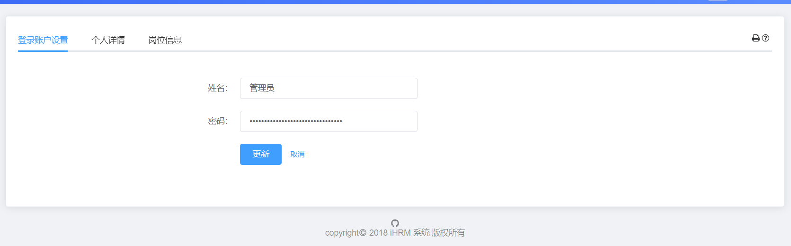
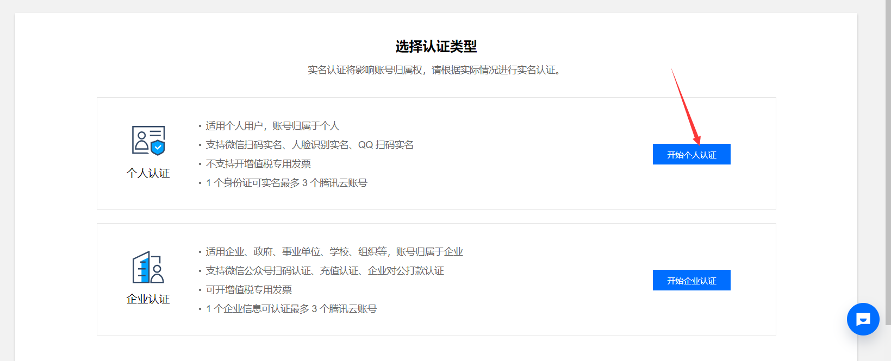
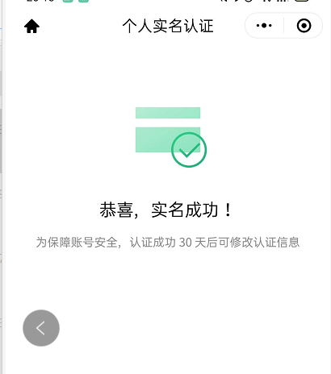
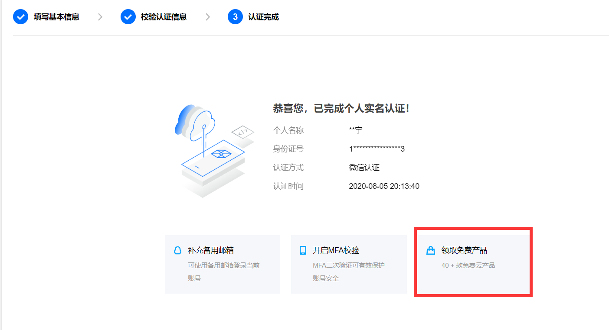
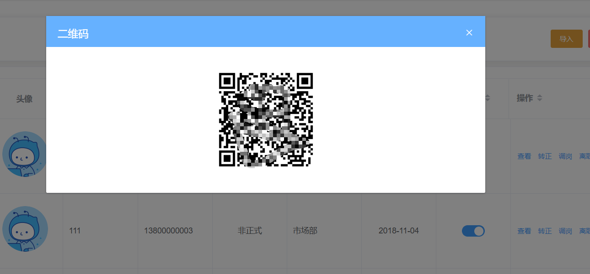
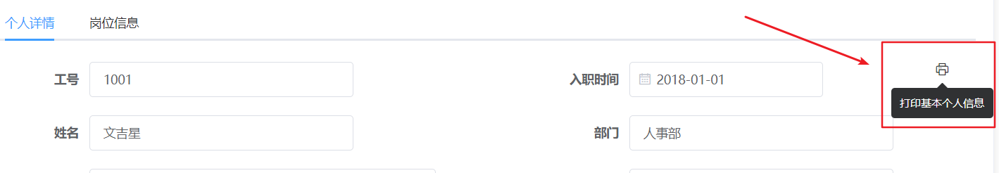
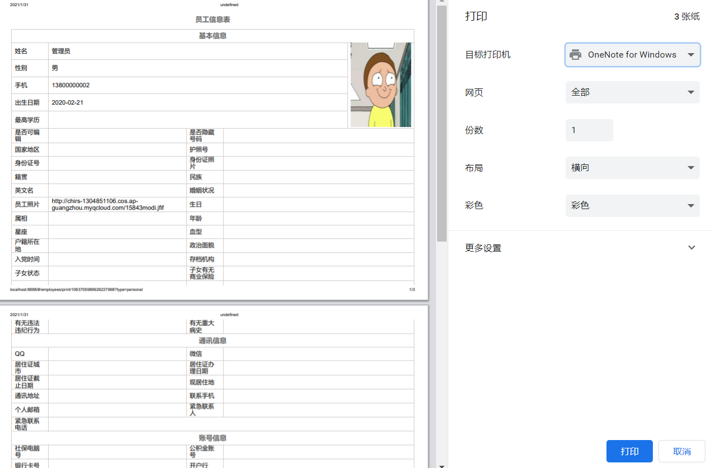

# 登录账户设置

## 布局和路由



（1）新建组件`employee/detail.vue`

```jsx
<template>
  <div class="dashboard-container">
    <div class="app-container">
      员工详情
    </div>
  </div>
</template>

<script>
export default {

}
</script>

<style>

</style>

```

（2）配置路由规则

```js
export default {
  path: '/employees',
  component: Layout,
  children: [
    {
      name: 'employees',
      path: '',
      component: () => import('@/views/employees'),
      meta: {
        title: '员工',
        icon: 'people'
      }
    },
    {
      path: 'detail/:id', // query传参 动态路由传参
      component: () => import('@/views/employees/detail'),
      hidden: true, // 不在左侧菜单显示
    }
  ]
}
```

（3）点击查看按钮跳转

```jsx
<el-button
  type="text"
  size="small"
  @click="$router.push(`/employees/detail/${row.id}`)"
>查看</el-button>
```

（4）基本结构

```vue
<div class="dashboard-container">
    <div class="app-container">
      <el-card>
        <el-tabs>
          <el-tab-pane label="登录账户设置">
            <!-- 放置表单 -->
            <el-form label-width="120px" style="margin-left: 120px; margin-top:30px">
              <el-form-item label="姓名:">
                <el-input style="width:300px" />
              </el-form-item>
              <el-form-item label="密码:">
                <el-input style="width:300px" type="password" />
              </el-form-item>
              <el-form-item>
                <el-button type="primary">更新</el-button>
              </el-form-item>
            </el-form>
          </el-tab-pane>
          <el-tab-pane label="个人详情" />
          <el-tab-pane label="岗位信息" />
        </el-tabs>
      </el-card>
    </div>
  </div>
```

## 修改用户信息-数据回显

（1）发送请求，回显用户数据加载个人基本信息，该接口已经在之前提供过了 **`src/api/user.js`**

```jsx
import { getUserDetailById } from '@/api/user'

export default {
  data() {
    return {
      userId: this.$route.params.id,
      userInfo: {
        username: '',
        password: ''
      }
    }
  },
  created() {
    this.getUserDetailById()
  },
  methods: {
    async getUserDetailById() {
      this.userInfo = await getUserDetailById(this.userId)
    }
  }
}
```

（2）数据双向绑定，回显数据

```jsx
<el-input v-model="userInfo.username" style="width:300px" />
<el-input v-model="userInfo.password" style="width:300px" type="password" />
```

问题：我们发现回显的密码是不对的，这是因为我们获取的密码是后端的密文。后端是不会存储明文密码的，因此密码回显没有什么意义，我们只需要提供新密码用于修改即可。

（3）提供newPassword数据与密码框进行绑定

```jsx
data() {
  return {
    userId: this.$route.params.id,
    userInfo: {
      username: '',
      newPassword: ''
    }
  }
},
  
<el-input v-model="userInfo.newPassword" style="width:300px" type="password" />
```

## 修改用户信息-表单校验

```jsx
<!-- 放置表单 -->
<el-form
  label-width="120px"
  style="margin-left: 120px; margin-top:30px"
  :rules="rules"
  :model="userInfo"
>
  <el-form-item label="姓名:" prop="username">
    <el-input v-model="userInfo.username" style="width:300px" />
  </el-form-item>
  <el-form-item label="密码:" prop="newPassword">
    <el-input v-model="userInfo.newPassword" style="width:300px" type="password" />
  </el-form-item>
  <el-form-item>
    <el-button type="primary">更新</el-button>
  </el-form-item>
</el-form>


rules: {
  username: [
    { required: true, message: '姓名不能为空', trigger: ['change', 'blur'] }
  ],
  newPassword: [
    { required: true, message: '密码不能为空', trigger: ['blur'] },
    { min: 6, max: 9, message: '密码长度6-9位', trigger: ['change', 'blur'] }
  ]
}
```

## 修改用户信息-完成

(1)封装接口 保存个人基本信息**  **`src/api/employees.js`**

```js
/** *
 *
 * 保存员工的基本信息
 * **/
export function saveUserDetailById(data) {
  return request({
    url: `/sys/user/${data.id}`,
    method: 'put',
    data
  })
}

```

（2）发送请求

```jsx
async update() {
  try {
    await this.$refs.form.validate()
  } catch {
    return false
  }
  await saveUserDetailById({
    username: this.userInfo.username,
    password: this.userInfo.newPassword,
    id: this.userId
  })
  this.$message.success('修改用户信息成功')
}
```

# 个人详情设置

## 封装个人信息组件

> 我们将员工个人信息分为三部分，账户，个人， 岗位，这个小节我们对个人组件和岗位组件进行封装


**封装个人组件**   **`src/views/employees/components/UserInfo.vue`**

```vue
<template>
  <div class="user-info">
    <!-- 个人信息 -->
    <el-form label-width="220px">
      <!-- 工号 入职时间 -->
      <el-row class="inline-info">
        <el-col :span="12">
          <el-form-item label="工号">
            <el-input v-model="userInfo.workNumber" class="inputW" />
          </el-form-item>
        </el-col>
        <el-col :span="12">
          <el-form-item label="入职时间">
            <el-date-picker
              v-model="userInfo.timeOfEntry"
              type="date"
              class="inputW"
            />
          </el-form-item>
        </el-col>
      </el-row>
      <!-- 姓名 部门 -->
      <el-row class="inline-info">
        <el-col :span="12">
          <el-form-item label="姓名">
            <el-input v-model="userInfo.username" class="inputW" />
          </el-form-item>
        </el-col>
        <el-col :span="12">
          <el-form-item label="部门">
            <el-input v-model="userInfo.departmentName" class="inputW" />
          </el-form-item>
        </el-col>
      </el-row>
      <!--手机 聘用形式  -->
      <el-row class="inline-info">
        <el-col :span="12">
          <el-form-item label="手机">
            <el-input v-model="userInfo.mobile" />
          </el-form-item>
        </el-col>
        <el-col :span="12">
          <el-form-item label="聘用形式">
            <el-select v-model="userInfo.formOfEmployment" class="inputW">
              <el-option
                v-for="item in EmployeeEnum.hireType"
                :key="item.id"
                :label="item.value"
                :value="item.id"
              />
            </el-select>
          </el-form-item>
        </el-col>
      </el-row>
      <!-- 员工照片 -->
      <el-row class="inline-info">
        <el-col :span="12">
          <el-form-item label="员工头像">
            <!-- 放置上传图片 -->

          </el-form-item>
        </el-col>
      </el-row>
      <!-- 保存个人信息 -->
      <el-row class="inline-info" type="flex" justify="center">
        <el-col :span="12">
          <el-button type="primary" @click="saveUser">保存更新</el-button>
          <el-button @click="$router.back()">返回</el-button>

        </el-col>
      </el-row>
    </el-form>
    <!-- 基础信息 -->
    <el-form label-width="220px">
      <div class="block">
        <div class="title">个人详细信息</div>
        <hr>
        <el-form-item label="最高学历">
          <el-select v-model="formData.theHighestDegreeOfEducation" class="inputW2">
            <el-option
              v-for="item in EmployeeEnum.highestDegree"
              :key="item.value"
              :label="item.label"
              :value="item.value"
            />
          </el-select>
        </el-form-item>
        <!-- 个人头像 -->
        <!-- 员工照片 -->

        <el-form-item label="员工照片">
          <!-- 放置上传图片 -->
        </el-form-item>
        <el-form-item label="国家/地区">
          <el-select v-model="formData.nationalArea" class="inputW2">
            <el-option
              v-for="item in EmployeeEnum.isOverseas"
              :key="item.value"
              :label="item.label"
              :value="item.value"
            />
          </el-select>
        </el-form-item>
        <el-form-item label="护照号">
          <el-input v-model="formData.passportNo" placeholder="正规护照格式" class="inputW" />
        </el-form-item>
        <el-form-item label="身份证号">
          <el-input v-model="formData.idNumber" placeholder="正规身份证格式" class="inputW" />
        </el-form-item>
        <el-form-item label="籍贯">
          <el-input v-model="formData.nativePlace" placeholder="籍贯地址" class="inputW5" />
        </el-form-item>
        <el-form-item label="民族">
          <el-input v-model="formData.nation" placeholder="请输入民族" class="inputW2" />
        </el-form-item>
        <el-form-item label="婚姻状况">
          <el-select v-model="formData.maritalStatus" class="inputW2">
            <el-option
              v-for="item in EmployeeEnum.maritaStatus"
              :key="item.value"
              :label="item.label"
              :value="item.value"
            />
          </el-select>
        </el-form-item>
        <el-form-item label="生日">
          <el-input v-model="formData.birthday" placeholder="示例 0323" class="inputW" />
        </el-form-item>
        <el-form-item label="年龄">
          <el-input v-model="formData.age" type="number" class="inputW2" />
        </el-form-item>
        <el-form-item label="星座">
          <el-select v-model="formData.constellation" class="inputW2">
            <el-option
              v-for="item in EmployeeEnum.constellation"
              :key="item.value"
              :label="item.label"
              :value="item.value"
            />
          </el-select>
        </el-form-item>
        <el-form-item label="血型">
          <el-select v-model="formData.bloodType" class="inputW2">
            <el-option
              v-for="item in EmployeeEnum.bloodType"
              :key="item.value"
              :label="item.label"
              :value="item.value"
            />
          </el-select>
        </el-form-item>
        <el-form-item label="户籍所在地">
          <el-input v-model="formData.domicile" class="inputW5" />
        </el-form-item>
        <el-form-item label="政治面貌">
          <el-input v-model="formData.politicalOutlook" class="inputW2" />
        </el-form-item>
        <el-form-item label="入党时间">
          <el-date-picker
            v-model="formData.timeToJoinTheParty"
            type="date"
            placeholder="选择日期"
            class="inputW"
          />
        </el-form-item>
        <el-form-item label="存档机构">
          <el-input v-model="formData.archivingOrganization" placeholder="请输入" />
        </el-form-item>
        <el-form-item label="子女状态">
          <el-input v-model="formData.stateOfChildren" placeholder="请输入" />
        </el-form-item>
        <el-form-item label="子女有无商业险">
          <el-radio-group v-model="formData.doChildrenHaveCommercialInsurance">
            <el-radio label="1">有</el-radio>
            <el-radio label="2">无</el-radio>
          </el-radio-group>
        </el-form-item>
        <el-form-item label="有无违法违纪状态">
          <el-input v-model="formData.isThereAnyViolationOfLawOrDiscipline" placeholder="请输入" />
        </el-form-item>
        <el-form-item label="有无重大病史">
          <el-input v-model="formData.areThereAnyMajorMedicalHistories" placeholder="请输入" />
        </el-form-item>
      </div>
      <!-- 通讯信息 -->
      <div class="block">
        <div class="title">通讯信息</div>
        <el-form-item label="QQ">
          <el-input v-model="formData.qq" placeholder="请输入" class="inputW" />
        </el-form-item>
        <el-form-item label="微信">
          <el-input v-model="formData.wechat" placeholder="请输入" class="inputW" />
        </el-form-item>
        <el-form-item label="现居住地">
          <el-input v-model="formData.placeOfResidence" placeholder="请输入" />
        </el-form-item>
        <el-form-item label="通讯地址">
          <el-input v-model="formData.postalAddress" placeholder="请输入" />
        </el-form-item>
        <el-form-item label="联系手机">
          <el-input v-model="formData.contactTheMobilePhone" placeholder="11位字符" maxlength="11" class="inputW" @change.native="handlePhone(2)" />
        </el-form-item>
        <el-form-item label="个人邮箱">
          <el-input v-model="formData.personalMailbox" placeholder="请输入" type="mail" class="inputW" />
        </el-form-item>
        <el-form-item label="紧急联系人">
          <el-input v-model="formData.emergencyContact" placeholder="请输入" class="inputW" />
        </el-form-item>
        <el-form-item label="紧急联系电话">
          <el-input v-model="formData.emergencyContactNumber" placeholder="11位字符" class="inputW" />
        </el-form-item>
      </div>
      <!-- 账号信息 -->
      <div class="block">
        <div class="title">账号信息</div>
        <el-form-item label="社保电脑号">
          <el-input v-model="formData.socialSecurityComputerNumber" placeholder="请输入" class="inputW" />
        </el-form-item>
        <el-form-item label="公积金账号">
          <el-input v-model="formData.providentFundAccount" placeholder="请输入" class="inputW" />
        </el-form-item>
        <el-form-item label="银行卡号">
          <el-input v-model="formData.bankCardNumber" placeholder="请输入" class="inputW" />
        </el-form-item>
        <el-form-item label="开户行">
          <el-input v-model="formData.openingBank" placeholder="请输入" class="inputW" />
        </el-form-item>
      </div>
      <!-- 教育信息 -->
      <div class="block">
        <div class="title">教育信息</div>
        <el-form-item label="学历类型">
          <el-select v-model="formData.educationalType" placeholder="请选择">
            <el-option
              v-for="item in EmployeeEnum.educationType"
              :key="item.value"
              :label="item.label"
              :value="item.value"
            />
          </el-select>
        </el-form-item>
        <el-form-item label="毕业学校">
          <el-input v-model="formData.graduateSchool" placeholder="请输入" class="inputW2" />
        </el-form-item>
        <el-form-item label="入学时间">
          <el-date-picker v-model="formData.enrolmentTime" type="data" placeholder="请输入时间" class="inputW" />
        </el-form-item>
        <el-form-item label="毕业时间">
          <el-date-picker v-model="formData.graduationTime" type="data" placeholder="请输入时间" class="inputW" />
        </el-form-item>
        <el-form-item label="专业">
          <el-input v-model="formData.major" placeholder="请输入" class="inputW" />
        </el-form-item>
      </div>
      <!-- 从业信息 -->
      <div class="block">
        <div class="title">从业信息</div>
        <el-form-item label="上家公司">
          <el-input v-model="formData.homeCompany" placeholder="请输入" class="inputW" />
        </el-form-item>
        <el-form-item label="职称">
          <el-input v-model="formData.title" placeholder="请输入" class="inputW" />
        </el-form-item>
        <el-form-item label="有无竞业限制">
          <el-input v-model="formData.isThereAnyCompetitionRestriction" placeholder="请输入" style="width:80%" />
        </el-form-item>
        <el-form-item label="备注">
          <el-input v-model="formData.remarks" type="textarea" placeholder="请输入备注" style="width:80%" />
        </el-form-item>
        <!-- 保存员工信息 -->
        <el-row class="inline-info" type="flex" justify="center">
          <el-col :span="12">
            <el-button type="primary" @click="savePersonal">保存更新</el-button>
            <el-button @click="$router.back()">返回</el-button>
          </el-col>
        </el-row>
      </div>
    </el-form>

  </div>

</template>
```

> 本章节个人数据过于**`繁杂，庞大`**，同学们在开发期间，拷贝代码即可，我们只写关键部位的代码

**定义user-info的数据**

```js
import EmployeeEnum from '@/api/constant/employees'

export default {
  data() {
    return {
      userId: this.$route.params.id,
      EmployeeEnum, // 员工枚举数据
      userInfo: {},
      formData: {
        userId: '',
        username: '', // 用户名
        sex: '', // 性别
        mobile: '', // 手机
        companyId: '', // 公司id
        departmentName: '', // 部门名称
        //  onTheJobStatus: '', // 在职状态 no
        dateOfBirth: '', // 出生日期
        timeOfEntry: '', // 入职时间
        theHighestDegreeOfEducation: '', // 最高学历
        nationalArea: '', // 国家
        passportNo: '', // 护照号
        idNumber: '', // 身份证号
        idCardPhotoPositive: '', // 身份证照正
        idCardPhotoBack: '', // 身份证照正
        nativePlace: '', // 籍贯
        nation: '', // 民族
        englishName: '', // 英文名字
        maritalStatus: '', // 婚姻状况
        staffPhoto: '', // 员工照片
        birthday: '', // 生日
        zodiac: '', // 属相
        age: '', // 年龄
        constellation: '', // 星座
        bloodType: '', // 血型
        domicile: '', // 户籍所在地
        politicalOutlook: '', // 政治面貌
        timeToJoinTheParty: '', // 入党时间
        archivingOrganization: '', // 存档机构
        stateOfChildren: '', // 子女状态
        doChildrenHaveCommercialInsurance: '1', // 保险状态
        isThereAnyViolationOfLawOrDiscipline: '', // 违法违纪状态
        areThereAnyMajorMedicalHistories: '', // 重大病史
        qq: '', // QQ
        wechat: '', // 微信
        residenceCardCity: '', // 居住证城市
        dateOfResidencePermit: '', // 居住证办理日期
        residencePermitDeadline: '', // 居住证截止日期
        placeOfResidence: '', // 现居住地
        postalAddress: '', // 通讯地址
        contactTheMobilePhone: '', // 联系手机
        personalMailbox: '', // 个人邮箱
        emergencyContact: '', // 紧急联系人
        emergencyContactNumber: '', // 紧急联系电话
        socialSecurityComputerNumber: '', // 社保电脑号
        providentFundAccount: '', // 公积金账号
        bankCardNumber: '', // 银行卡号
        openingBank: '', // 开户行
        educationalType: '', // 学历类型
        graduateSchool: '', // 毕业学校
        enrolmentTime: '', // 入学时间
        graduationTime: '', // 毕业时间
        major: '', // 专业
        graduationCertificate: '', // 毕业证书
        certificateOfAcademicDegree: '', // 学位证书
        homeCompany: '', // 上家公司
        title: '', // 职称
        resume: '', // 简历
        isThereAnyCompetitionRestriction: '', // 有无竞业限制
        proofOfDepartureOfFormerCompany: '', // 前公司离职证明
        remarks: '' // 备注
      }
    }
  }
}
```

**在detail.vue组件中，注册并使用**

```jsx
import UserInfo from './components/UserInfo';


<el-tab-pane label="个人详情">
  <user-info />
</el-tab-pane>
```

## 封装岗位组件

同理，封装岗位组件

**封装岗位组件**  **`src/views/employee/components/JobInfo.vue`**

```vue
<template>
  <div class="job-info">
    <!-- 基础信息 -->
    <el-form label-width="220px">
      <div class="block">
        <div class="title">基础信息</div>
        <el-form-item label="岗位">
          <el-input v-model="formData.post" placeholder="请输入" class="inputW" />
        </el-form-item>
        <!-- <el-form-item label="转正日期">
          <el-date-picker
            v-model="formData.dateOfCorrection"
            type="date"
            placeholder="选择日期"

          />
        </el-form-item> -->
        <el-form-item label="转正状态">
          <el-select v-model="formData.stateOfCorrection" placeholder="请选择" disabled>
            <el-option
              v-for="item in EmployeeEnum.stateOfCorrection"
              :key="item.value"
              :value="item.value"
            />
          </el-select>
        </el-form-item>
        <el-form-item label="职级">
          <el-input v-model="formData.rank" class="inputW" />
        </el-form-item>
        <el-form-item label="转正评价">
          <el-input v-model="formData.correctionEvaluation" type="textarea" placeholder="1-300位字符" />
        </el-form-item>
        <el-form-item label="汇报对象">
          <el-select v-model="formData.reportId" filterable placeholder="请选择" class="inputW">
            <el-option v-for="item in depts" :key="item.id" :label="item.username" :value="item.id" />
          </el-select>
        </el-form-item>
        <el-form-item label="HRBP">
          <el-select v-model="formData.hrbp" filterable placeholder="请选择" class="inputW">
            <el-option v-for="item in depts" :key="item.id" :label="item.username" :value="item.id" class="inputW" />
          </el-select>
        </el-form-item>
        <el-form-item class="formInfo" label="调整司龄(天)：">
          <el-input v-model="formData.adjustmentAgedays" type="number" placeholder="请输入" class="inputW" />
        </el-form-item>
        <el-form-item label="首次参加工作时间">
          <el-date-picker
            v-model="formData.workingTimeForTheFirstTime"
            type="date"
            placeholder="选择日期"
          />
        </el-form-item>
        <el-form-item label="调整工龄">
          <el-input v-model="formData.adjustmentOfLengthOfService" placeholder="0.00年" class="inputW" disabled />
        </el-form-item>
      </div>
      <!-- 合同信息 -->
      <div class="block">
        <div class="title">合同信息</div>
        <el-form-item class="formInfo" label="首次合同开始时间：">
          <el-date-picker
            v-model="formData.initialContractStartTime"
            type="date"
            placeholder="选择日期"
          />
        </el-form-item>
        <el-form-item label="首次合同结束时间">
          <el-date-picker
            v-model="formData.firstContractTerminationTime"
            type="date"
            placeholder="选择日期"
          />
        </el-form-item>
        <el-form-item label="现合同开始时间">
          <el-date-picker
            v-model="formData.currentContractStartTime"
            type="date"
            placeholder="选择日期"
          />
        </el-form-item>
        <el-form-item label="现合同结束时间">
          <el-date-picker
            v-model="formData.closingTimeOfCurrentContract	"
            type="date"
            placeholder="选择日期"
          />
        </el-form-item>
        <el-form-item label="合同期限">
          <el-select v-model="formData.contractPeriod" class="filter-item">
            <el-option
              v-for="item in EmployeeEnum.contractPeriod"
              :key="item.value"
              :label="item.label"
              :value="item.value"
            />
          </el-select>
        </el-form-item>
        <el-form-item label="续签次数">
          <el-select v-model="formData.renewalNumber" class="filter-item">
            <el-option
              v-for="item in EmployeeEnum.renewalCount"
              :key="item.id"
              :label="item.value"
              :value="item.id"
            />
          </el-select>
        </el-form-item>
      </div>
      <!-- 招聘信息 -->
      <div class="block">
        <div class="title">招聘信息</div>
        <el-form-item label="其他招聘渠道">
          <el-select v-model="formData.otherRecruitmentChannels" placeholder="请选择">
            <el-option
              v-for="item in EmployeeEnum.resumeSource"
              :key="item.id"
              :label="item.value"
              :value="item.value"
            />
          </el-select>
        </el-form-item>
        <el-form-item label="招聘渠道">
          <el-select v-model="formData.recruitmentChannels" placeholder="请选择">
            <el-option
              v-for="item in EmployeeEnum.resumeSource"
              :key="item.value"
              :label="item.label"
              :value="item.value"
            />
          </el-select>
        </el-form-item>
        <el-form-item label="社招/校招">
          <el-select v-model="formData.socialRecruitment" placeholder="请选择">
            <el-option
              v-for="item in EmployeeEnum.hireSourceType"
              :key="item.value"
              :label="item.label"
              :value="item.value"
            />
          </el-select>
        </el-form-item>
        <el-form-item label="推荐企业/人">
          <el-input v-model="formData.recommenderBusinessPeople" placeholder="请输入" class="infoPosition inputW" />
        </el-form-item>
      </div>
      <!-- 从业信息 -->
      <el-form-item>
        <el-button type="primary" @click="saveJob">保存更新</el-button>
        <el-button @click="$router.back()">返回</el-button>
      </el-form-item>
    </el-form>
  </div>

</template>
```

**定义岗位数据**

```js
import EmployeeEnum from '@/api/constant/employees'

export default {
  data() {
    return {
      userId: this.$route.params.id,
      depts: [],
      EmployeeEnum,
      formData: {
        adjustmentAgedays: '', // 调整司龄天
        adjustmentOfLengthOfService: '', // 调整工龄天
        closingTimeOfCurrentContract: '', // 现合同结束时间
        companyId: '', // 公司ID
        contractDocuments: '', // 合同文件
        contractPeriod: '', // 合同期限
        correctionEvaluation: '', //  转正评价
        currentContractStartTime: '', // 现合同开始时间
        firstContractTerminationTime: '', // 首次合同结束时间
        hrbp: '', // HRBP
        initialContractStartTime: '', // 首次合同开始时间
        otherRecruitmentChannels: '', // 其他招聘渠道
        post: '', // 岗位
        rank: null, // 职级
        recommenderBusinessPeople: '', // 推荐企业人
        recruitmentChannels: '', // 招聘渠道
        renewalNumber: '', // 续签次数
        reportId: '', // 汇报对象
        reportName: null, // 汇报对象
        socialRecruitment: '', // 社招校招
        stateOfCorrection: '', // 转正状态
        taxableCity: '', // 纳税城市
        userId: '', // 员工ID
        workMailbox: '', // 工作邮箱
        workingCity: '', // 工作城市
        workingTimeForTheFirstTime: '' // 首次参加工作时间
      }
    }
  }
}
```

**在detail.vue组件中，注册并使用**

```jsx
import JobInfo from './components/job-info'

components: {
  UserInfo,
  JobInfo
},

<el-tab-pane label="岗位信息">
  <job-info />
</el-tab-pane>
```

**`本节任务`**：完成个人组件和岗位组件封装

## 个人信息和岗位信息设置

### 个人信息-上半部分设置

> 个人信息上半部分，不用新的接口，还是使用登录账户设置的两个接口就行了

（1）数据回显

```jsx
import { getUserDetailById } from '@/api/user'

created() {
  this.getUserDetailById()
},
methods: {
  async getUserDetailById() {
    this.userInfo = await getUserDetailById(this.userId)
  }
}
```

（2）保存个人信息

```jsx
<el-button type="primary" @click="saveUser">保存更新</el-button>

async saveUser() {
  await saveUserDetailById(this.userInfo)
  this.$message.success('修改成功')
}
```

### 个人信息-下半部分设置

（1）封装接口

```jsx
/** *
 *  读取用户详情的基础信息
 * **/
export function getPersonalDetail(id) {
  return request({
    url: `/employees/${id}/personalInfo`
  })
}

/** *
 *  更新用户详情的基础信息
 * **/
export function updatePersonal(data) {
  return request({
    url: `/employees/${data.userId}/personalInfo`,
    method: 'put',
    data
  })
}
```

（2）数据回显

```jsx
import { saveUserDetailById, getPersonalDetail, updatePersonal } from '@/api/employees'

created() {
	this.getUserDetailById()
	this.getPersonalDetail()
},
  
async getPersonalDetail() {
  this.formData = await getPersonalDetail(this.userId) // 获取员工数据
}
```

（3）修改个人信息

```jsx
import { saveUserDetailById, getPersonalDetail, updatePersonal } from '@/api/employees'

<el-button type="primary" @click="savePersonal">保存更新</el-button>

async savePersonal() {
  await updatePersonal({ ...this.formData, id: this.userId })
  this.$message.success('保存成功')
}
```

### 岗位信息设置

（1）封装接口

```jsx
/** **
 * 获取用户的岗位信息
 *
 * ****/
export function getJobDetail(id) {
  return request({
    url: `/employees/${id}/jobs`
  })
}


/**
 * 保存岗位信息
 * ****/
export function updateJob(data) {
  return request({
    url: `/employees/${data.userId}/jobs`,
    method: 'put',
    data
  })
}
```

（2）数据回显

```js
import { getJobDetail } from '@/api/employees'

created() {
  this.getJobDetail()
}

methods: {
  async getJobDetail() {
    this.formData = await getJobDetail(this.userId)
  }
}
```

（3）汇报对象处理

```jsx
import { getEmployeeSimple } from '@/api/employees'

created() {
  this.getEmployeeSimple()
}

methods: {
  // 获取员工列表
  async getEmployeeSimple() {
    this.depts = await getEmployeeSimple()
  }
}
```

（4）修改岗位信息

```jsx
<el-button type="primary" @click="saveJob">保存更新</el-button>

import { updateJob } from '@/api/employees'

methods: {
  // 保存岗位信息
  async saveJob() {
    await updateJob(this.formData)
    this.$message.success('保存岗位信息成功')
  }
}  
```

# 上传组件封装

## 配置腾讯云Cos  

**`目标`**： 配置一个腾讯云cos

### 注册账号

> 由于上课的开发的特殊性，我们不希望把所有的图片都上传到我们自己的官方服务器上，这里我们可以采用一个腾讯云的图片方案


> 上边图的意思就是说，我们找一个可以免费上传图片的服务器，帮我们**`代管图片`**，我们在自己的数据库里只保存一个地址就行， 这其实也是很多项目的处理方案，会有一个**`公共的文件服务器`**

第一步，我们必须先拥有一个[腾迅云](https://cloud.tencent.com/login?s_url=https%3A%2F%2Fconsole.cloud.tencent.com%2F)的开发者账号(**小心腾讯云的广告电话**)

> 请按照腾讯云的注册方式，注册自己的账号

第二步，实名认证

> 选择个人账户 



**填写个人身份信息**


下一步，扫描二维码授权


**手机端授权**




点击**领取免费产品**



**选择对象存储COS**


> 我们免费拥有**`6个月的50G流量`**的对象存储空间使用权限，足够我们上传用户头像的使用了

**点击0元试用，开通服务**


### 创建存储桶

到这一步，账号的部分就操作完毕，接下来，我们需要来创建一个存储图片的存储桶

登录 [对象存储控制台](https://console.cloud.tencent.com/cos5) ，[创建存储桶](https://cloud.tencent.com/document/product/436/13309)。设置存储桶的权限为 **`公有读，私有写`**


设置cors规则


AllowHeader 需配成`*`，如下图所示。


> 因为我们本身没有域名，所以这里设置成**`*`**，仅限于测试，正式环境的话，这里需要配置真实的域名地址

到这里，我们的腾讯云存储桶就设置好了。 

### 上传图片

**初始化cos对象参数**

| 名称      | 描述                                                         |
| :-------- | :----------------------------------------------------------- |
| SecretId  | 开发者拥有的项目身份识别 ID，用以身份认证，可在 [API 密钥管理](https://console.cloud.tencent.com/capi) 页面获取 |
| SecretKey | 开发者拥有的项目身份密钥，可在 [API 密钥管理](https://console.cloud.tencent.com/capi) 页面获取 |

> 注意，上述的参数我们在本次开发过程中，直接将参数放置在前端代码中存储，但是腾讯云本身是不建议这么做的，因为**`敏感信息`**放在前端很容易被捕获，由于我们本次是测试研发，所以这个过程可以忽略
>
> 正确的做法应该是，通过网站调用接口换取敏感信息

[相关文档](https://cloud.tencent.com/document/product/436/11459)

实例化 上传sdk

```js
SecretId： AKIDvdOzNe2P00qTvGS6IMKC1sc8NQTVuH5i
SecretKey：DsIWgjrBNOYgMZbU7rgJBXnJgpmX5oTa
var cos = new COS({
    SecretId: 'COS_SECRETID', // 身份识别 ID
    SecretKey: 'COS_SECRETKEY', // 身份密钥
});
```


```jsx
created() {
  // SECRETID 和 SECRETKEY请登录 https://console.cloud.tencent.com/cam/capi 进行查看和管理
  this.cos = new COS({
    SecretId: 'AKIDvdOzNe2P00qTvGS6IMKC1sc8NQTVuH5i',
    SecretKey: 'DsIWgjrBNOYgMZbU7rgJBXnJgpmX5oTa'
  })
},
methods: {
  change(e) {
    const file = e.target.files[0]
    console.log(file)
    this.cos.putObject({
      // 存储桶名称
      Bucket: 'hr-88-1256173530', /* 必须 */
      Region: 'ap-shanghai', /* 存储桶所在地域，必须字段 */
      Key: uuid() + file.name, /* 必须 */
      StorageClass: 'STANDARD',
      Body: file, // 上传文件对象
      onProgress: function(progressData) {
        console.log(JSON.stringify(progressData))
      }
    }, function(err, data) {
      console.log(err || data)
    })
  }
}
```

## 需求分析

该组件需要满足什么要求呢？

1. 可以显示传入的图片地址
2. 可以删除传入的图片地址
3. 可以上传图片到云服务器
4. 上传到腾讯云之后，可以返回图片地址，显示  
5. 上传成功之后，可以回调成功函数

## 基本结构

**`目标`**实现上传组件的代码部分

（1）新建上传图片组件 **`src/components/ImageUpload/index.vue`**

```jsx
<template>
  <div>上传组件</div>
</template>

<script>
export default {

}
</script>

<style>

</style>

```

（2）全局注册  `src/components/index.js`

```jsx
import ImageUpload from './ImageUpload'

install(Vue) {
  // 全局注册组件
  Vue.component('ImageUpload', ImageUpload)
}
```

（3）在`dashboard`中测试使用

```
<image-upload />
```

（4）基本结构

> 上传组件，我们可以沿用element的el-upload组件

```vue
<template>
  <el-upload class="avatar-uploader">
    
    <i v-else class="el-icon-plus avatar-uploader-icon" />
  </el-upload>
</template>

<script>
export default {
  name: 'ImageUpload',
  data() {
    return {
      // imageUrl: 'https://fuss10.elemecdn.com/3/63/4e7f3a15429bfda99bce42a18cdd1jpeg.jpeg?imageMogr2/thumbnail/360x360/format/webp/quality/100'
      imgUrl: ''
    }
  }
}
</script>

<style lang="scss" scoped>
.avatar-uploader {
  ::v-deep {
    .el-upload {
      border: 1px dashed #d9d9d9;
      border-radius: 6px;
      cursor: pointer;
      position: relative;
      overflow: hidden;
    }
    .el-upload:hover {
      border-color: #409EFF;
    }
  }
  .avatar-uploader-icon {
    font-size: 28px;
    color: #8c939d;
    width: 178px;
    height: 178px;
    line-height: 178px;
    text-align: center;
  }
  .avatar {
    width: 178px;
    height: 178px;
    display: block;
  }
}
</style>

```

## 自定义上传功能

+ 必填属性： action, 如果传了，组件会自动上传图片，，，不适合
+ http-request, 如果传了，覆盖默认的自动上传，变成手动上传图片

```jsx
<template>
  <el-upload
    class="avatar-uploader"
    action=""
    :http-request="upload"
  >
    
    <i v-else class="el-icon-plus avatar-uploader-icon" />
  </el-upload>
</template>
```

## 图片上传逻辑

+ 在http-request中使用腾讯云上传图片

```jsx
import COS from 'cos-js-sdk-v5'
import uuid from 'uuid-v4'


created() {
  this.cos = new COS({
    SecretId: 'AKIDvdOzNe2P00qTvGS6IMKC1sc8NQTVuH5i',
    SecretKey: 'DsIWgjrBNOYgMZbU7rgJBXnJgpmX5oTa'
  })
},

methods: {
  upload({ file }) {
    console.log('自定义上传', file)
    this.cos.putObject({
      Bucket: 'hr-88-1256173530', /* 必须 */
      Region: 'ap-shanghai', /* 存储桶所在地域，必须字段 */
      Key: uuid() + '.' + file.name.split('.')[1], /* 必须,上传的文件的名字 */
      StorageClass: 'STANDARD',
      Body: file // 上传文件对象
    }, (err, data) => {
      if (err) return console.log(err)
      console.log('上传成功', data.Location)
      this.imageUrl = 'https://' + data.Location
    })
  }
}
```

## 上传之前检查

> 控制上传图片的类型和上传大小， 如果不满足条件 返回false上传就会停止

```js
beforeUpload(file) {
  // console.log(file)
  if (!['image/png', 'image/jpeg'].includes(file.type)) {
    this.$message.error('图片只能是jpg或者png格式')
    return false
  }
  if (file.size / 1024 / 1024 >= 1) {
    this.$message.error('图片不能超过1MB')
    return false
  }
  return true
}
```

## 上传组件-父子组件通讯

+ 父组件提供url属性，传递给子组件

```jsx
<ImageUpload :url.sync="url" />
```

+ 子组件接收url并且展示，，，上传成功，通知父组件修改

```jsx
<template>
  <el-upload
    class="avatar-uploader"
    action=""
    :http-request="upload"
    :show-file-list="false"
    :before-upload="beforeUpload"
  >
    
    <i v-else class="el-icon-plus avatar-uploader-icon" />
  </el-upload>
</template>

<script>
import COS from 'cos-js-sdk-v5'
import uuid from 'uuid-v4'
export default {
  name: 'ImageUpload',
  // data() {
  //   return {
  //     // imageUrl: 'https://fuss10.elemecdn.com/3/63/4e7f3a15429bfda99bce42a18cdd1jpeg.jpeg?imageMogr2/thumbnail/360x360/format/webp/quality/100'
  //     imageUrl: ''
  //   }
  // },
  props: {
    url: {
      type: String,
      default: ''
    }
  },
  created() {
    this.cos = new COS({
      SecretId: 'AKIDvdOzNe2P00qTvGS6IMKC1sc8NQTVuH5i',
      SecretKey: 'DsIWgjrBNOYgMZbU7rgJBXnJgpmX5oTa'
    })
  },
  methods: {
    upload({ file }) {
      // console.log('自定义上传', file)
      this.cos.putObject({
        Bucket: 'hr-88-1256173530', /* 必须 */
        Region: 'ap-shanghai', /* 存储桶所在地域，必须字段 */
        Key: uuid() + '.' + file.name.split('.')[1], /* 必须,上传的文件的名字 */
        StorageClass: 'STANDARD',
        Body: file // 上传文件对象
      }, (err, data) => {
        if (err) return console.log(err)
        // console.log('上传成功', data.Location)
        // this.imageUrl = 'https://' + data.Location
        this.$emit('update:url', 'https://' + data.Location)
      })
    },
    beforeUpload(file) {
      // console.log(file)
      if (!['image/png', 'image/jpeg'].includes(file.type)) {
        this.$message.error('图片只能是jpg或者png格式')
        return false
      }
      if (file.size / 1024 / 1024 >= 1) {
        this.$message.error('图片不能超过1MB')
        return false
      }
      return true
    }
  }
}
</script>

<style lang="scss" scoped>
.avatar-uploader {
  ::v-deep {
    .el-upload {
      border: 1px dashed #d9d9d9;
      border-radius: 6px;
      cursor: pointer;
      position: relative;
      overflow: hidden;
    }
    .el-upload:hover {
      border-color: #409EFF;
    }
  }
  .avatar-uploader-icon {
    font-size: 28px;
    color: #8c939d;
    width: 178px;
    height: 178px;
    line-height: 178px;
    text-align: center;
  }
  .avatar {
    width: 178px;
    height: 178px;
    display: block;
  }
}
</style>

```


# 在员工详情中应用上传组件

**`目标`**：应用封装好的上传组件

## 使用上传组件

```jsx
<!-- 员工照片 -->
<el-row class="inline-info">
  <el-col :span="12">
    <el-form-item label="员工头像">
      <!-- 放置上传图片 -->
      <image-upload :url.sync="userInfo.staffPhoto" />
    </el-form-item>
  </el-col>
</el-row>
```

+ 判断修改的是否是当前用户自己的信息

```jsx
async saveUser() {
  await saveUserDetailById(this.userInfo)
  this.$message.success('修改成功')
  // 判断，修改的信息如果是自己的，同步到vuex中
  if (this.userId === this.$store.state.user.userInfo.userId) {
    this.$store.dispatch('user/getUserInfo')
  }
},
```

## 员工列表显示图片

**`目标`**：在员工列表中心显示图片

> 员工的头像可以在列表项中添加一列来进行显示

```vue
<el-table-column label="头像" align="center">
  <template v-slot="{row}">
    
  </template>
</el-table-column>
```

## 图片地址生成二维码

**`目标`** 将图片地址生成二维码显示

> 我们想完成这样一个功能，当我们拥有头像地址时，将头像地址生成一个二维码，用手机扫码来访问

首先，需要安装生成二维码的插件

```bash 
$ npm i qrcode
```

> qrcode的用法是导入
>
> import qrcode from 'qrcode'

```js
QrCode.toCanvas(dom, info)
```

> dom为一个canvas的dom对象， info为转化二维码的信息

我们尝试将canvas标签放到dialog的弹层中

```vue
<!-- 显示二维码 -->
<el-dialog title="二维码" :visible.sync="showCodeDialog">
  <el-row type="flex" justify="center">
    <canvas ref="canvas" />
  </el-row>
</el-dialog>
```

在点击员工的图片时，注册事件

```js
<el-table-column label="头像" align="center">
  <template v-slot="{row}">
    
  </template>
</el-table-column>
```

生成二维码

```jsx
async showCode(url) {
  // console.log(url)
  this.showCodeDialog = true
  // 等DOM更新，等弹窗先渲染
  await this.$nextTick()
  // 参数1：canvas标签
  qrcode.toCanvas(this.$refs.canvas, url)
}
```




# 打印功能

**`目标`** 完成个人信息和工作信息的打印功能



将来能够打印




## 新建打印页面 - 配置路由

配置路由

```jsx
// 员工打印页
{
  path: 'print/:id',
  component: () => import('@/views/employees/print'),
  hidden: true
}
```

准备图标按钮

```jsx
<el-tab-pane label="个人详情">
  <el-tooltip class="tooltip-box" content="打印基本个人信息">
    <router-link :to="`/employees/print/${userId}?type=personal`">
      <i class="el-icon-printer" />
    </router-link>
  </el-tooltip>
  
  <user-info />
</el-tab-pane>

<el-tab-pane label="岗位信息">  
  <job-info />
</el-tab-pane>
```

样式

```scss
<style lang="scss" scoped>
.employees-detail-container {
  .el-tab-pane {
    padding-top: 10px;
  }
  .tooltip-box {
    position: absolute;
    right: 30px;
    top: 10px;
    z-index: 999;
  }
}
</style>
```

**创建页面组件 (已准备好)**

```vue
<template>
  <div id="myPrint" class="dashboard-container">
    <div class="app-container">
      <el-card>
        <el-breadcrumb separator="/" class="titInfo ">
          <el-breadcrumb-item :to="{ path: '/' }">首页</el-breadcrumb-item>
          <el-breadcrumb-item>
            <router-link :to="{'path':'/employees'}">员工管理</router-link>
          </el-breadcrumb-item>
          <el-breadcrumb-item>打印</el-breadcrumb-item>
        </el-breadcrumb>
        <div>
          <h2 class="centInfo">员工信息表</h2>
          <table cellspacing="0" width="100%" class="tableList">
            <tr class="title">
              <td colspan="8" class="centInfo">基本信息</td>
            </tr>
            <tr>
              <th style="width:10%">姓名</th>
              <td colspan="6" style="width:80%">{{ formData.username }}</td>
              <td rowspan="5" style="width:10%"></td>

            </tr>
            <tr>
              <th>性别</th>
              <td colspan="6">{{ formData.sex }}</td>
            </tr>
            <tr>
              <th>手机</th>
              <td colspan="6">{{ formData.mobile }}</td>
            </tr>
            <tr>
              <th>出生日期</th>
              <td colspan="6">{{ formData.dateOfBirth | dateFilter }}</td>
            </tr>
            <tr>
              <th>最高学历</th>
              <td colspan="6">{{ formData.theHighestDegreeOfEducation }}</td>
            </tr>
            <tr>
              <th style="width:10%">是否可编辑</th>
              <td style="width:35%">{{ formData.isItEditable }}</td>
              <th style="width:10%">是否隐藏号码</th>
              <td colspan="5" style="width:45%">{{ formData.doYouHideNumbers }}</td>
            </tr>
            <tr>
              <th>国家地区</th>
              <td>{{ formData.nationalArea }}</td>
              <th>护照号</th>
              <td colspan="5">{{ formData.passportNo }}</td>
            </tr>
            <tr>
              <th>身份证号</th>
              <td>{{ formData.idNumber }}</td>
              <th>身份证照片</th>
              <td colspan="5">{{ formData.iDCardPhoto }}</td>
            </tr>
            <tr>
              <th>籍贯</th>
              <td>{{ formData.nativePlace }}</td>
              <th>民族</th>
              <td colspan="5">{{ formData.nation }}</td>
            </tr>
            <tr>
              <th>英文名</th>
              <td>{{ formData.englishName }}</td>
              <th>婚姻状况</th>
              <td colspan="5">{{ formData.maritalStatus }}</td>
            </tr>
            <tr>
              <th>员工照片</th>
              <td>{{ formData.staffPhoto }}</td>
              <th>生日</th>
              <td colspan="5">{{ formData.birthday }}</td>
            </tr>
            <tr>
              <th>属相</th>
              <td>{{ formData.zodiac }}</td>
              <th>年龄</th>
              <td colspan="5">{{ formData.age }}</td>
            </tr>
            <tr>
              <th>星座</th>
              <td>{{ formData.constellation }}</td>
              <th>血型</th>
              <td colspan="5">{{ formData.bloodType }}</td>
            </tr>
            <tr>
              <th>户籍所在地</th>
              <td>{{ formData.domicile }}</td>
              <th>政治面貌</th>
              <td colspan="5">{{ formData.politicalOutlook }}</td>
            </tr>
            <tr>
              <th>入党时间</th>
              <td>{{ formData.timeToJoinTheParty }}</td>
              <th>存档机构</th>
              <td colspan="5">{{ formData.archivingOrganization }}</td>
            </tr>
            <tr>
              <th>子女状态</th>
              <td>{{ formData.stateOfChildren }}</td>
              <th>子女有无商业保险</th>
              <td colspan="5">{{ formData.doChildrenHaveCommercialInsurance }}</td>
            </tr>
            <tr>
              <th>有无违法违纪行为</th>
              <td>{{ formData.isThereAnyViolationOfLawOrDiscipline }}</td>
              <th>有无重大病史</th>
              <td colspan="5">{{ formData.areThereAnyMajorMedicalHistories }}</td>
            </tr>
            <tr class="title">
              <td colspan="8" class="centInfo">通讯信息</td>
            </tr>
            <tr>
              <th>QQ</th>
              <td>{{ formData.qQ }}</td>
              <th>微信</th>
              <td colspan="5">{{ formData.weChat }}</td>
            </tr>
            <tr>
              <th>居住证城市</th>
              <td>{{ formData.residenceCardCity }}</td>
              <th>居住证办理日期</th>
              <td colspan="5">{{ formData.dateOfResidencePermit }}</td>
            </tr>
            <tr>
              <th>居住证截止日期</th>
              <td>{{ formData.residencePermitDeadline }}</td>
              <th>现居住地</th>
              <td colspan="5">{{ formData.placeOfResidence }}</td>
            </tr>
            <tr>
              <th>通讯地址</th>
              <td>{{ formData.postalAddress }}</td>
              <th>联系手机</th>
              <td colspan="5">{{ formData.contactTheMobilePhone }}</td>
            </tr>
            <tr>
              <th>个人邮箱</th>
              <td>{{ formData.personalMailbox }}</td>
              <th>紧急联系人</th>
              <td colspan="5">{{ formData.emergencyContact }}</td>
            </tr>
            <tr>
              <th>紧急联系电话</th>
              <td colspan="7">{{ formData.emergencyContactNumber }}</td>
            </tr>
            <tr class="title">
              <td colspan="8" class="centInfo">账号信息</td>
            </tr>
            <tr>
              <th>社保电脑号</th>
              <td>{{ formData.socialSecurityComputerNumber }}</td>
              <th>公积金账号</th>
              <td colspan="5">{{ formData.providentFundAccount }}</td>
            </tr>
            <tr>
              <th>银行卡号</th>
              <td>{{ formData.bankCardNumber }}</td>
              <th>开户行</th>
              <td colspan="5">{{ formData.openingBank }}</td>
            </tr>
            <tr class="title">
              <td colspan="8" class="centInfo">教育信息</td>
            </tr>
            <tr>
              <th>学历类型</th>
              <td>{{ formData.educationalType }}</td>
              <th>毕业学校</th>
              <td colspan="5">{{ formData.graduateSchool }}</td>
            </tr>
            <tr>
              <th>入学时间</th>
              <td>{{ formData.enrolmentTime }}</td>
              <th>毕业时间</th>
              <td colspan="5">{{ formData.graduationTime }}</td>
            </tr>
            <tr>
              <th>专业</th>
              <td>{{ formData.major }}</td>
              <th>毕业证书</th>
              <td colspan="5">{{ formData.graduationCertificate }}</td>
            </tr>
            <tr>
              <th>学位证书</th>
              <td colspan="7">{{ formData.certificateOfAcademicDegree }}</td>
            </tr>
            <tr class="title">
              <td colspan="8" class="centInfo">从业信息</td>
            </tr>
            <tr>
              <th>上家公司</th>
              <td>{{ formData.homeCompany }}</td>
              <th>职称</th>
              <td colspan="5">{{ formData.title }}</td>
            </tr>
            <tr>
              <th>简历</th>
              <td>{{ formData.resume }}</td>
              <th>有无竞业限制</th>
              <td colspan="5">{{ formData.isThereAnyCompetitionRestriction }}</td>
            </tr>
            <tr>
              <th>前公司离职证明</th>
              <td>{{ formData.proofOfDepartureOfFormerCompany }}</td>
              <th>备注</th>
              <td colspan="5">{{ formData.remarks }}</td>
            </tr>
          </table>
          <div class="foot">签字：___________日期:___________</div>
        </div>
      </el-card>
    </div>
  </div>
</template>

<script>
import { getPersonalDetail } from '@/api/employees'
import { getUserDetail } from '@/api/user'
export default {
  data() {
    return {
      formData: {}
    }
  },
  computed: {
    userId() {
      return this.$route.params.id
    }
  },
  // 创建完毕状态
  created() {
    // 获取员工的基本信息
    this.getPersonalDetail()
  },
  // 组件更新
  methods: {
    async getPersonalDetail() {
      const personal = await getPersonalDetail(this.userId)
      const userInfo = await getUserDetail(this.userId)
      this.formData = { ...personal, ...userInfo }
    }

  }
}
</script>

<style lang="scss">
.foot {
  padding: 30px 0;
  text-align: right;
}
</style>

```

> 该页面内容实际上就是读取个人和详情的接口数据，根据传入的type类型决定显示个人还是岗位

type为**`personal`**时显示个人，为**`job`**时显示岗位


## 利用vue-print-nb打印

首先，打印功能我们借助一个比较流行的插件 vue-print-nb

```bash
$ yarn add vue-print-nb
```

> 它的用法是 

首先注册该插件

```js
import Print from 'vue-print-nb'
Vue.use(Print)
```

给要打印的盒子指定 id

```jsx
<div id="printbox">
```

使用v-print指令的方式进行打印

```vue
<div style="text-align: right; margin-top: 10px;">
  <el-button v-print="{ id: 'printbox' }" type="primary" size="small">打印</el-button>
</div>
```

最终，我们看到的效果


**提交代码**

**`本节任务`**打印员工信息

