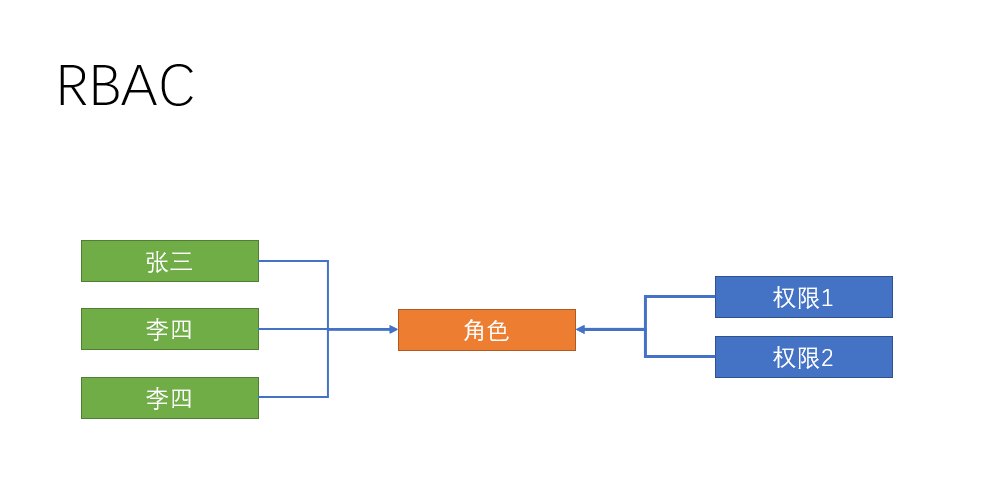
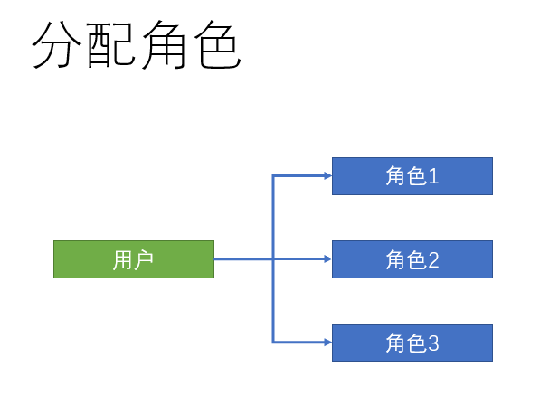
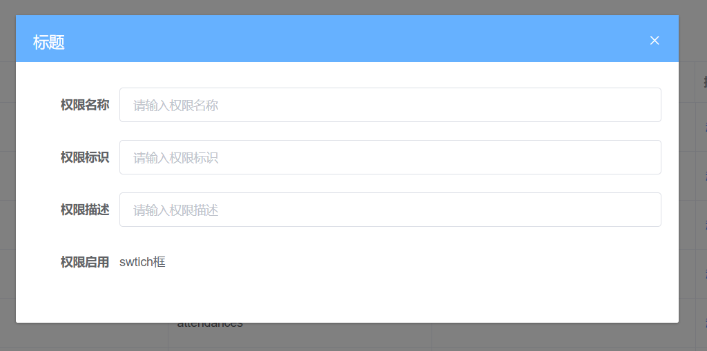
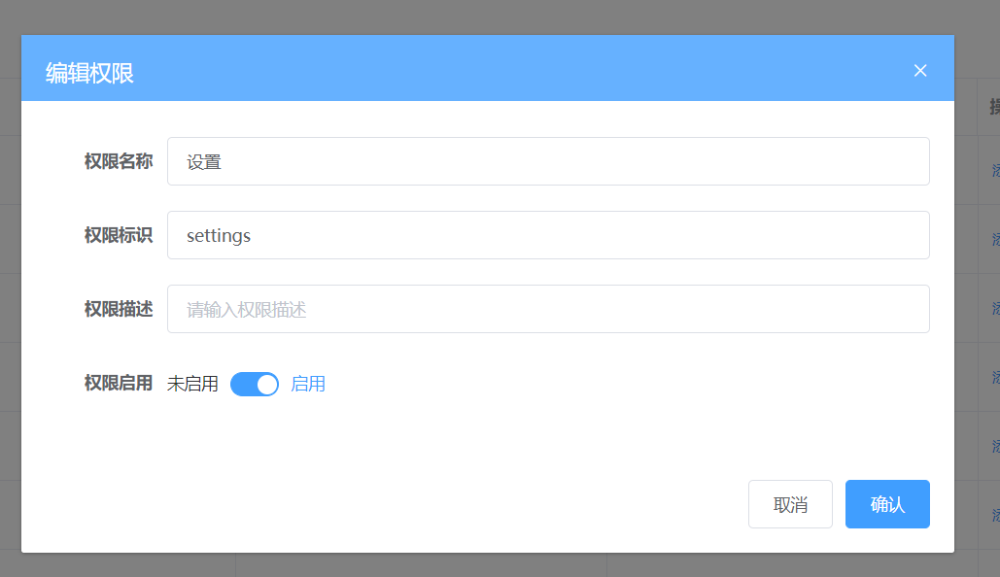
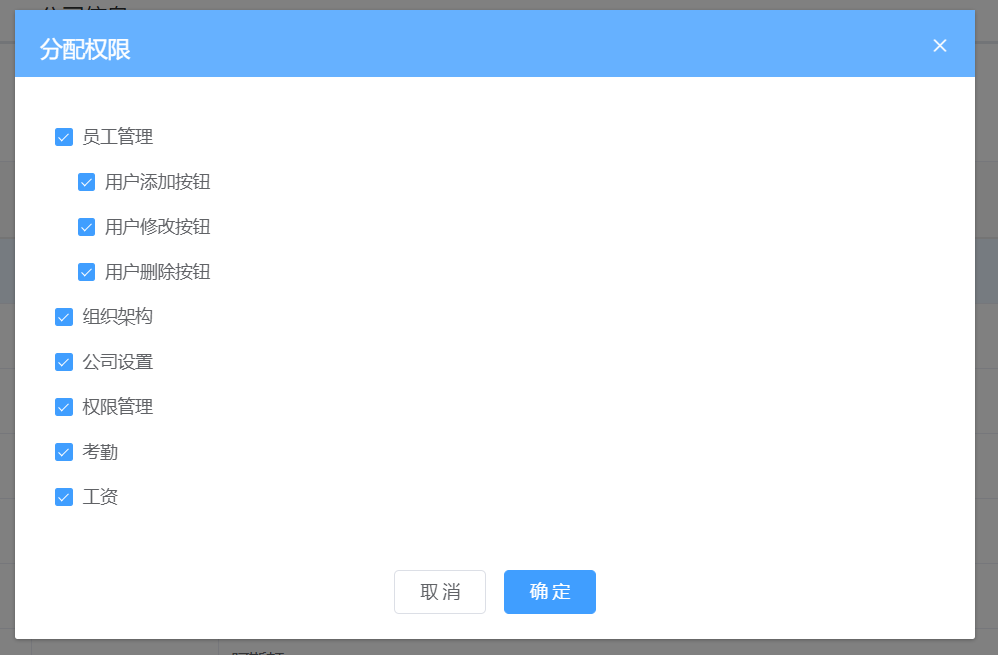
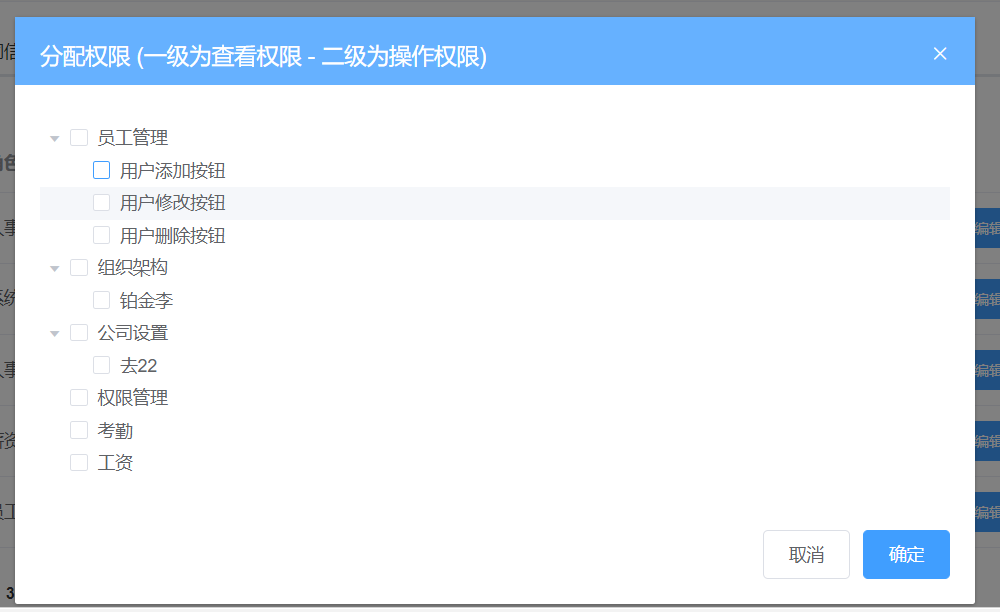
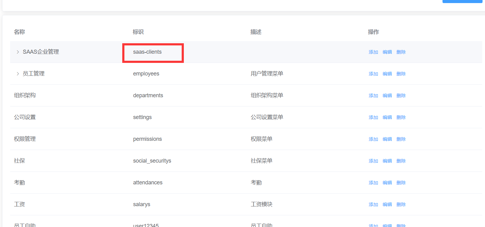
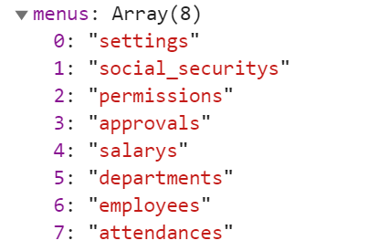
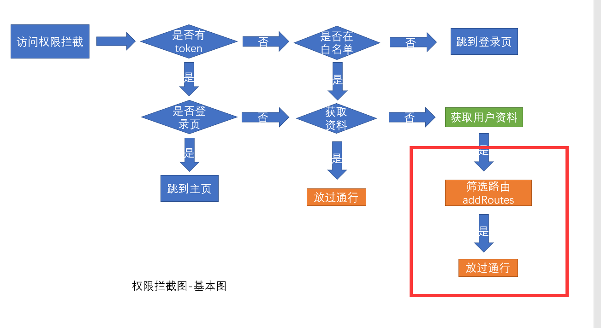
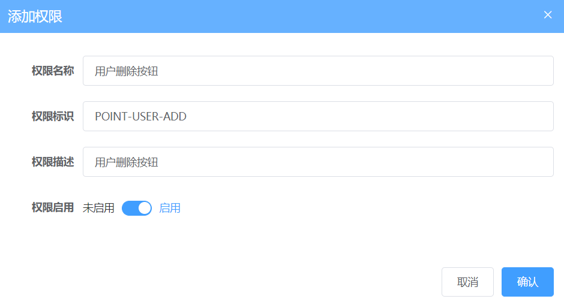

# 权限设计和管理

## RBAC的`权限设计`思想

采用方案: RBAC的权限模型，RBAC(Role-Based Access control) ，也就是基于角色的权限分配解决方案

其权限模式如下:



三个关键点: 员工用户, 角色, 权限

1. 给员工分配角色
2. 给角色分配权限

以你自己为例, 你进入一家公司, 入职, 人事将你录入系统 => 分配你的角色 (学生)

同角色有着相同的权限, 操作角色权限的同时, 所有该角色的用户对应权限, 就会同步更新


如何控制项目中权限？

页面级别的权限（路由），按钮级别的权限，api级别的权限（后端）


## 给员工分配角色

**`目标`**在员工管理页面，分配角色



用户和角色是**`1对多`**的关系，即一个用户可以拥有多个角色，比如公司的董事长可以拥有总经理和系统管理员一样的角色

### 新建分配角色弹框 

（1）新建`分配角色`组件 **`employees/components/assign-role.vue`** 	

```jsx
<template>
  <el-dialog class="assign-role" title="分配角色" :visible="showRoleDialog" width="40%">
    <!-- 这里准备复选框 -->

    <template #footer>
      <el-button type="primary" size="small">确定</el-button>
      <el-button size="small">取消</el-button>
    </template>
  </el-dialog>
</template>

<script>
export default {
  props: {
    showRoleDialog: {
      type: Boolean,
      default: false
    },
    // 用户的id 用来查询当前用户的角色信息
    userId: {
      type: String,
      default: null
    }
  }
}
</script>
```

（2）注册组件 `employees/index.vue`

```jsx
import AssignRole from './components/assign-role'

components: {
  AddEmployee,
  AssignRole
},
  
// 渲染组件，需要传两个值
<assign-role :show-role-dialog="showRoleDialog" :user-id="userId" />
  
// 准备数据
data() {
  return {
    showRoleDialog: false,
    userId: ''
  }
},
```

（3）点击角色按钮, 记录id, 显示弹层

```jsx
<el-button
  type="text"
  size="small"
  @click="editRole(row.id)"
>角色</el-button>

editRole(id) {
  this.userId = id
  this.showRoleDialog = true
}
```

（4）弹层的关闭

```jsx
// 父组件使用sync修饰符
<assign-role :show-role-dialog.sync="showRoleDialog" :user-id="userId" />

// 注册事件
<el-dialog
  class="assign-role"
  title="分配角色"
  :visible="showRoleDialog"
  width="40%"
  @close="close"
>

methods: {
  close() {
    this.$emit('update:showRoleDialog')
  }
}
```


### 获取当前用户的角色列表

（1）准备结构和数据

```jsx
<el-checkbox-group v-model="roleIds">
  <el-checkbox label="110">管理员</el-checkbox>
  <el-checkbox label="113">开发者</el-checkbox>
  <el-checkbox label="115">人事</el-checkbox>
</el-checkbox-group>

data() {
  return {
    roleIds: []
  }
},
```

（2）发送请求获取角色列表

```js
import { getRoleList } from '@/settings'

data() {
  return {
    // 所有的角色
    roleList: [],
    // 选中的角色id
    checkList: []
  }
},

created() {
  this.getRoleList()
},
  methods: {
    async getRoleList() {
      const res = await getRoleList(1, 10000)
      this.roleList = res.rows
      console.log(res)
    }
  }
```

（3）渲染数据

```jsx
<el-checkbox-group v-model="checkList">
  <el-checkbox v-for="item in list" :key="item.id" :label="item.id" >
    {{ item.name }}
  </el-checkbox>
</el-checkbox-group>
```

### 回显当前用户的角色

**获取用户的当前角色, 进行回显**  

```js
import { getUserDetail } from '@/api/user'

async open() {
  // 发送请求，获取当前用户的角色信息
  this.loading = true
  const res = await getUserDetail(this.userId)
  this.checkList = res.roleIds
  this.loading = false
}
```

created 中直接发请求会有问题, 一进入页面, 弹框还没点就发请求了, 而此时还没有 userId

可以换到弹框显示发请求, 给弹框注册open事件

```jsx
<el-dialog
  class="assign-role"
  title="分配角色"
  :visible="showRoleDialog"
  width="40%"
  @close="close"
  @open="open"
>
```

```jsx
async open() {
  // 发送请求，获取当前用户的角色信息
  this.loading = true
  const res = await getUserDetail(this.userId)
  this.checkList = res.roleIds
  this.loading = false
}
```

### 给员工分配角色

**分配角色接口**  **`api/employees.js`**

```js
/** *
 * 给用户分配角色
 * ***/
export function assignRoles(data) {
  return request({
    url: '/sys/user/assignRoles',
    data,
    method: 'put'
  })
}
```

**确定保存**  **`assign-role`**

```js
<el-button type="primary" @click="assign">确定</el-button>

import { assignRoles } from '@/api/employees'
async assign() {
  await assignRoles({
    id: this.userId,
    roleIds: this.roleIds
  })
  this.$emit('update:showRoleDialog', false)
  this.$message.success('修改成功')
}
```

==注意：不要修改管理员的角色，推荐新增一个用户进行修改==

### 添加loading效果

```jsx
data() {
  return {
    roleIds: [],
    list: [],
    loading: false
  }
},

<el-checkbox-group v-model="roleIds" v-loading="loading">

```

**提交代码**

**`本节任务`** 分配员工权限

## 权限点管理页面开发

**`目标`**： 完成权限点页面的开发和管理 => 为了后面做准备

1. 便于分配权限, 只有有权限了才能分配
2. 只有分配好了权限, 有对应的权限规则, 才能控制路由(模块访问权), 才能控制按钮的显示(操作权)

### 新建权限点管理页面

> 人已经有了角色，只要给角色分配权限, 人就有了权限 
>
> 那么权限是什么

在企业服务中，权限一般分割为 **页面访问权限**，**按钮操作权限**，**API访问权限**

> API权限多见于在后端进行拦截，所以我们需要做**`页面访问`**和**`按钮操作授权`**

由此，我们可以根据业务需求,  设计权限管理页面


一定先有模块访问权, 才进一步区分操作权, 所以这里的结构也是树形结构


**完成权限页面结构** **`src/views/permission/index.vue`**

```jsx
<template>
  <div class="permission-container">
    <div class="app-container">
      <!-- 表格 -->
      <el-card>
        <div style="text-align: right; margin-bottom: 20px">
          <el-button type="primary" size="small">添加权限</el-button>
        </div>
        <el-table border>
          <el-table-column label="名称" />
          <el-table-column label="标识" />
          <el-table-column label="描述" />
          <el-table-column label="操作">
            <template>
              <el-button size="small" type="text">添加权限点</el-button>
              <el-button size="small" type="text">查看</el-button>
              <el-button size="small" type="text">删除</el-button>
            </template>
          </el-table-column>
        </el-table>
      </el-card>
    </div>
  </div>
</template>

<script>
export default {
  name: 'Permission'
}
</script>
```

**封装权限管理的增删改查请求**  **`src/api/permisson.js`**

```js
import request from '@/utils/request'

// 获取权限
export function getPermissionList() {
  return request({
    method: 'get',
    url: '/sys/permission'
  })
}
// 新增权限
export function addPermission(data) {
  return request({
    method: 'post',
    url: '/sys/permission',
    data
  })
}

// 更新权限
export function updatePermission(data) {
  return request({
    method: 'put',
    url: `/sys/permission/${data.id}`,
    data
  })
}

// 删除权限
export function delPermission(id) {
  return request({
    method: 'delete',
    url: `/sys/permission/${id}`
  })
}
// 获取权限详情
export function getPermissionDetail(id) {
  return request({
    method: 'get',
    url: `/sys/permission/${id}`
  })
}
```

### 基本请求 - 展示数据

```jsx
<template>
  <div class="permission-container">
    <div class="app-container">
      <!-- 表格 -->
      <el-card>
        <div style="text-align: right; margin-bottom: 20px">
          <el-button type="primary" size="small">添加权限</el-button>
        </div>
        <el-table border :data="list">
          <el-table-column label="名称" prop="name" />
          <el-table-column label="标识" prop="code" />
          <el-table-column label="描述" prop="description" />
          <el-table-column label="操作">
            <template>
              <el-button size="small" type="text">添加权限点</el-button>
              <el-button size="small" type="text">查看</el-button>
              <el-button size="small" type="text">删除</el-button>
            </template>
          </el-table-column>
        </el-table>
      </el-card>
    </div>
  </div>
</template>

<script>
import { getPermissionList } from '@/api/permission'
export default {
  name: 'Permission',
  data() {
    return {
      list: []
    }
  },
  created() {
    this.getPermissionList()
  },
  methods: {
    async getPermissionList() {
      const data = await getPermissionList()
      this.list = data
    }
  }
}
</script>

```

但是这里的数据, 拿到的是列表式的数据, 但是希望渲染的是树形结构的, 所以需要处理


### 获取权限数据并转化树形

这里，我们通过树形操作方法，将列表转化成层级数据

```jsx
import { listToTree } from '@/utils'

methods: {
  async getPermissionList() {
    const data = await getPermissionList()
    this.list = listToTree(data, '0')
  }
}
```

给 table 表格添加 row-key 属性

```jsx
<el-table border :data="list" row-key="id">
  <el-table-column label="名称" prop="name" />
  <el-table-column label="标识" prop="code" />
  <el-table-column label="描述" prop="description" />
  <el-table-column label="操作">
    <template>
      <el-button size="small" type="text">添加权限点</el-button>
      <el-button size="small" type="text">查看</el-button>
      <el-button size="small" type="text">删除</el-button>
    </template>
  </el-table-column>
</el-table>
```

需要注意的是，当 type为1 时为访问权限， type为2 时为功能权限, 功能权限就不显示添加子权限了

```jsx
<el-table-column label="操作">
  <template v-slot="{row}">
    <el-button :disabled="row.type === 2" size="small" type="text">添加权限点</el-button>
    <el-button size="small" type="text">查看</el-button>
    <el-button size="small" type="text">删除</el-button>
  </template>
</el-table-column>
```

### 准备新增的弹层



弹层结构:

```jsx
<!-- 新增编辑的弹层 -->
<el-dialog :visible.sync="showDialog" width="40%" title="弹层标题">
  <!-- 表单内容 -->
  <el-form label-width="100px">
    <el-form-item label="权限名称">
      <el-input />
    </el-form-item>
    <el-form-item label="权限标识">
      <el-input />
    </el-form-item>
    <el-form-item label="权限描述">
      <el-input />
    </el-form-item>
    <el-form-item label="权限启用">
      switch
    </el-form-item>
  </el-form>

  <template #footer>
    <div style="text-align: right;">
      <el-button @click="showDialog = false">取消</el-button>
      <el-button type="primary">确定</el-button>
    </div>
  </template>
</el-dialog>
```

注册点击事件

```jsx
<el-button type="primary" size="small" @click="showAdd(1, '0')">添加权限</el-button>

<el-button
  v-if="row.type === 1"
  size="small"
  type="text"
  @click="showAdd(2, row.id)"
>添加权限点</el-button>

methods: {
  showAdd(type, id) {
    this.showDialog = true
  }
}
```

### 绑定数据与校验

基于文档准备数据

```jsx
data() {
  return {
    list: [],
    showDialog: false,
    formData: {
      enVisible: '0', // 开启
      name: '', // 名称
      code: '', // 权限标识
      description: '', // 描述
      type: '', // 类型
      pid: '' // 添加到哪个节点下
    },
    rules: {
      name: [{ required: true, message: '权限名称不能为空', trigger: ['change', 'blur'] }],
      code: [{ required: true, message: '权限标识不能为空', trigger: ['change', 'blur'] }]
    }
  }
},
```

表单绑定

```jsx
<!-- 新增编辑的弹层 -->
<el-dialog :visible.sync="showDialog" width="40%" title="弹层标题">
  <!-- 表单内容 -->
  <el-form label-width="100px" :model="formData">
    <el-form-item label="权限名称">
      <el-input v-model="formData.name" />
    </el-form-item>
    <el-form-item label="权限标识">
      <el-input v-model="formData.code" />
    </el-form-item>
    <el-form-item label="权限描述">
      <el-input v-model="formData.description" />
    </el-form-item>
    <el-form-item label="权限启用">
      <el-switch
        v-model="formData.enVisible"
        active-value="1"
        inactive-value="0"
      />
    </el-form-item>
  </el-form>
  <template #footer>
    <div style="text-align: right;">
      <el-button @click="showDialog = false">取消</el-button>
      <el-button type="primary">确定</el-button>
    </div>
  </template>
</el-dialog>
```

### 新增功能

新增有两个新增:

1. 点击上面的添加权限,  添加是一级, 是一级访问权

```jsx
<el-button type="primary" size="small" @click="clickAdd(1, '0')">添加权限</el-button>
```

2. 点击下面的添加权限点, 添加的是二级, 是二级操作权(这里row.id 作为将来的pid)

```jsx
<el-button v-if="row.type === 1" size="small" type="text" @click="clickAdd(2, row.id)">添加权限点</el-button>
```

提供事件处理函数

```jsx
async add() {
  try {
    await this.$refs.form.validate()
  } catch {
    return
  }
  await addPermission(this.form)
  this.$message.success('添加权限成功')
  this.showDialog = false
  // 重新渲染
  this.getPermissionList()
},
```

### 删除功能

1 注册点击事件

```jsx
<el-button size="small" type="text" @click="del(row.id)">删除</el-button>
```

2 点击时发送删除请求

```jsx
async del(id) {
  try {
    await this.$confirm('确定要删除该权限吗?', '温馨提示')
  } catch {
    return
  }
  await delPermission(id)
  this.getPermissionList()
  this.$message.success('删除成功')
}
```

### 查看修改功能



1 注册点击事件

```jsx
<el-button size="small" type="text" @click="showEdit(row.id)">查看</el-button>
```

2 查看时回显

```jsx
async showEdit(id) {
  // 获取数据回显
  const data = await getPermissionDetail(id)
  this.form = data
  this.showDialog = true
}
```

3 计算属性控制标题

```jsx
computed: {
  showTitle() {
    if (this.form.id) {
      return '查看编辑'
    } else {
      return '添加权限'
    }
  }
},
  
<el-dialog :visible="showDialog" :title="showTitle" @close="closeDialog">
```

4 提交修改, 通过判断 formData 中有没有 id (新增是没有 id 的)

```jsx
async add() {
  try {
    this.$refs.form.validate()
  } catch {
    return
  }
  if (this.formData.id) {
    await updatePermission(this.formData)
  } else {
    await addPermission(this.formData)
  }
  this.$message.success('操作成功')
  this.getPermissionList()
  this.showDialog = false
},
```

5 关闭时重置数据,防止编辑时,表单数据的无法清空

```jsx
closeDialog() {
  this.showDialog = false
  this.formData = {
    enVisible: '0', // 开启
    name: '', // 名称
    code: '', // 权限标识
    description: '', // 描述
    type: '', // 类型
    pid: '' // 添加到哪个节点下
  }
}
```

**提交代码**

**`本节任务`**: 权限点管理页面开发


## 给角色分配权限

**`目标`**： 完成给角色分配权限的业务




### 新建分配权限弹出层

准备弹层

```jsx
<!-- 分配权限的弹层 -->
<el-dialog title="分配权限" :visible="showAssignDialog" @close="closeAssignDialog">
  内容部分
  <template #footer>
    <div style="text-align: right;">
      <el-button @click="closeAssignDialog">取消</el-button>
      <el-button type="primary">确定</el-button>
    </div>
  </template>
</el-dialog>
```

注册事件

```jsx
<el-button size="small" type="success" @click="showAssign(row.id)">分配权限</el-button>
```

提供数据方法

```jsx
showAssignDialog: false, // 控制弹层的显示隐藏
roleId: '' // 记录正在操作的角色

closeAssignDialog() {
  this.showAssignDialog = false
},
showAssign(id) {
  this.roleId = id
  this.showAssignDialog = true
}
```

### 获取权限数据

这里要进行权限分配, 先要请求拿到权限数据

```jsx
permissionData: [] // 存储权限数据
```

拿到数据处理成功树形结构

```jsx
async showAssign(id) {
  this.roleId = id
  this.showAssignDialog = true
  const data = await getPermissionList()
  this.permissionData = listToTree(data, '0')
}
```


### 结合树形控件显示

基本展示

```jsx
<el-tree
  :data="permissionData"
  :props="{ label: 'name' }"
  :default-expand-all="true"
  :show-checkbox="true"
  :check-strictly="true"
/>
```

show-checkbox 显示选择框

default-expand-all 默认展开

 check-strictly  设置true, 可以关闭父子关联



### 回显默认的权限

树形结构认知: 回显数据, 需要有一些树形结构的认知

1. node-key 唯一标识
2. this.$refs.tree.setCheckedKeys([ ])    => 传入选中的node-key数组

```jsx
<el-tree
  ref="tree"
  v-loading="treeLoading"
  :data="permissionData"
  :props="{ label: 'name' }"
  :default-expand-all="true"
  :show-checkbox="true"
  :check-strictly="true"
  node-key="id"
/>

```

发送请求, 获取已选中的权限 id 列表, 进行回显

```jsx
async showAssign(id) {
  this.treeLoading = true
  this.roleId = id
  this.showAssignDialog = true
  const data = await getPermissionList()
  this.permissionData = listToTree(data, '0')
  const data2 = await getRoleDetail(this.roleId)
  this.$refs.tree.setCheckedKeys(data2.permIds)
  this.treeLoading = false
}
```


### 给角色分配权限

**封装分配权限的api**  **`src/api/setting.js`**

```js
// 给角色分配权限
export function assignPerm(data) {
  return request({
    url: '/sys/role/assignPrem',
    method: 'put',
    data
  })
}

```

**分配权限**

```js
// 分配权限
async clickAssign() {
  await reqAssignPerm({
    id: this.roleId,
    permIds: this.$refs.tree.getCheckedKeys()
  })
  this.$message.success('分配成功')
  this.showAssignDialog = false
}
```

**提交代码**

**`本节任务`** 给角色分配权限

## 前端权限-页面访问权(路由)

**`目标`**： 在当前项目应用用户的页面访问权限

### 权限受控的思路 - addRoutes

**到了最关键的环节，我们设置的权限如何应用？**

在上面的几个小节中，我们已经把给用户分配了角色， 给角色分配了权限，

那么在用户登录获取资料的时候，会自动查出该用户拥有哪些权限，这个权限需要和我们的菜单还有路由有效结合起来

而动态路由表其实就是根据用户的实际权限来访问的，接下来我们操作一下







在权限管理页面中，我们设置了一个**标识**， 这个标识可以和我们的路由模块进行关联，

如果用户拥有这个标识，那么用户就可以 **拥有这个路由模块**，如果没有这个标识，就不能**访问路由模块**


### addRoutes 的基本使用



`router/index.js` 去掉 asyncRoutes 的默认合并, 

```jsx
const createRouter = () => new Router({
  // mode: 'history', // require service support
  scrollBehavior: () => ({ y: 0 }),
  routes: [
    ...constantRoutes // 静态路由, 首页
    // ...asyncRoutes // 所有的动态路由
  ]
})
```

`permission.js` 我们通过 addRoutes 动态添加试一下

```jsx
import { asyncRoutes } from '@/router/index'

router.beforeEach(async(to, from, next) => {
  ...
  	...
      if (!store.state.user.userInfo.userId) {
        // 调用获取信息的action
        const res = await store.dispatch('user/getUserInfo')
        console.log('进行权限处理', res)
        // 拿到权限信息之后, 应该根据权限信息, 从动态路由模块中筛选出, 需要追加的路由,
        // 追加到routes规则中, addRoutes
        router.addRoutes(asyncRoutes)
        return
      }
  	...
  ...
})
```

可以新增出来, 但是菜单却没有动态渲染出来 => router.options.routes (拿的是默认配置的项, 拿不到动态新增的) 不是响应式的! 

为了能正确的显示菜单, 为了能够将来正确的获取到, 目前用户的路由, 我们需要用vuex管理routes路由数组


### 处理刷新 404 的问题和白屏

页面刷新的时候，本来应该拥有权限的页面出现了404，这是因为404的匹配权限放在了静态路由中 (静态路由的404要删除)

我们需要将404放置到动态路由的最后

https://blog.csdn.net/qq_41912398/article/details/109231418

```jsx
if (!store.state.user.userInfo.userId) {
  // 调用获取信息的action
  const { roles } = await store.dispatch('user/getUserInfo')
  // 调用action同步到vuex中
  const otherRoutes = await store.dispatch('permission/filterRoutes', roles.menus)
  // 动态新增路由
  router.addRoutes([...otherRoutes, { path: '*', redirect: '/404', hidden: true }])
  next({
    ...to, // next({ ...to })的目的,是保证路由添加完了再进入页面 (可以理解为重进一次)
    replace: true // 重进一次, 不保留重复历史
  })
  return
}
```

### 筛选路由

```jsx
if (!store.getters.name) {
  const { roles } = await store.dispatch('user/getUserInfo')
  // 处理菜单显示
  // const otherRoutes = await store.dispatch('permission/filterRoutes', roles.menus)
  console.log(roles)
  // 筛选
  const otherRoutes = asyncRoutes.filter(item => {
    // 如果item.children[0].name 的名字 在roles.menus菜单中存在，就保留
    return roles.menus.includes(item.children[0].name)
  })
  router.addRoutes([
    ...otherRoutes,
    { path: '*', redirect: '/404', hidden: true }
  ])
  // 重新进入
  next({
    ...to,
    replace: true
  })
  return
}
```

### 新建Vuex权限模块

可以在vuex中新增一个permission模块, 专门维护管理, 所有的路由 routes 数组 (响应式的)

在任何的组件中, 都可以非常方便的将来拿到 vuex 中存的 routes, 而不是去找 router.options.routes (拿的是默认配置)

**`src/store/modules/permission.js`**

```js
import { constantRoutes } from '@/router'

const state = {
  // 路由表, 标记当前用户所拥有的所有路由
  routes: constantRoutes // 默认静态路由表
}
const mutations = {
  // otherRoutes登录成功后, 需要添加的新路由
  setRoutes(state, otherRoutes) {
    // 静态路由基础上, 累加其他权限路由
    state.routes = [...constantRoutes, ...otherRoutes]
  }
}
const actions = {}
export default {
  namespaced: true,
  state,
  mutations,
  actions
}

```

在Vuex管理模块中引入permisson模块

```js
import Vue from 'vue'
import Vuex from 'vuex'
import getters from './getters'
import app from './modules/app'
import settings from './modules/settings'
import user from './modules/user'
import permission from './modules/permission'

Vue.use(Vuex)

const store = new Vuex.Store({
  modules: {
    app,
    settings,
    user,
    permission
  },
  getters
})

export default store
```

### 添加筛选的路由

```jsx
if (!store.getters.name) {
  const { roles } = await store.dispatch('user/getUserInfo')
  // 处理菜单显示
  // const otherRoutes = await store.dispatch('permission/filterRoutes', roles.menus)
  console.log(roles)
  // 筛选
  const otherRoutes = asyncRoutes.filter(item => {
    // 如果item.children[0].name 的名字 在roles.menus菜单中存在，就保留
    return roles.menus.includes(item.children[0].name)
  })
  router.addRoutes([
    ...otherRoutes,
    { path: '*', redirect: '/404', hidden: true }
  ])
  store.commit('permission/setRoutes', otherRoutes)
  // 重新进入
  next({
    ...to,
    replace: true
  })
  return
}
```

渲染路由

```jsx
...mapGetters([
  'sidebar',
  'routes'
]),
```

### 退出时重置路由

退出时, 需要将路由权限重置 (恢复默认), 将来登录后, 再次追加

我们的**`router/index.js`**文件，发现一个重置路由方法

```js
// 重置路由
export function resetRouter() {
  const newRouter = createRouter()
  router.matcher = newRouter.matcher // 重新设置路由的可匹配路径
}
```

这个方法就是将路由重新实例化，相当于换了一个新的路由，之前**`加的路由`**就不存在了，需要在登出的时候， 调用一下即可

`store/modules/user.js`

```js
import { resetRouter } from '@/router'

// 退出的action操作
logout(context) {
  // 1. 移除vuex个人信息
  context.commit('removeUserInfo')
  // 2. 移除token信息
  context.commit('removeToken')
  // 3. 重置路由
  resetRouter()
  // 4. 重置 vuex 中的路由信息
  context.commit('permission/setRoutes', [], { root: true })
},
```

## 前端权限 - 按钮操作权

### 按钮操作权的受控思路

当我们拥有了一个模块的访问权限之后，页面中的某些功能，用户可能有，也可能没有

这就是上小节，查询出来的数据中的**`points`**


当然现在是空,  所以首先需要在员工管理的权限点下， 新增一个删除权限点，并启用



效果如下图所示:


我们要做的就是看看用户，是否拥有**point-user-delete**这个point，有就可以让删除能用，没有就隐藏或者禁用


### 演示功能 - 将方法挂载到原型

配置getters

```jsx
const getters = {
  ...,
  roles: state => state.user.userInfo.roles,
}
export default getters
```

所有的页面中, 都要用到这个校验方法

```jsx
Vue.prototype.$checkPermission = function(key) {
  // key: POINT-USER-ADD, POINT-USER-EDIT, POINT-USER-DEL
  // store.state.user.userInfo.roles.points 当前用户拥有的权限点信息
  // store.getters.roles.points 当前用户拥有的权限点信息
  if (store.getters.roles.points) {
    // 进行权限点判断
    return store.getters.roles.points.includes(key)
  }
  // 没有权限点POINTS信息, 说明用户没有身份, 没有任何权限
  return false
}
```

按钮控制

```jsx
<el-button
  v-if="$checkPermission('POINT-USER-UPDATE')"
  type="text"
  size="small"
  @click="$router.push('/employees/detail/' + row.id)"
>查看</el-button>

<el-button
  v-if="$checkPermission('POINT-USER-DEL')"
  type="text"
  size="small"
  @click="delEmployee(row.id)"
>删除</el-button>

<el-button
  v-if="$checkPermission('POINT-USER-ADD')"
  size="small"
  type="primary"
  @click="showDialog = true"
>新增员工</el-button>
```

效果图: (有权限, 才显示按钮, 或者禁用也可)


### 使用 Mixins 将检查方法注入 

`mixins/hello.js`

```jsx
// 这是一个打招呼的mixin, 只要混入了这个mixin, 就可以created打招呼
export default {
  // vue的配置项, data, methods, created, ....
  created() {
    console.log('created: hello, 你好哇')
    this.sayHi()
  },
  methods: {
    sayHi() {
      console.log('调用方法, sayHi: hello, 你好哇')
    }
  }
}
```

局部混入

```jsx
import { mapGetters } from 'vuex'
import hello from '@/mixins/hello'

export default {
  name: 'Dashboard',
  mixins: [hello],
  computed: {
    ...mapGetters([
      'name'
    ])
  }
}
```

全局混入 (注意点: 一旦配置, 所有的组件, 全都会被混入 (慎用))

```jsx
import hello from '@/mixins/hello'
Vue.mixin(hello)
```


