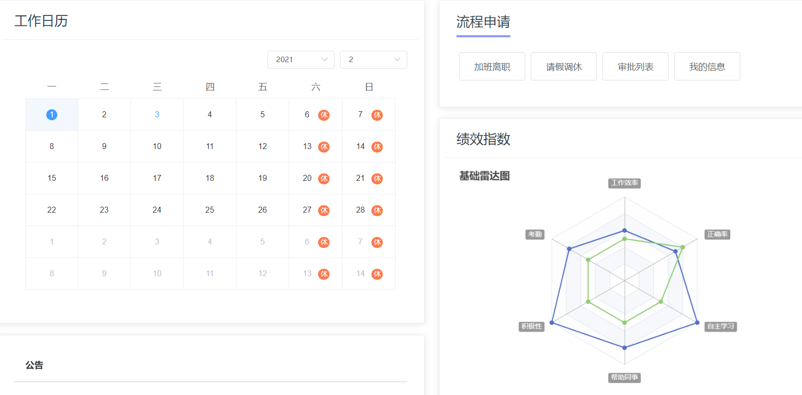
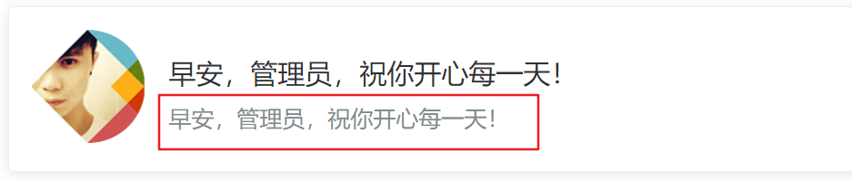
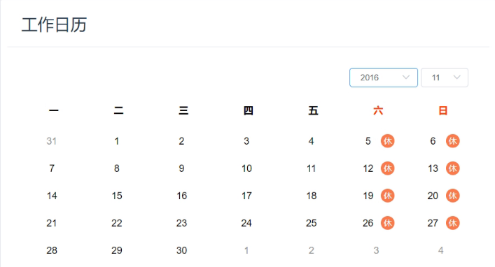
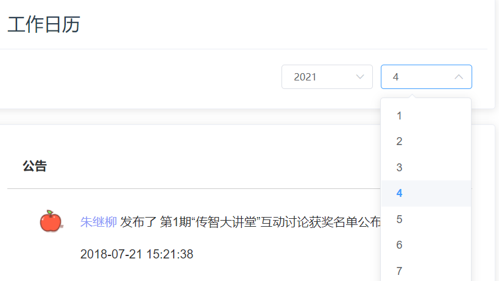
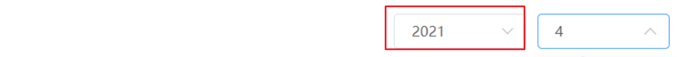
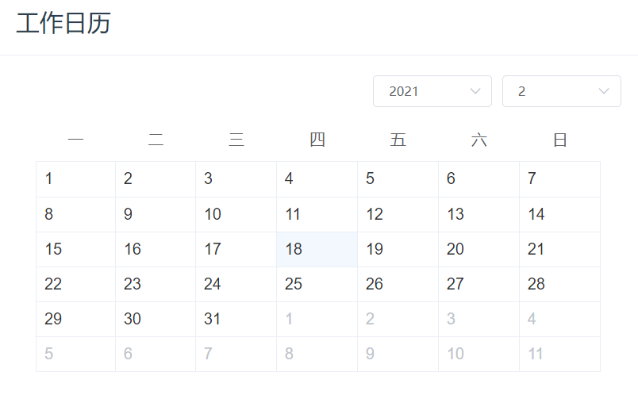
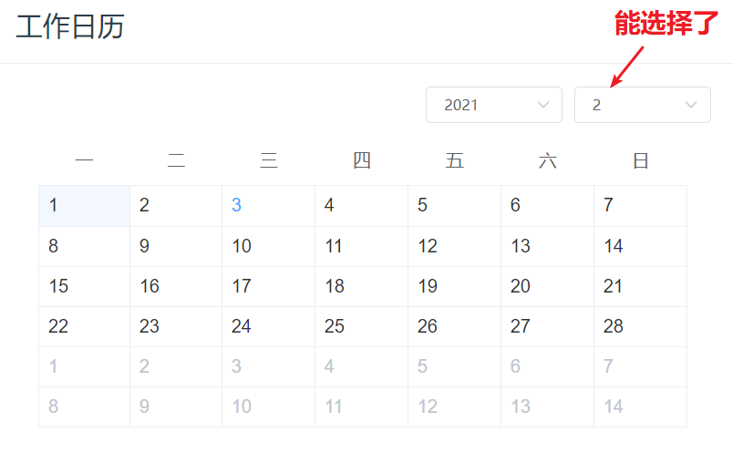
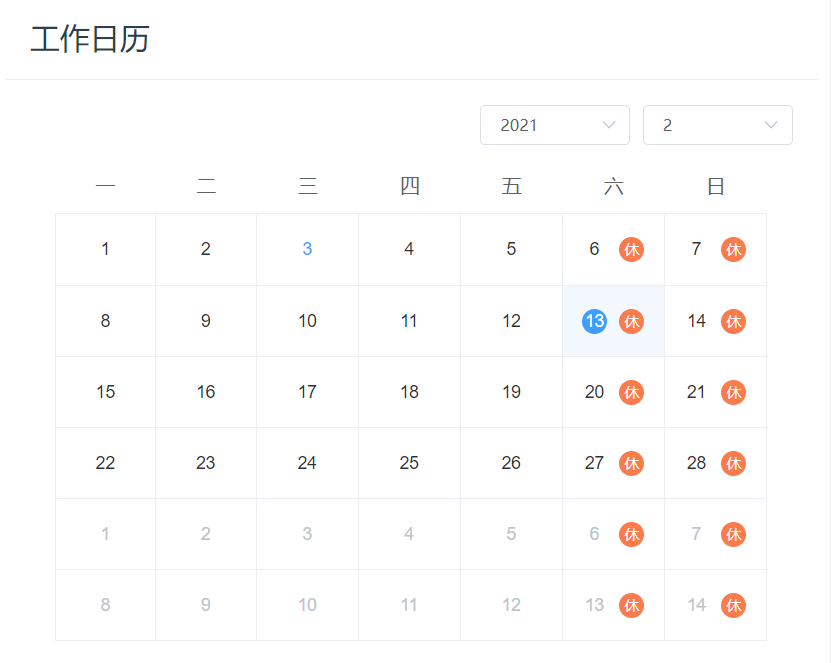
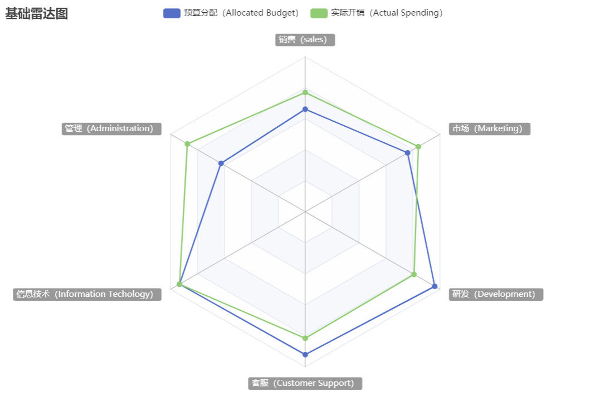
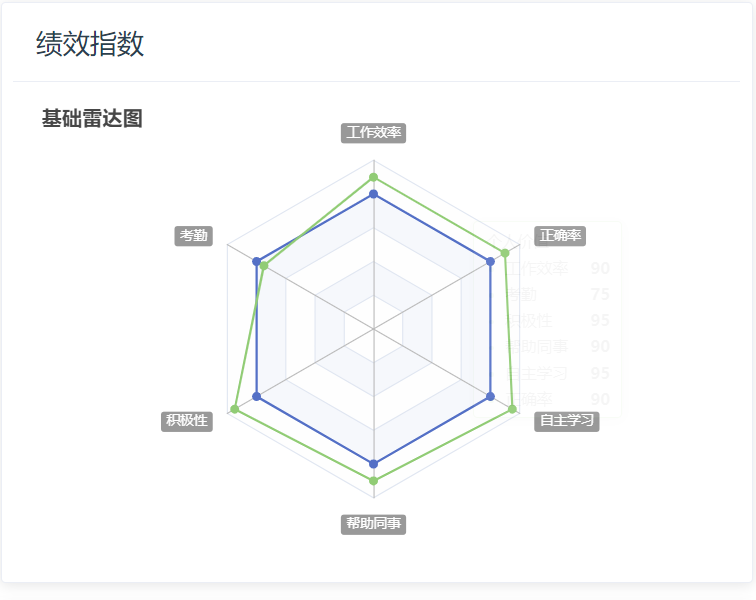

#  主页(审批 和 图表)

## 首页的页面结构

**`目标`**： 实现系统首页的页面结构

> 目前，我们的页面还剩下首页，这里我们可以按照如图实现一下的结构



首页页面结构，**src/views/dashboard/index.vue**

```vue
<template>
  <div class="dashboard-container">
    <!-- 头部内容 -->
    <el-card class="header-card">
      <div>
        <div class="fl headL">
          <div class="headImg">
            
          </div>
          <div class="headInfoTip">
            <p class="firstChild">早安，管理员，祝你开心每一天！</p>
            <p class="lastChild">早安，管理员，祝你开心每一天！</p>
          </div>
        </div>
        <div class="fr" />
      </div>
    </el-card>
    <!-- 主要内容 -->
    <el-row type="flex" justify="space-between">
      <!-- 左侧内容 -->
      <el-col :span="13" style="padding-right:26px">
        <!-- 工作日历 -->
        <el-card class="box-card">
          <div slot="header" class="header">
            <span>工作日历</span>
          </div>
        <!-- 放置日历组件 -->
        </el-card>
        <!-- 公告 -->
        <el-card class="box-card">
          <div class="advContent">
            <div class="title"> 公告</div>
            <div class="contentItem">
              <ul class="noticeList">
                <li>
                  <div class="item">
                    
                    <div>
                      <p><span class="col">朱继柳</span> 发布了 第1期“传智大讲堂”互动讨论获奖名单公布</p>
                      <p>2018-07-21 15:21:38</p>
                    </div>
                  </div>
                </li>
                <li>
                  <div class="item">
                    
                    <div>
                      <p><span class="col">朱继柳</span> 发布了 第2期“传智大讲堂”互动讨论获奖名单公布</p>
                      <p>2018-07-21 15:21:38</p>
                    </div>
                  </div>
                </li>
                <li>
                  <div class="item">
                    
                    <div>
                      <p><span class="col">朱继柳</span> 发布了 第3期“传智大讲堂”互动讨论获奖名单公布</p>
                      <p>2018-07-21 15:21:38</p>
                    </div>
                  </div>
                </li>
              </ul>
            </div>
          </div>
        </el-card>
      </el-col>
      <!-- 右侧内容 -->
      <el-col :span="11">
        <el-card class="box-card">
          <div class="header headTit">
            <span>流程申请</span>
          </div>
          <div class="sideNav">
            <el-button class="sideBtn">加班离职</el-button>
            <el-button class="sideBtn">请假调休</el-button>
            <el-button class="sideBtn">审批列表</el-button>
            <el-button class="sideBtn">我的信息</el-button>
          </div>
        </el-card>

        <!-- 绩效指数 -->
        <el-card class="box-card">
          <div slot="header" class="header">
            <span>绩效指数</span>
          </div>
        <!-- 放置雷达图 -->
        </el-card>
        <!-- 帮助连接 -->
        <el-card class="box-card">
          <div class="header headTit">
            <span>帮助链接</span>
          </div>
          <div class="sideLink">
            <el-row>
              <el-col :span="8">
                <a href="#">
                  <span class="icon iconGuide" />
                  <p>入门指南</p>
                </a>
              </el-col>
              <el-col :span="8">
                <a href="#">
                  <span class="icon iconHelp" />
                  <p>在线帮助手册</p>
                </a>
              </el-col>
              <el-col :span="8">
                <a href="#">
                  <span class="icon iconTechnology" />
                  <p>联系技术支持</p>
                </a>
              </el-col>
            </el-row>
          </div>
        </el-card>
      </el-col>
    </el-row>
  </div>
</template>

<script>
import { mapGetters } from 'vuex'

export default {
  name: 'Dashboard',
  computed: {
    ...mapGetters([
      'name'
    ])
  }
}
</script>

<style lang="scss" scoped>
.dashboard-container {
  margin: 10px;
  li {
    list-style: none;
  }
  .headImg {
    float: left;
    width: 100px;
    height: 100px;
    border-radius: 50%;
    background: #999;
          img {
      width: 100%;
      height: 100%;
      border-radius: 50%;
    }
  }

  .headInfoTip {
    padding: 25px 0 0;
    margin-left: 120px;
    p {
      padding: 0 0 15px;
      margin: 0;
      &.firstChild {
        font-size: 24px;
      }
      &.lastChild {
        font-size: 20px;
        color: #7f8c8d;
      }
    }
  }
}

.box-card {
  padding: 5px 10px;
  margin-top: 20px;
  .header {
    span {
      color: #2c3e50;
      font-size: 24px;
    }
    .item {
      color: #97a8be;
      float: right;
      padding: 3px 0;
    }
  }
  .headTit {
    span {
      border-bottom: 4px solid #8a97f8;
      padding-bottom: 10px;
    }
  }
}
.header-card{
  position: relative;
  .header {
    position: absolute;
    right: 20px;
    top: 15px;
    z-index: 1;
  }
}

.advContent {
  background: #fff;
  border-radius: 5px 5px 0px 0px;
  .title {
    font-size: 16px;
    padding: 20px;
    font-weight: bold;
    border-bottom: solid 1px #ccc;
  }
  .contentItem {
    padding: 0 30px;
    min-height: 350px;
    .item {
      display: flex;
      padding:18px 0 10px;
      border-bottom: solid 1px #ccc;
      .col {
        color: #8a97f8;
      }
      img {
        width: 56px;
        height: 56px;
        border-radius: 50%;
        margin-right: 10px;
      }
      p{
        padding: 0 0 8px;
      }
    }
  }
}
.noticeList {
  margin: 0;
  padding: 0;
}
.sideNav,
.sideLink {
  padding: 30px 0 12px;
  .sideBtn {
    padding: 16px 26px;
    font-size:16px;
    margin: 10px 5px;
  }
}
.sideLink {
  text-align: center;
  .icon {
    display: inline-block;
    width: 76px;
    height: 76px;
    background: url('./../../assets/common/icon.png') no-repeat;
  }
  .iconGuide {
    background-position: 0 0;
  }
  .iconHelp {
    background-position: -224px 0;
  }
  .iconTechnology {
    background-position: -460px 0;
  }
}
</style>

```

> 通过上面的代码，我们得到了如下的页面


我们预留了**`工作日历`**和**`绩效指数`**两个组件，我们会在后续的组件中进行开发


## 首页用户资料显示



​	**`目标`**：将首页的信息换成真实的用户资料

> 直接获取Vuex的用户资料即可

```vue
<script>
import { mapGetters, mapState } from 'vuex'
import defaultImg from '@/assets/common/bigUserHeader.png'

export default {
  name: 'Dashboard',
  data() {
    return {
      defaultImg
    }
  },
  computed: {
    ...mapGetters(['name']),
    ...mapState('user', ['userInfo'])
  }
}
</script>
```

在 vue视图中绑定

```vue
<div class="headImg">
  
</div>
<div class="headInfoTip">
  <p class="firstChild">早安，{{ userInfo.username }}，祝你开心每一天！</p>
  <p class="lastChild">早安，{{ userInfo.username }} | {{ userInfo.companyName }}</p>
</div>
```


## 工作日历组件封装

**`目标`**封装一个工作日历组件在首页中展示



### 新建工作日历组件结构

>  工作日历的要求很简单，显示每个月的日期，可以设定日期的范围



基本代码结构如下  **`src/views/dashboard/components/work-calendar.vue`**

```jsx
<template>
  <div>
    <!-- 工作日历, 年和月 -->
    <div class="select-box">
      <el-select v-model="currentYear" size="small" style="width: 120px; margin-right: 10px">
        <!-- 年份取给定年份的, 前五年 + 后五年 -->
        <el-option v-for="item in yearList" :key="item" :label="item" :value="item" />
      </el-select>
      <el-select v-model="currentMonth" size="small" style="width: 120px;">
        <el-option v-for="item in 12" :key="item" :label="item" :value="item" />
      </el-select>
    </div>
  </div>
</template>

<script>
export default {
  props: {
    startDate: {
      type: Date,
      default: () => {
        return new Date()
      }
    }
  },
  data() {
    return {
      currentYear: null, // 当前年份
      currentMonth: null, // 当前月份
      yearList: [] // 要遍历的年的数组
    }
  },
  created() {
    this.currentYear = this.startDate.getFullYear() // 得到当前年份
    this.currentMonth = this.startDate.getMonth() + 1 // 当前月份
  }
}
</script>

<style lang="scss" scoped>
.select-box {
  display: flex;
  justify-content: flex-end;
}
</style>

```

### 动态计算 yearList



 `Array.from`还可以接受第二个参数，作用类似于数组的`map`方法，

用来对每个元素进行处理，将处理后的值放入返回的数组。 

```jsx
Array.from(new Array(10), (item, index) => index)
=> [0, 1, 2, 3, 4, 5, 6, 7, 8, 9]
```

计算设置 yearList

```jsx
created() {
  this.currentYear = this.startDate.getFullYear()
  this.currentMonth = this.startDate.getMonth() + 1
  // 上下5年
  this.yearList = Array.from(new Array(11), (item, index) => index + this.currentYear - 5)
}
```

使用日历组件

```jsx
<el-calendar></el-calendar>
```

样式:

```scss
<style lang="scss" scoped>
.select-box {
  display: flex;
  justify-content: flex-end;
}

::v-deep .el-calendar-day {
  height:  auto;
 }
::v-deep .el-calendar-table__row td::v-deep .el-calendar-table tr td:first-child, ::v-deep .el-calendar-table__row td.prev{
  border:none;
 }
.date-content {
  height: 40px;
  text-align: center;
  line-height: 40px;
  font-size: 14px;
}
.date-content .rest {
  color: #fff;
  border-radius: 50%;
  background: rgb(250, 124, 77);
  width: 20px;
  height: 20px;
  line-height: 20px;
  display: inline-block;
  font-size: 12px;
  margin-left: 10px;
}
.date-content .text{
  width: 20px;
  height: 20px;
  line-height: 20px;
 display: inline-block;

}
::v-deep .el-calendar-table td.is-selected .text{
   background: #409eff;
   color: #fff;
   border-radius: 50%;
 }
::v-deep .el-calendar__header {
   display: none
 }
</style>
```

基本结构效果图:




### 实现工作日历选择逻辑

绑定变量

```jsx
<el-calendar v-model="currentDate"/>

data() {
  return {
    currentYear: null,
    currentMonth: null,
    yearList: [],
    currentDate: new Date()
  }
},
```

改变年份, 月份, 日历都要更新 => 注册change事件

```jsx
<el-select v-model="currentYear" size="small" style="width: 120px; margin-right: 10px" @change="changeDate">
<el-select v-model="currentYear" size="small" style="width: 120px; margin-right: 10px" @change="changeDate">
  
created() {
  this.currentYear = this.startDate.getFullYear()
  this.currentMonth = this.startDate.getMonth() + 1
  // 上下5年
  this.yearList = Array.from(new Array(11), (item, index) => index + this.currentYear - 5)
  this.changeDate()
},
  
methods: {
  changeDate() {
    this.currentDate = new Date(this.currentYear, this.currentMonth - 1)
  }
}
```

效果图:



### 定制日历内容 (插槽)

```jsx
<el-calendar v-model="currentDate">
  <template #dateCell="{ date, data }">
    {{ date.getDate() }}
  </template>
</el-calendar>
```

加类优化结构

```jsx
<el-calendar v-model="currentDate">
  <template #dateCell="{ date, data }">
    <div class="date-content">
      <span class="text">{{ data.day | getDay }}</span>
      <span v-if="isWeek(date)" class="rest">休</span>
    </div>
  </template>
</el-calendar>
```

判断是否是周末

```jsx
isWeek(date) {
  return date.getDay() === 6 || date.getDay() === 0
}
```

效果如图:




### watch 监视解决日历同步

```jsx
watch: {
  currentDate(newValue) {
    // console.log(newValue)
    this.currentYear = newValue.getFullYear()
    this.currentMonth = newValue.getMonth() + 1
  }
},
```


## 封装雷达图图表显示在首页

**`目标`**：封装一个echarts中的雷达图表显示在首页的绩效指数的位置

### 了解雷达图



### 封装雷达图插件

> 首页中，还有一个绩效指数的位置需要放置一个雷达图的图表，我们可以采用百度的echarts进行封装

第一步， 安装echarts图表

```bash
$ yarn add echarts
```

> echarts是一个很大的包，里面包含了众多图形，假设我们只使用雷达图，可以做按需加载

第二步， 新建雷达图组件，**`src/views/dashboard/components/radar.vue`**

```vue
<template>
  <!-- 雷达图  图表必须给高和宽度-->
  <div ref="myDiv" class="radar-echart" />
</template>

<script>
// 完整加载过程
// import * as echarts from 'echarts'
// 按需加载
import * as echarts from 'echarts/core' // 引入主模块
import { RadarChart } from 'echarts/charts' // 引入雷达图
// 引入提示框和标题组件
import { TitleComponent, TooltipComponent } from 'echarts/components'
// 引入canvas渲染器
import { CanvasRenderer } from 'echarts/renderers'
// 注册必须的组件
echarts.use(
  [TitleComponent, TooltipComponent, RadarChart, CanvasRenderer]
)

export default {
  // 页面渲染完毕事件
  mounted() {
    const myChart = echarts.init(this.$refs.myDiv) // 得到图表实例
    myChart.setOption({
      title: {
        text: '基础雷达图'
      },
      tooltip: {},
      legend: {
        data: ['平均水平', '个人价值']
      },
      radar: {
        // shape: 'circle',
        name: {
          textStyle: {
            color: '#fff',
            backgroundColor: '#999',
            borderRadius: 3,
            padding: [3, 5]
          }
        },
        indicator: [
          { name: '工作效率', max: 100 },
          { name: '考勤', max: 100 },
          { name: '积极性', max: 100 },
          { name: '帮助同事', max: 100 },
          { name: '自主学习', max: 100 },
          { name: '正确率', max: 100 }
        ]
      },
      series: [{
        name: '平均 vs 个人',
        type: 'radar',
        // areaStyle: {normal: {}},
        data: [
          {
            value: [80, 80, 80, 80, 80, 80],
            name: '平均水平'
          },
          {
            value: [90, 75, 95, 90, 95, 90],
            name: '个人价值'
          }
        ]
      }]
    })
  }
}
</script>

<style>
.radar-echart {
    width: 600px;
    height: 400px;
}
</style>

```

我们得到一个雷达图，对绩效指数进行统计



