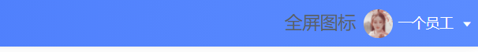
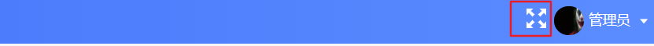
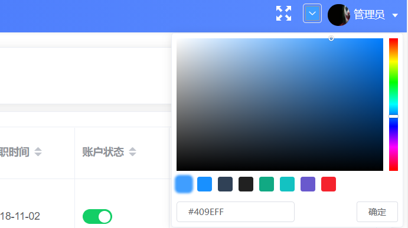
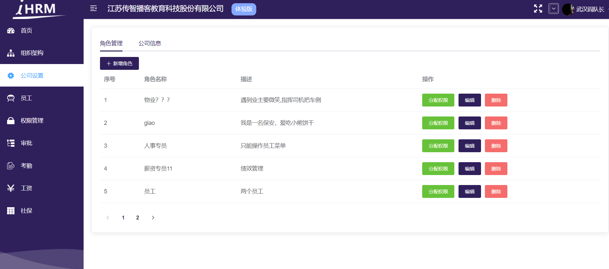
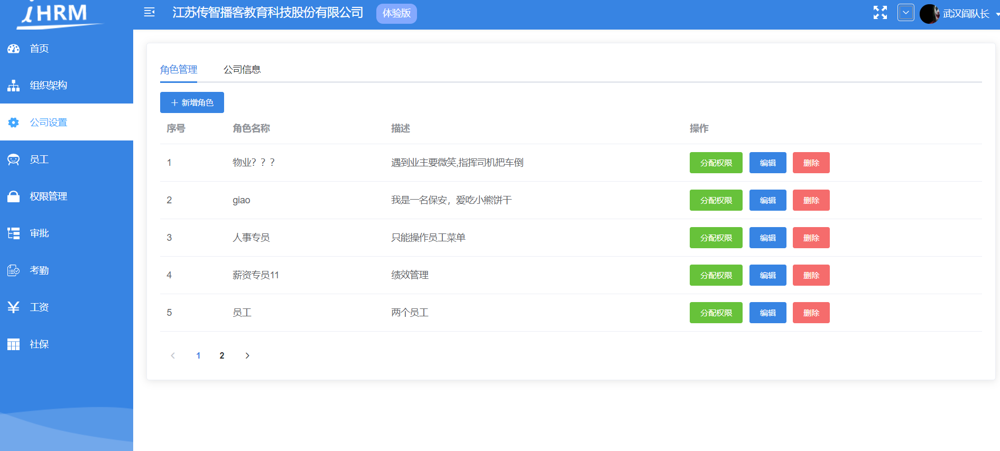
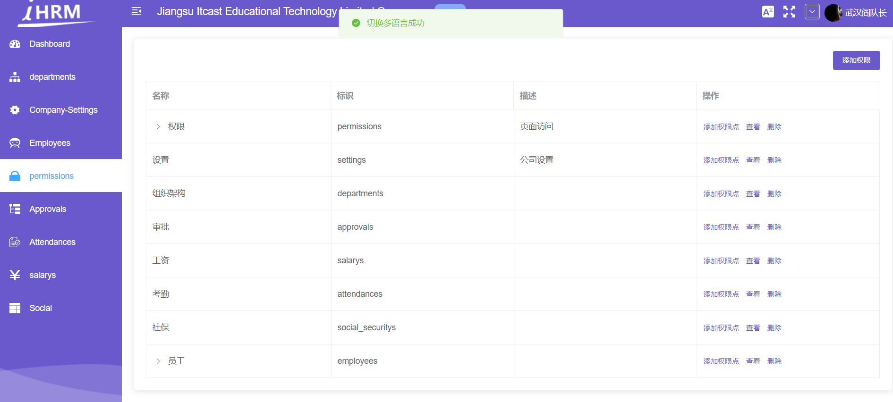
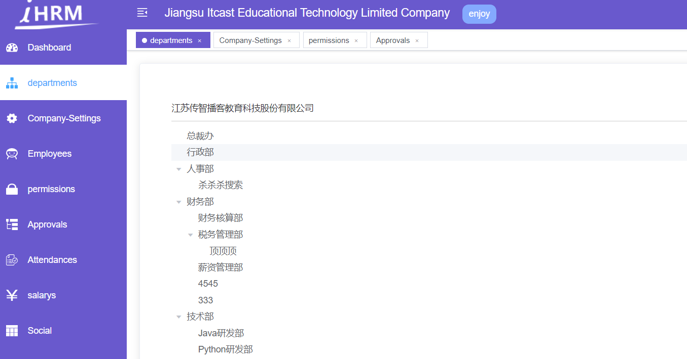

# 全屏插件的引用

**目标**：实现页面的全屏功能

## 参考vue-element-admin

+ 参考链接https://github.com/PanJiaChen/vue-element-admin/blob/master/src/components/Screenfull/index.vue
+ 注意：这个代码有一些问题
  + screenfull版本问题，，，4.2.0升级到了5.1.0，，，`screenfull.enabled` 变成 `screenfull.isEnabled`

```jsx
<template>
  <div class="screenfull-svg">
    <svg-icon
      :icon-class="isFullscreen?'exit-fullscreen':'fullscreen'"
      @click="click"
    />
  </div>
</template>

<script>
import screenfull from 'screenfull'
export default {
  name: 'Screenfull',
  data() {
    return {
      isFullscreen: false
    }
  },
  mounted() {
    this.init()
  },
  beforeDestroy() {
    this.destroy()
  },
  methods: {
    click() {
      if (!screenfull.isEnabled) {
        this.$message({
          message: 'you browser can not work',
          type: 'warning'
        })
        return false
      }
      screenfull.toggle()
    },
    change() {
      this.isFullscreen = screenfull.isFullscreen
    },
    init() {
      if (screenfull.isEnabled) {
        screenfull.on('change', this.change)
      }
    },
    destroy() {
      if (screenfull.isEnabled) {
        screenfull.off('change', this.change)
      }
    }
  }
}
</script>

<style scoped>
.screenfull-svg {
  display: inline-block;
  cursor: pointer;
  color: #fff;
  width: 20px;
  height: 20px;
  /* vertical-align: 10px; */
}
</style>

```

## 基本介绍 和 组件创建

> 全屏功能可以借助一个插件来实现
>
> 底层:
>
> 1 开启全屏: document.documentElement.requestFullscreen()
>
> 2 关闭全屏: document.exitFullscreen()

第一步，安装全局插件**screenfull**

```bash
$ yarn add screenfull
```

第二步，封装全屏显示的组件 **`src/components/ScreenFull/index.vue`**

```jsx
<template>
  <!-- 放置一个图标 -->
  <span>
    全屏图标
  </span>
</template>

<script>
export default {
  name: 'ScreenFull'
}
</script>
```

第三步，全局注册该组件  **`src/components/index.js`**

```js
import ScreenFull from './ScreenFull'
Vue.component('ScreenFull', ScreenFull) // 注册全屏组件
```

第四步，放置于**`layout/navbar.vue`**中

```vue
<div class="right-menu">
  <!-- 全屏组件 -->
  <screen-full class="right-icon" />
  ...
</div>
```

样式:

```scss
.right-icon {
  vertical-align: middle;
}
```




## 准备全屏的 svg 图标

检查 icons 目录下 svg 是否有你的 svg 图标  (fullscreen)

写一个 svg-icon 组件, 加 icon-class 属性即可指定使用哪个图标 `<svg-icon icon-class="fullscreen" />`

```jsx
<template>
  <!-- 放置一个图标 -->
  <div>
    <svg-icon icon-class="fullscreen" class="fullscreen" />
  </div>
</template>

<script>
export default {
  name: 'ScreenFull'
}
</script>

<style lang="scss" scoped>
.fullscreen {
  width: 20px;
  height: 20px;
  color: #fff;
  cursor: pointer;
}
</style>

```

效果图:




## 全屏功能实现

全局插件 **screenfull** 已安装过, 这里可以使用它的 api 完成功能

导入: `import ScreenFull from 'screenfull'`

属性: `ScreenFull.isEnabled` 获取浏览器是否支持全屏, 支持, 就返回 true

方法: `ScreenFull.toggle()`  切换全屏状态

```vue
<template>
  <!-- 放置一个图标 -->
  <div>
    <!-- svg-icon组件, 配置icon-class属性, 配置成svg的文件名即可 -->
    <svg-icon
      v-if="!isFullScreen"
      icon-class="fullscreen"
      class="fullscreen"
      @click="toggleFullScreen"
    />
    <svg-icon
      v-else
      icon-class="exit-fullscreen"
      class="fullscreen"
      @click="toggleFullScreen"
    />
  </div>
</template>

<script>
import ScreenFull from 'screenfull'
export default {
  name: 'ScreenFull',
  data() {
    return {
      isFullScreen: false // 默认不全屏
    }
  },
  methods: {
    toggleFullScreen() {
      // 查看是否支持全屏
      if (ScreenFull.isEnabled) {
        // 支持
        ScreenFull.toggle()
        this.isFullScreen = !this.isFullScreen
      } else {
        // 不支持
        this.$message.error('兄弟, 您的浏览器版本过低, 不支持全屏功能哦!')
      }
    }
  }
}
</script>

<style lang="scss" scoped>
.fullscreen {
  width: 20px;
  height: 20px;
  color: #fff;
  cursor: pointer;
}
</style>

```

**提交代码**

**`本节任务`**： 实现页面的全屏功能


# 动态主题的设置 

**`目标`**： 实现动态主题的设置

> 我们想要实现在页面中实时的切换颜色，此时页面的主题可以跟着设置的颜色进行变化







### 自定义主题 (element-ui自带的效果切换)

**简单说明原理：** 

1. 颜色选择器: https://element.eleme.io/#/zh-CN/component/color-picker
2. element-ui 自定义主题: https://element.eleme.io/#/zh-CN/component/custom-theme

步骤:

1. 新建 `styles/element-variables.scss` 测试文件

```jsx
/* 改变主题色变量 */
$--color-primary: teal;

/* 改变 icon 字体路径变量，必需 */
$--font-path: '~element-ui/lib/theme-chalk/fonts';

@import "~element-ui/packages/theme-chalk/src/index";
```

2. main.js 中导入

```jsx
import '@/styles/index.scss' // global css
```

问题: 这样的element ui主题色, 是写死的主题色, 所以这个样式需要根据我们选择的颜色动态配置, 是需要动态生成样式去覆盖

而实际的代码不用我们写, 已经有人家封装好的组件了

### 使用 ThemePicker 组件

演示地址: https://panjiachen.github.io/vue-element-admin/#/login?redirect=%2Fdashboard

第一步， 拷贝颜色选择组件 **`ThemePicker`** 代码地址：[@/components/ThemePicker](https://github.com/PanJiaChen/vue-element-admin/blob/master/src/components/ThemePicker/index.vue)。

```vue
<template>
  <el-color-picker
    v-model="theme"
    :predefine="['#409EFF', '#1890ff', '#304156','#212121','#11a983', '#13c2c2', '#6959CD', '#f5222d', ]"
    class="theme-picker"
    popper-class="theme-picker-dropdown"
  />

</template>

<script>
const version = require('element-ui/package.json').version // element-ui version from node_modules
const ORIGINAL_THEME = '#409EFF' // default color
export default {
  data() {
    return {
      chalk: '', // content of theme-chalk css
      theme: ''
    }
  },
  computed: {
    defaultTheme() {
      return this.$store.state.settings.theme
    }
  },
  watch: {
    defaultTheme: {
      handler: function(val, oldVal) {
        this.theme = val
      },
      immediate: true
    },
    async theme(val) {
      const oldVal = this.chalk ? this.theme : ORIGINAL_THEME
      if (typeof val !== 'string') return
      const themeCluster = this.getThemeCluster(val.replace('#', ''))
      const originalCluster = this.getThemeCluster(oldVal.replace('#', ''))
      console.log(themeCluster, originalCluster)
      const $message = this.$message({
        message: '  Compiling the theme',
        customClass: 'theme-message',
        type: 'success',
        duration: 0,
        iconClass: 'el-icon-loading'
      })
      const getHandler = (variable, id) => {
        return () => {
          const originalCluster = this.getThemeCluster(ORIGINAL_THEME.replace('#', ''))
          const newStyle = this.updateStyle(this[variable], originalCluster, themeCluster)
          let styleTag = document.getElementById(id)
          if (!styleTag) {
            styleTag = document.createElement('style')
            styleTag.setAttribute('id', id)
            document.head.appendChild(styleTag)
          }
          styleTag.innerText = newStyle
        }
      }
      if (!this.chalk) {
        const url = `https://unpkg.com/element-ui@${version}/lib/theme-chalk/index.css`
        await this.getCSSString(url, 'chalk')
      }
      const chalkHandler = getHandler('chalk', 'chalk-style')
      chalkHandler()
      const styles = [].slice.call(document.querySelectorAll('style'))
        .filter(style => {
          const text = style.innerText
          return new RegExp(oldVal, 'i').test(text) && !/Chalk Variables/.test(text)
        })
      styles.forEach(style => {
        const { innerText } = style
        if (typeof innerText !== 'string') return
        style.innerText = this.updateStyle(innerText, originalCluster, themeCluster)
      })
      this.$emit('change', val)
      $message.close()
    }
  },
  methods: {
    updateStyle(style, oldCluster, newCluster) {
      let newStyle = style
      oldCluster.forEach((color, index) => {
        newStyle = newStyle.replace(new RegExp(color, 'ig'), newCluster[index])
      })
      return newStyle
    },
    getCSSString(url, variable) {
      return new Promise(resolve => {
        const xhr = new XMLHttpRequest()
        xhr.onreadystatechange = () => {
          if (xhr.readyState === 4 && xhr.status === 200) {
            this[variable] = xhr.responseText.replace(/@font-face{[^}]+}/, '')
            resolve()
          }
        }
        xhr.open('GET', url)
        xhr.send()
      })
    },
    getThemeCluster(theme) {
      const tintColor = (color, tint) => {
        let red = parseInt(color.slice(0, 2), 16)
        let green = parseInt(color.slice(2, 4), 16)
        let blue = parseInt(color.slice(4, 6), 16)
        if (tint === 0) { // when primary color is in its rgb space
          return [red, green, blue].join(',')
        } else {
          red += Math.round(tint * (255 - red))
          green += Math.round(tint * (255 - green))
          blue += Math.round(tint * (255 - blue))
          red = red.toString(16)
          green = green.toString(16)
          blue = blue.toString(16)
          return `#${red}${green}${blue}`
        }
      }
      const shadeColor = (color, shade) => {
        let red = parseInt(color.slice(0, 2), 16)
        let green = parseInt(color.slice(2, 4), 16)
        let blue = parseInt(color.slice(4, 6), 16)
        red = Math.round((1 - shade) * red)
        green = Math.round((1 - shade) * green)
        blue = Math.round((1 - shade) * blue)
        red = red.toString(16)
        green = green.toString(16)
        blue = blue.toString(16)
        return `#${red}${green}${blue}`
      }
      const clusters = [theme]
      for (let i = 0; i <= 9; i++) {
        clusters.push(tintColor(theme, Number((i / 10).toFixed(2))))
      }
      clusters.push(shadeColor(theme, 0.1))
      return clusters
    }
  }
}
</script>

<style>
.theme-message,
.theme-picker-dropdown {
  z-index: 99999 !important;
}
.theme-picker .el-color-picker__trigger {
  height: 26px !important;
  width: 26px !important;
  padding: 2px;
}
.theme-picker-dropdown .el-color-dropdown__link-btn {
  display: none;
}
.el-color-picker {
  height: auto !important;
}
</style>

```

**注册组件**

```js
import ThemePicker from './ThemePicker'
Vue.component('ThemePicker', ThemePicker)
```

第二步，  放置于**`layout/navbar.vue`**中

```vue
<div class="right-menu">
  <!-- 全屏组件 -->
  <screen-full />
  <!-- 放置换肤插件 -->
  <theme-picker />
</div>
```

第三步, setting 模块中, 准备 theme 属性, 配置默认主题色

```jsx
const { showSettings, fixedHeader, sidebarLogo, themeColor } = defaultSettings

const state = {
  showSettings: showSettings,
  fixedHeader: fixedHeader,
  sidebarLogo: sidebarLogo,
  theme: '#f00'
}
```

修改默认主题色不生效,  加载时不生效, 需要配置下 immediate: true, 让他一进入页面, 就设置下主题色

```jsx
  watch: {
    // 监视了theme的变化, theme一变化, 就换肤
    // watch 监视语法: immediate: true 一进入页面, 就立即执行一次配置的处理函数
    theme: {
      immediate: true,
      // 这个处理函数, 就是在theme变化时, 进行换肤操作
      handler: async function(val) {
        ...
      }
    }
  },

```

### 同步到vuex中, 实现持久化

改变主题色, 注册change 事件监听

```jsx
<theme-picker class="right-menu-item" style="padding-top: 10px" @change="changeTheme" />
```

同步到 vuex 中, 提交了action

```jsx
changeTheme(val) {
  // 发布action, 同步主题色到vuex中
  this.$store.dispatch('settings/changeSetting', {
    key: 'theme',
    value: val
  })
}
```

持久化处理  Cookies

```jsx
import defaultSettings from '@/settings'
import Cookies from 'js-cookie'
const { showSettings, fixedHeader, sidebarLogo, themeColor } = defaultSettings

const state = {
  showSettings: showSettings,
  fixedHeader: fixedHeader,
  sidebarLogo: sidebarLogo,
  theme: Cookies.get('theme') || themeColor
}

const mutations = {
  CHANGE_SETTING: (state, { key, value }) => {
    // 判断state有没有key这个属性 key: theme, 如果有, 就进行值的覆盖
    // eslint-disable-next-line no-prototype-builtins
    if (state.hasOwnProperty(key)) {
      state[key] = value
    }
    // 如果key是theme, 说明在修改主题的配置
    if (key === 'theme') {
      // 同步到本地
      Cookies.set('theme', value)
    }
  }
}

const actions = {
  changeSetting({ commit }, data) {
    commit('CHANGE_SETTING', data)
  }
}

export default {
  namespaced: true,
  state,
  mutations,
  actions
}


```


### 退出时, 清除主题色信息

提供mutation

```jsx
import defaultSettings from '@/settings'
import Cookies from 'js-cookie'
const { showSettings, fixedHeader, sidebarLogo, themeColor } = defaultSettings
const themeKey = 'hrsaas_76_theme_color'

const state = {
  showSettings: showSettings,
  fixedHeader: fixedHeader,
  sidebarLogo: sidebarLogo,
  theme: Cookies.get(themeKey) || themeColor
}

const mutations = {
  CHANGE_SETTING: (state, { key, value }) => {
    // 判断state有没有key这个属性 key: theme, 如果有, 就进行值的覆盖
    // eslint-disable-next-line no-prototype-builtins
    if (state.hasOwnProperty(key)) {
      state[key] = value
    }
    // 如果key是theme, 说明在修改主题的配置
    if (key === 'theme') {
      // 同步到本地
      Cookies.set(themeKey, value)
    }
  },
  resetTheme(state) {
    // 重置成默认颜色
    state.theme = themeColor
    // cookies中也要移出
    Cookies.remove(themeKey)
  }
}

const actions = {
  changeSetting({ commit }, data) {
    commit('CHANGE_SETTING', data)
  }
}

export default {
  namespaced: true,
  state,
  mutations,
  actions
}
```

退出的action操作

```jsx
logout(context) {
  // 1. 移除vuex个人信息
  context.commit('removeUserInfo')
  // 2. 移除token信息
  context.commit('removeToken')
  // 3. 重置路由 (每个人登进来权限是不一样的, 需要在退出时重置成默认的)
  resetRouter()
  // 4. 将vuex中路由信息数组, 也重置
  // 需求: 需要调用 permission 模块中的 setRoutes (mutation)
  context.commit('permission/setRoutes', [], { root: true })
  // 5. 清除主题色信息
  context.commit('settings/resetTheme', null, { root: true })
},
```

### 自定义效果定制

`navbar`导航

```jsx
<div class="navbar" :style="{ background: $store.state.settings.theme }">
```

`sidebar / 整体背景`

```jsx
<div :class="{'has-logo':showLogo}" :style="{ background: $store.state.settings.theme }">
```


# 多语言实现



**`目标`**实现国际化语言切换 http://kazupon.github.io/vue-i18n/zh/introduction.html

## 国际化基本使用步骤

本项目使用国际化 i18n 方案。通过 [vue-i18n](https://github.com/kazupon/vue-i18n)而实现。

**第一步，我们需要首先国际化的包**

```bash
 $ yarn add vue-i18n
```

**第二步，需要单独一个多语言的实例化文件 `src/lang/index.js`**

```jsx
// 国际化
import Vue from 'vue' // 引入Vue
import VueI18n from 'vue-i18n' // 引入国际化的插件包

// 使用插件
Vue.use(VueI18n)

// 类似于 new VueRouter
export default new VueI18n({
  // 指定语言  zh en
  locale: 'jp',
  messages: {
    en: {
      msg: 'hello'
    },
    zh: {
      msg: '你好'
    },
    jp: {
      msg: '扩你七娃'
    },
    kr: {
      msg: '阿尼啊私有'
    }
  }
})

```

**第三步：关联i18n给vue实例 main.js**

```jsx
import i18n from './lang'

new Vue({
  el: '#app',
  router,
  store,
  i18n,
  render: h => h(App)
})
```

**第四步：在任何组件中都会多一个方法 `$t`**

```jsx
<p>{{ $t('msg') }}</p>
```

## 项目中使用国际化

+ 从素材中获取了 en.js 和 zh.js文件，已经提供好了国际化数据

+ 导入国际化的数据

```jsx
// 国际化
import Vue from 'vue' // 引入Vue
import VueI18n from 'vue-i18n' // 引入国际化的插件包
import en from './en'
import zh from './zh'
// 使用插件
Vue.use(VueI18n)

// 类似于 new VueRouter
export default new VueI18n({
  // 指定语言  zh en
  locale: 'zh',
  messages: {
    en: {
      ...en
    },
    zh: {
      ...zh
    }
  }
})

```

+ 国际化的使用，  navBar.vue

```jsx
<template #dropdown>
  <el-dropdown-menu class="user-dropdown">
    <router-link to="/">
      <el-dropdown-item>
        {{ $t('navbar.dashboard') }}
      </el-dropdown-item>
    </router-link>
    <a target="_blank" href="https://gitee.com/hucongcong/hm-hr-88">
      <el-dropdown-item>{{ $t('navbar.github') }}</el-dropdown-item>
    </a>
    <el-dropdown-item divided @click.native="logout">
      <span style="display:block;">{{ $t('navbar.logOut') }}</span>
    </el-dropdown-item>
  </el-dropdown-menu>
</template>
```

## 国际化-兼容element-ui

> https://element.eleme.cn/#/zh-CN/component/i18n

+ 在lang/index.js中，引入element-ui的语法

```jsx
// 国际化
import Vue from 'vue' // 引入Vue
import VueI18n from 'vue-i18n' // 引入国际化的插件包
import en from './en'
import zh from './zh'
import enLocale from 'element-ui/lib/locale/lang/en'
import zhLocale from 'element-ui/lib/locale/lang/zh-CN'
// 使用插件
Vue.use(VueI18n)

// 类似于 new VueRouter
export default new VueI18n({
  // 指定语言  zh en
  locale: 'en',
  messages: {
    en: {
      // 项目中的语言包
      ...en,
      // element-ui的语言包
      ...enLocale
    },
    zh: {
      ...zh,
      ...zhLocale
    }
  }
})
```

+ 修改main.js的逻辑

```jsx
Vue.use(ElementUI, {
  i18n: (key, value) => i18n.t(key, value)
})
```

## 封装组件-多语言切换

+ 参考vue-element-admin的语言切换组件 https://github.com/PanJiaChen/vue-element-admin/blob/i18n/src/components/LangSelect/index.vue

```jsx
<template>
  <el-dropdown trigger="click" class="international">
    <div>
      <svg-icon class-name="international-icon" icon-class="language" />
    </div>
    <el-dropdown-menu slot="dropdown">
      <el-dropdown-item
        :disabled="language==='zh'"
        @click.native="handleSetLanguage('zh')"
      >
        中文
      </el-dropdown-item>
      <el-dropdown-item
        :disabled="language==='en'"
        @click.native="handleSetLanguage('en')"
      >
        English
      </el-dropdown-item>
    </el-dropdown-menu>
  </el-dropdown>
</template>

<script>
export default {
  computed: {
    language() {
      return this.$store.state.app.language
    }
  },
  methods: {
    handleSetLanguage(lang) {
      this.$i18n.locale = lang
      this.$store.commit('app/setLanguage', lang)
      this.$message({
        message: 'Switch Language Success',
        type: 'success'
      })
    }
  }
}
</script>

<style scoped lang="scss">
.international {
  display: inline-block;
  cursor: pointer;
  color: #fff;
  width: 20px;
  height: 50px;
  margin: 0 10px;

  .international-icon {
    font-size: 16px;
  }
  /* vertical-align: 10px; */
}
</style>

```

+ 修改`store/modules/app.js`

```js
const state = {
  language: 'zh'
}

const mutations = {
  setLanguage(state, language) {
    state.language = language
  }
}

```

## 把多语言切换存储到cookie中

```jsx
const state = {
  language: Cookies.get('language') || 'zh'
}

setLanguage(state, language) {
  state.language = language
  // 存储到本地中
  Cookies.set('language', language)
}
```


# tab页的视图引入

https://panjiachen.gitee.io/vue-element-admin/#/dashboard

**`目标`**： 实现tab页打开路由的功能

当前我们实现的打开页面，看到一个页面之后，另一个页面就会关闭，为了显示更加有效率，我们可以引入多页签组件

在资源目录中，**`多页签`** 目录下放置的是 组件和 vuex模块

第一步，将组件TagsView目录放置到**`src/components`** , 并全局注册

```js
import TagsView from './TagsView'
Vue.component('TagsView', TagsView)
```

第二步，将Vuex模块**`tagsView.js`**放置到 **`src/store/modules`**

并在store中引入该模块

```js
import tagsView from './modules/tagsView'
const store = new Vuex.Store({
  modules: {
    app,
    settings,
    user,
    permission,
    tagsView
  },
  getters
})
```

第三步，在**`src/layout/Index.vue`**中引入该组件

```vue
<template>
  <div :class="classObj" class="app-wrapper">
    <div v-if="device==='mobile'&&sidebar.opened" class="drawer-bg" @click="handleClickOutside" />
    <sidebar class="sidebar-container" />
    <div class="main-container">
      <div :class="{'fixed-header':fixedHeader}">
        <navbar />
        <!-- 放置tabsview -->
        <tags-view />
      </div>
      <app-main />
    </div>
  </div>
</template>
```

首页国际化问题

```jsx
{
  path: '/',
  component: Layout,
  redirect: '/dashboard',
  children: [
    {
      path: 'dashboard',
      name: 'dashboard',
      component: () => import('@/views/dashboard/index'),
      meta: { title: 'route.dashboard', icon: 'dashboard' }
    }
  ]
}
```


效果如下



**`提交代码`**