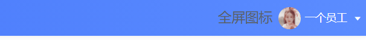
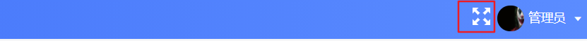
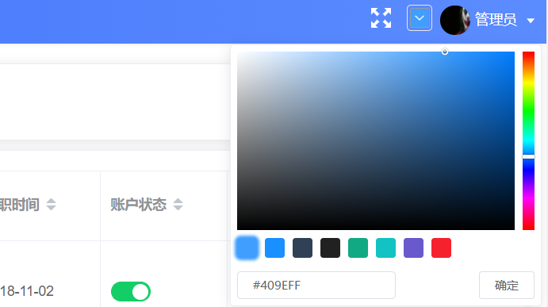
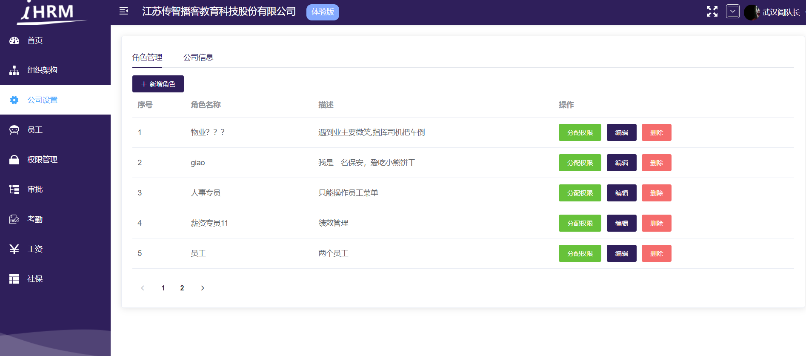
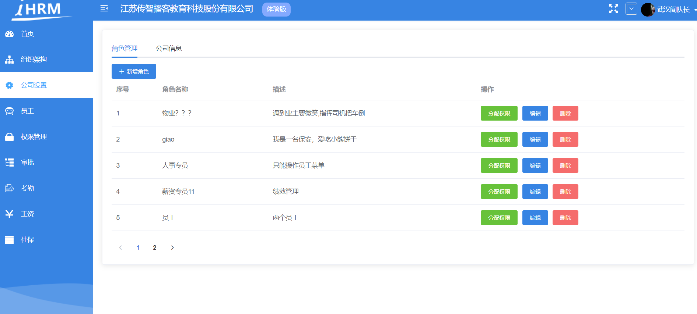
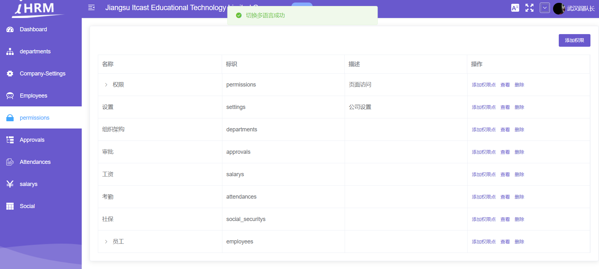
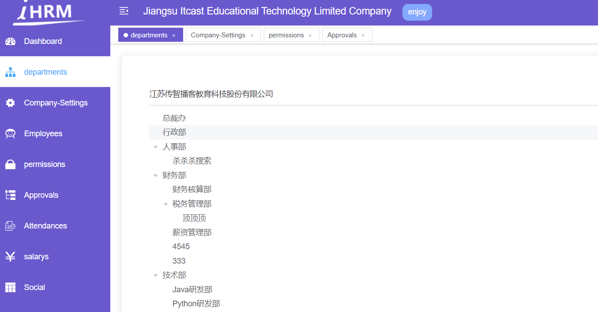

# 全屏插件的引用

**目标**：实现页面的全屏功能

## 基本介绍 和 组件创建

> 全屏功能可以借助一个插件来实现
>
> 底层:
>
> 1 开启全屏: document.documentElement.requestFullscreen()
>
> 2 关闭全屏: document.exitFullscreen()

第一步，安装全局插件**screenfull**

```bash
$ yarn add screenfull
```

第二步，封装全屏显示的组件 **`src/components/ScreenFull/index.vue`**

```jsx
<template>
  <!-- 放置一个图标 -->
  <span>
    全屏图标
  </span>
</template>

<script>
export default {
  name: 'ScreenFull'
}
</script>
```

第三步，全局注册该组件  **`src/components/index.js`**

```js
import ScreenFull from './ScreenFull'
Vue.component('ScreenFull', ScreenFull) // 注册全屏组件
```

第四步，放置于**`layout/navbar.vue`**中

```vue
<div class="right-menu">
  <!-- 全屏组件 -->
  <screen-full class="right-icon" />
  ...
</div>
```

样式:

```scss
.right-icon {
  vertical-align: middle;
}
```




## 准备全屏的 svg 图标

检查 icons 目录下 svg 是否有你的 svg 图标  (fullscreen)

写一个 svg-icon 组件, 加 icon-class 属性即可指定使用哪个图标 `<svg-icon icon-class="fullscreen" />`

```jsx
<template>
  <!-- 放置一个图标 -->
  <div>
    <svg-icon icon-class="fullscreen" class="fullscreen" />
  </div>
</template>

<script>
export default {
  name: 'ScreenFull'
}
</script>

<style lang="scss" scoped>
.fullscreen {
  width: 20px;
  height: 20px;
  color: #fff;
  cursor: pointer;
}
</style>

```

效果图:




## 全屏功能实现

全局插件 **screenfull** 已安装过, 这里可以使用它的 api 完成功能

导入: `import ScreenFull from 'screenfull'`

属性: `ScreenFull.isEnabled` 获取浏览器是否支持全屏, 支持, 就返回 true

方法: `ScreenFull.toggle()`  切换全屏状态

```vue
<template>
  <!-- 放置一个图标 -->
  <div>
    <!-- svg-icon组件, 配置icon-class属性, 配置成svg的文件名即可 -->
    <svg-icon
      v-if="!isFullScreen"
      icon-class="fullscreen"
      class="fullscreen"
      @click="toggleFullScreen"
    />
    <svg-icon
      v-else
      icon-class="exit-fullscreen"
      class="fullscreen"
      @click="toggleFullScreen"
    />
  </div>
</template>

<script>
import ScreenFull from 'screenfull'
export default {
  name: 'ScreenFull',
  data() {
    return {
      isFullScreen: false // 默认不全屏
    }
  },
  methods: {
    toggleFullScreen() {
      // 查看是否支持全屏
      if (ScreenFull.isEnabled) {
        // 支持
        ScreenFull.toggle()
        this.isFullScreen = !this.isFullScreen
      } else {
        // 不支持
        this.$message.error('兄弟, 您的浏览器版本过低, 不支持全屏功能哦!')
      }
    }
  }
}
</script>

<style lang="scss" scoped>
.fullscreen {
  width: 20px;
  height: 20px;
  color: #fff;
  cursor: pointer;
}
</style>

```

**提交代码**

**`本节任务`**： 实现页面的全屏功能


# 动态主题的设置 

**`目标`**： 实现动态主题的设置

> 我们想要实现在页面中实时的切换颜色，此时页面的主题可以跟着设置的颜色进行变化







### 自定义主题 (element-ui自带的效果切换)

**简单说明原理：** 

1. 颜色选择器: https://element.eleme.io/#/zh-CN/component/color-picker
2. element-ui 自定义主题: https://element.eleme.io/#/zh-CN/component/custom-theme

步骤:

1. 新建 `styles/element-variables.scss` 测试文件

```jsx
/* 改变主题色变量 */
$--color-primary: teal;

/* 改变 icon 字体路径变量，必需 */
$--font-path: '~element-ui/lib/theme-chalk/fonts';

@import "~element-ui/packages/theme-chalk/src/index";
```

2. main.js 中导入

```jsx
import '@/styles/index.scss' // global css
```

问题: 这样的element ui主题色, 是写死的主题色, 所以这个样式需要根据我们选择的颜色动态配置, 是需要动态生成样式去覆盖

而实际的代码不用我们写, 已经有人家封装好的组件了

### 使用 ThemePicker 组件

演示地址: https://panjiachen.gitee.io/vue-element-admin/#/dashboard

第一步， 拷贝颜色选择组件 **`ThemePicker`** 代码地址：[@/components/ThemePicker](https://github.com/PanJiaChen/vue-element-admin/blob/master/src/components/ThemePicker/index.vue)。

```vue
<template>
  <el-color-picker
    v-model="theme"
    :predefine="['#409EFF', '#1890ff', '#304156','#212121','#11a983', '#13c2c2', '#6959CD', '#f5222d', ]"
    class="theme-picker"
    popper-class="theme-picker-dropdown"
  />

</template>

<script>
const version = require('element-ui/package.json').version // element-ui version from node_modules
const ORIGINAL_THEME = '#409EFF' // default color
export default {
  data() {
    return {
      chalk: '', // content of theme-chalk css
      theme: ''
    }
  },
  computed: {
    defaultTheme() {
      return this.$store.state.settings.theme
    }
  },
  watch: {
    defaultTheme: {
      handler: function(val, oldVal) {
        this.theme = val
      },
      immediate: true
    },
    async theme(val) {
      const oldVal = this.chalk ? this.theme : ORIGINAL_THEME
      if (typeof val !== 'string') return
      const themeCluster = this.getThemeCluster(val.replace('#', ''))
      const originalCluster = this.getThemeCluster(oldVal.replace('#', ''))
      console.log(themeCluster, originalCluster)
      const $message = this.$message({
        message: '  Compiling the theme',
        customClass: 'theme-message',
        type: 'success',
        duration: 0,
        iconClass: 'el-icon-loading'
      })
      const getHandler = (variable, id) => {
        return () => {
          const originalCluster = this.getThemeCluster(ORIGINAL_THEME.replace('#', ''))
          const newStyle = this.updateStyle(this[variable], originalCluster, themeCluster)
          let styleTag = document.getElementById(id)
          if (!styleTag) {
            styleTag = document.createElement('style')
            styleTag.setAttribute('id', id)
            document.head.appendChild(styleTag)
          }
          styleTag.innerText = newStyle
        }
      }
      if (!this.chalk) {
        const url = `https://unpkg.com/element-ui@${version}/lib/theme-chalk/index.css`
        await this.getCSSString(url, 'chalk')
      }
      const chalkHandler = getHandler('chalk', 'chalk-style')
      chalkHandler()
      const styles = [].slice.call(document.querySelectorAll('style'))
        .filter(style => {
          const text = style.innerText
          return new RegExp(oldVal, 'i').test(text) && !/Chalk Variables/.test(text)
        })
      styles.forEach(style => {
        const { innerText } = style
        if (typeof innerText !== 'string') return
        style.innerText = this.updateStyle(innerText, originalCluster, themeCluster)
      })
      this.$emit('change', val)
      $message.close()
    }
  },
  methods: {
    updateStyle(style, oldCluster, newCluster) {
      let newStyle = style
      oldCluster.forEach((color, index) => {
        newStyle = newStyle.replace(new RegExp(color, 'ig'), newCluster[index])
      })
      return newStyle
    },
    getCSSString(url, variable) {
      return new Promise(resolve => {
        const xhr = new XMLHttpRequest()
        xhr.onreadystatechange = () => {
          if (xhr.readyState === 4 && xhr.status === 200) {
            this[variable] = xhr.responseText.replace(/@font-face{[^}]+}/, '')
            resolve()
          }
        }
        xhr.open('GET', url)
        xhr.send()
      })
    },
    getThemeCluster(theme) {
      const tintColor = (color, tint) => {
        let red = parseInt(color.slice(0, 2), 16)
        let green = parseInt(color.slice(2, 4), 16)
        let blue = parseInt(color.slice(4, 6), 16)
        if (tint === 0) { // when primary color is in its rgb space
          return [red, green, blue].join(',')
        } else {
          red += Math.round(tint * (255 - red))
          green += Math.round(tint * (255 - green))
          blue += Math.round(tint * (255 - blue))
          red = red.toString(16)
          green = green.toString(16)
          blue = blue.toString(16)
          return `#${red}${green}${blue}`
        }
      }
      const shadeColor = (color, shade) => {
        let red = parseInt(color.slice(0, 2), 16)
        let green = parseInt(color.slice(2, 4), 16)
        let blue = parseInt(color.slice(4, 6), 16)
        red = Math.round((1 - shade) * red)
        green = Math.round((1 - shade) * green)
        blue = Math.round((1 - shade) * blue)
        red = red.toString(16)
        green = green.toString(16)
        blue = blue.toString(16)
        return `#${red}${green}${blue}`
      }
      const clusters = [theme]
      for (let i = 0; i <= 9; i++) {
        clusters.push(tintColor(theme, Number((i / 10).toFixed(2))))
      }
      clusters.push(shadeColor(theme, 0.1))
      return clusters
    }
  }
}
</script>

<style>
.theme-message,
.theme-picker-dropdown {
  z-index: 99999 !important;
}
.theme-picker .el-color-picker__trigger {
  height: 26px !important;
  width: 26px !important;
  padding: 2px;
}
.theme-picker-dropdown .el-color-dropdown__link-btn {
  display: none;
}
.el-color-picker {
  height: auto !important;
}
</style>

```

**注册组件**

```js
import ThemePicker from './ThemePicker'
Vue.component('ThemePicker', ThemePicker)
```

第二步，  放置于**`layout/navbar.vue`**中

```vue
<div class="right-menu">
  <!-- 全屏组件 -->
  <screen-full class="right-menu-item" />
  <!-- 放置换肤插件 -->
  <theme-picker class="right-menu-item" style="padding-top: 10px" />
</div>
```

第三步, setting 模块中, 准备 theme 属性, 配置默认主题色

```jsx
const { showSettings, fixedHeader, sidebarLogo, themeColor } = defaultSettings

const state = {
  showSettings: showSettings,
  fixedHeader: fixedHeader,
  sidebarLogo: sidebarLogo,
  theme: themeColor
}
```

setting.js 配置默认主题色

```jsx
// 小的设置配置文件, 起一些变量, 供项目的任何地方使用
module.exports = {
  // 网站的标题 (初始值)
  title: '人力资源管理系统',

  /**
   * @type {boolean} true | false
   * @description Whether fix the header
   */
  // 控制头部是否固定定位 (初始值)
  fixedHeader: false,

  /**
   * @type {boolean} true | false
   * @description Whether show the logo in sidebar
   */
  // 是否要在侧边栏上, 显示logo
  sidebarLogo: true,

  // 默认主题色
  themeColor: '#409eff'
}
```

修改默认主题色不生效,  加载时不生效, 需要配置下 immediate: true, 让他一进入页面, 就设置下主题色

```jsx
  watch: {
    // 监视了theme的变化, theme一变化, 就换肤
    // watch 监视语法: immediate: true 一进入页面, 就立即执行一次配置的处理函数
    theme: {
      immediate: true,
      // 这个处理函数, 就是在theme变化时, 进行换肤操作
      handler: async function(val) {
        ...
      }
    }
  },

```

### 同步到vuex中, 实现持久化

改变主题色, 注册change 事件监听

```jsx
<theme-picker class="right-menu-item" style="padding-top: 10px" @change="changeTheme" />
```

同步到 vuex 中, 提交了action

```jsx
changeTheme(val) {
  // 发布action, 同步主题色到vuex中
  this.$store.dispatch('settings/changeSetting', {
    key: 'theme',
    value: val
  })
}
```

持久化处理  Cookies

```jsx
import defaultSettings from '@/settings'
import Cookies from 'js-cookie'
const { showSettings, fixedHeader, sidebarLogo, themeColor } = defaultSettings

const state = {
  showSettings: showSettings,
  fixedHeader: fixedHeader,
  sidebarLogo: sidebarLogo,
  theme: Cookies.get('theme') || themeColor
}

const mutations = {
  CHANGE_SETTING: (state, { key, value }) => {
    // 判断state有没有key这个属性 key: theme, 如果有, 就进行值的覆盖
    // eslint-disable-next-line no-prototype-builtins
    if (state.hasOwnProperty(key)) {
      state[key] = value
    }
    // 如果key是theme, 说明在修改主题的配置
    if (key === 'theme') {
      // 同步到本地
      Cookies.set('theme', value)
    }
  }
}

const actions = {
  changeSetting({ commit }, data) {
    commit('CHANGE_SETTING', data)
  }
}

export default {
  namespaced: true,
  state,
  mutations,
  actions
}


```


### 退出时, 清除主题色信息

提供mutation

```jsx
import defaultSettings from '@/settings'
import Cookies from 'js-cookie'
const { showSettings, fixedHeader, sidebarLogo, themeColor } = defaultSettings
const themeKey = 'hrsaas_76_theme_color'

const state = {
  showSettings: showSettings,
  fixedHeader: fixedHeader,
  sidebarLogo: sidebarLogo,
  theme: Cookies.get(themeKey) || themeColor
}

const mutations = {
  CHANGE_SETTING: (state, { key, value }) => {
    // 判断state有没有key这个属性 key: theme, 如果有, 就进行值的覆盖
    // eslint-disable-next-line no-prototype-builtins
    if (state.hasOwnProperty(key)) {
      state[key] = value
    }
    // 如果key是theme, 说明在修改主题的配置
    if (key === 'theme') {
      // 同步到本地
      Cookies.set(themeKey, value)
    }
  },
  resetTheme(state) {
    // 重置成默认颜色
    state.theme = themeColor
    // cookies中也要移出
    Cookies.remove(themeKey)
  }
}

const actions = {
  changeSetting({ commit }, data) {
    commit('CHANGE_SETTING', data)
  }
}

export default {
  namespaced: true,
  state,
  mutations,
  actions
}
```

退出的action操作

```jsx
logout(context) {
  // 1. 移除vuex个人信息
  context.commit('removeUserInfo')
  // 2. 移除token信息
  context.commit('removeToken')
  // 3. 重置路由 (每个人登进来权限是不一样的, 需要在退出时重置成默认的)
  resetRouter()
  // 4. 将vuex中路由信息数组, 也重置
  // 需求: 需要调用 permission 模块中的 setRoutes (mutation)
  context.commit('permission/setRoutes', [], { root: true })
  // 5. 清除主题色信息
  context.commit('settings/resetTheme', null, { root: true })
},
```

### 自定义效果定制

`navbar`导航

```jsx
<div class="navbar" :style="{ background: $store.state.settings.theme }">
```

`sidebar / 整体背景`

```jsx
<div :class="{'has-logo':showLogo}" :style="{ background: $store.state.settings.theme }">
```


# 多语言实现



**`目标`**实现国际化语言切换 http://kazupon.github.io/vue-i18n/zh/introduction.html

## 初始化多语言包

本项目使用国际化 i18n 方案。通过 [vue-i18n](https://github.com/kazupon/vue-i18n)而实现。

**第一步，我们需要首先国际化的包**

```bash
 $ yarn add vue-i18n
```

**第二步，需要单独一个多语言的实例化文件 `src/lang/index.js`**

```js
import Vue from 'vue' // 引入Vue
import VueI18n from 'vue-i18n' // 引入国际化的插件包
import Cookies from 'js-cookie' // 引入cookie包
import elementEN from 'element-ui/lib/locale/lang/en' // 引入饿了么的英文包
import elementZH from 'element-ui/lib/locale/lang/zh-CN' // 引入饿了么的中文包
Vue.use(VueI18n) // 全局注册国际化包

// 创建国际化插件的实例
export default new VueI18n({
  // 指定语言类型
  locale: Cookies.get('language') || 'zh', // 从cookie中获取语言类型 获取不到就是中文
  messages: {
    en: {
      ...elementEN // 将饿了么的英文语言包引入
    },
    zh: {
      ...elementZH // 将饿了么的中文语言包引入
    }
  }
})

```

> 上面的代码的作用是将Element的两种语言导入了

**第三步，在main.js中对挂载 i18n的插件，并配置ElementUI的中英切换逻辑**

```js
import i18n from '@/lang'

// 配置ElementUI的中英切换逻辑
Vue.use(ElementUI, {
  i18n: (key, value) => i18n.t(key, value)
})

new Vue({
  el: '#app',
  router,
  store,
  i18n,
  render: h => h(App)
})

```

## 引入自定义语言包

> 此时，element已经能够实现中英文切换，但是我们常规的内容怎么根据当前语言类型显示？

这里，针对英文和中文，我们可以提供两个不同的语言包 **`src/lang/zh.js , src/lang/en.js`**

**在index.js中同样引入该语言包**

```js
import Vue from 'vue' // 引入Vue
import VueI18n from 'vue-i18n' // 引入国际化的插件包
import Cookie from 'js-cookie' // 引入cookie包
import elementEN from 'element-ui/lib/locale/lang/en' // 引入饿了么的英文包
import elementZH from 'element-ui/lib/locale/lang/zh-CN' // 引入饿了么的中文包
import customZH from './zh' // 引入自定义中文包
import customEN from './en' // 引入自定义英文包

Vue.use(VueI18n) // 全局注册国际化包

export default new VueI18n({
  locale: Cookie.get('language') || 'en', // 从cookie中获取语言类型 获取不到就是中文
  messages: {
    en: {
      ...elementEN, // 将饿了么的英文语言包引入
      ...customEN
    },
    zh: {
      ...elementZH, // 将饿了么的中文语言包引入
      ...customZH
    }
  }
})

```


## 在左侧菜单中应用多语言包

>  自定义语言包的内容怎么使用?

**在左侧菜单应用**

当我们全局注册i18n的时候，每个组件都会拥有一个**`$t`**的方法，

它会根据传入的key，自动的去寻找当前语言的文本，

1. 我们可以自己添加一些中英翻译, 将头部翻译成中英文

   ```jsx
   <div class="app-breadcrumb">
     {{ $t('navbar.title') }}
     <span class="breadBtn">{{ $t('navbar.version') }}</span>
   </div>
   ```

2. 我们可以将左侧菜单变成多语言展示文本

**`layout/components/SidebarItem.vue`**

```vue
<item :icon="onlyOneChild.meta.icon||(item.meta&&item.meta.icon)" :title="$t('route.'+onlyOneChild.name)" />
```

注意：当文本的值为嵌套时，可以通过**`$t('key1.key2.key3...')`**的方式获取

> 现在，我们已经完成了多语言的接入，现在封装切换多语言的组件


## 封装多语言组件 - 切换语言

**封装多语言组件**  **`src/components/Lang/index.vue`**

```vue
<template>
  <el-dropdown trigger="click" @command="changeLanguage">
    <div>
      <svg-icon style="color:#fff;font-size:20px" icon-class="language" />
    </div>
    <el-dropdown-menu slot="dropdown">
      <el-dropdown-item command="zh" :disabled="'zh'=== $i18n.locale ">中文</el-dropdown-item>
      <el-dropdown-item command="en" :disabled="'en'=== $i18n.locale ">en</el-dropdown-item>
    </el-dropdown-menu>
  </el-dropdown>
</template>

<script>
import Cookie from 'js-cookie'
export default {
  methods: {
    changeLanguage(lang) {
      Cookie.set('language', lang) // 切换多语言
      this.$i18n.locale = lang // 设置给本地的i18n插件
      this.$message.success('切换多语言成功')
    }
  }
}
</script>
```

`component/index.js`全局注册

```jsx
import Lang from './Lang'

export default {
  // 插件的初始化, 插件给你提供的全局的功能, 都可以在这里配置
  install(Vue) {
    // 进行组件的全局注册
		...
    Vue.component('Lang', Lang)
  }
}
```

在Navbar组件中引入

```vue
<!-- 语言包 -->
<lang class="right-menu-item" />
<!-- 全屏组件 -->
<screen-full class="right-menu-item" />
<!-- 放置换肤插件 -->
<theme-picker class="right-menu-item" style="padding-top: 10px" @change="changeTheme" />
```

最终效果


# tab页的视图引入

https://panjiachen.gitee.io/vue-element-admin/#/dashboard

**`目标`**： 实现tab页打开路由的功能

当前我们实现的打开页面，看到一个页面之后，另一个页面就会关闭，为了显示更加有效率，我们可以引入多页签组件

在资源目录中，**`多页签`** 目录下放置的是 组件和 vuex模块

第一步，将组件TagsView目录放置到**`src/components`** , 并全局注册

```js
import TagsView from './TagsView'
Vue.component('TagsView', TagsView)
```

第二步，将Vuex模块**`tagsView.js`**放置到 **`src/store/modules`**

并在store中引入该模块

```js
import tagsView from './modules/tagsView'
const store = new Vuex.Store({
  modules: {
    app,
    settings,
    user,
    permission,
    tagsView
  },
  getters
})
```

第三步，在**`src/layout/Index.vue`**中引入该组件

```vue
<template>
  <div :class="classObj" class="app-wrapper">
    <div v-if="device==='mobile'&&sidebar.opened" class="drawer-bg" @click="handleClickOutside" />
    <sidebar class="sidebar-container" />
    <div class="main-container">
      <div :class="{'fixed-header':fixedHeader}">
        <navbar />
        <!-- 放置tabsview -->
        <tags-view />
      </div>
      <app-main />
    </div>
  </div>
</template>
```

效果如下



**`提交代码`**