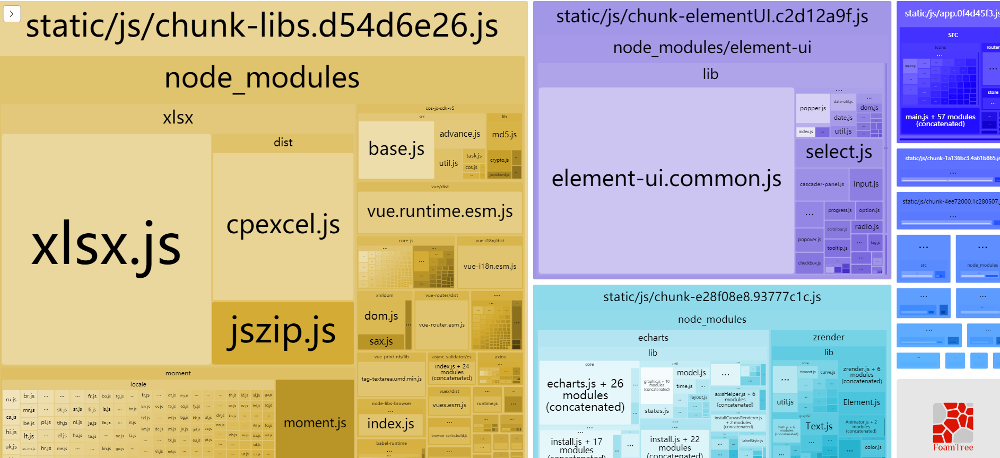
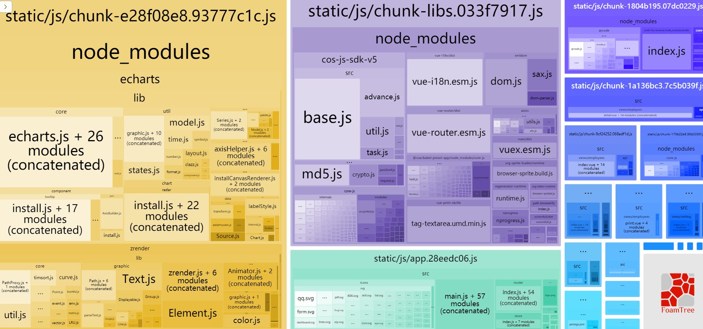
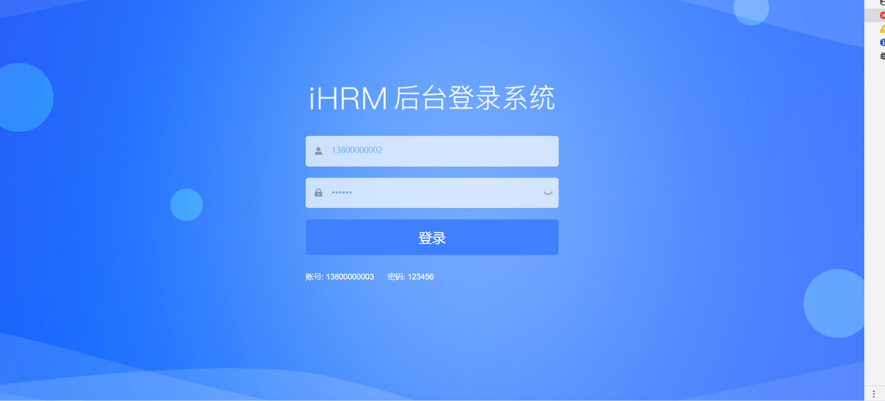
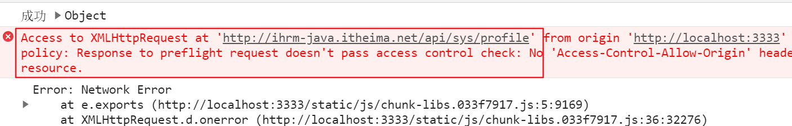
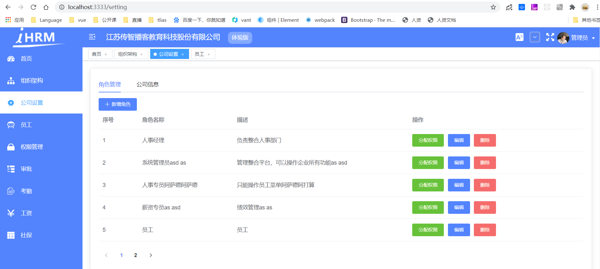

# 打包上线

## 配置路由模式

### 路由模式的介绍

**`目标`**认识不同的路由模式

> 在SPA单页应用中，我们需要认识两种常用的路由模式 
>
> (总共有三种:https://blog.csdn.net/weixin_38564268/article/details/105378003 了解即可, 常用的是两种)

**hash模式** ：使用 URL 的 hash 来模拟一个完整的 URL, 其显示的网路路径中会有 “#” 号。 锚点 #

hash 虽然出现URL中，但不会被包含在HTTP请求中，对后端完全没有影响，因此改变hash后刷新,  也不会有问题

hash模式示例:  http://localhost:8080/#/home       http://localhost:8080/#/user 


**history模式**： 美化后的hash模式，路径中不包含“#”。依赖于Html5 的 `history api `。

由于改变了地址, 刷新时会按照修改后的地址请求后端, 需要后端配置处理, 将地址访问做映射, 否则会404

history模式示例:  http://localhost:8080/home       http://localhost:8080/user

### 修改路由模式

**`目标`**修改路由模式

> 开发到现在，我们一直都在用hash模式，打包我们尝试用history模式

改成history模式非常简单，只需要将路由的mode类型改成history即可

```js
// 创建路由实例
const createRouter = () => new Router({
  mode: 'history', // require service support
  scrollBehavior: () => ({ y: 0 }),
  // 指定路由规则
  routes: [
    ...constantRoutes // 静态路由, 首页
  ]
})
```

我们会发现刷新没有任何问题 => 是因为 webpack 默认配好了对于 history 模式的处理 

实际上线的服务器, 让后台配即可, 网上步骤一搜就有 (我们后面演示node配置)

**提交代码**


## 性能分析和CDN的应用

打包优化:

1. 异步组件, 路由按需加载

   ```jsx
   component: () => import('@/views/attendances/index'),
   ```

2. 排除一些依赖包, 加快打包速度, 做cdn加速 (cdn: 内容分发网络)

**`目标`**： 对开发的应用进行性能分析和CDN的应用

### 性能分析

> 我们集成了功能，写了很多组件，最终都会打包成一堆文件，那么真实运行的性能如何呢？

我们可以使用vue-cli本身提供的性能分析工具，对我们开发的所有功能进行打包分析

它的应用非常简单

```bash
$ yarn preview -- --report
```

这个命令会从我们的**`入口main.js`**进行依赖分析，分析出最大的包，方便我们进行观察和优化

执行完这个命令，我们会看到如下的页面



如图所以，方块越大，说明该文件占用的文件越大，文件越大，对于网络带宽和访问速度的要求就越高，

这也就是我们优化的方向

> 像这种情况，我们怎么优化一下呢


### webpack排除打包

CDN加速, 是一个比较好的方式 (一般要付费) ,   一些开源的包, 有免费服务: https://www.bootcdn.cn/

> 文件不是大吗？我们就不要把这些大的文件和那些小的文件打包到一起了，
>
> 像这种xlsx,element这种功能性很全的插件，我们可以放到CDN服务器上，
>
> 一来，减轻整体包的大小，二来 CDN 的加速服务可以加快我们对于插件的访问速度

**使用方式**

先找到 `vue.config.js`， 添加 `externals` 让 `webpack` 不打包 `xlsx` 和 `element`   

**`vue.config.js`**

```js
configureWebpack: {
  // 配置单页应用程序的页面的标题
  name: name,
  externals: {
    // key(要排除的包名), value(引入的CDN包的全局变量名)
    'vue': 'Vue',
    'element-ui': 'ELEMENT',
    'xlsx': 'XLSX',
    'moment': 'moment'
  },
  resolve: {
    alias: {
      '@': resolve('src')
    }
  }
},
```

再次运行，我们会发现包的大小已经大幅减小




### CDN文件配置

> 但是，没有被打包的几个模块怎么处理？

可以采用CDN的方式，在页面模板中预先引入

**`vue.config.js`**

```js
const cdn = {
  css: [
    'https://unpkg.com/element-ui/lib/theme-chalk/index.css' // element-ui css 样式表
  ],
  js: [
    // vue must at first!
    'https://unpkg.com/vue/dist/vue.js', // vuejs
    'https://unpkg.com/element-ui/lib/index.js', // element-ui js
    'https://cdn.jsdelivr.net/npm/xlsx@0.16.6/dist/jszip.min.js',
    'https://cdn.jsdelivr.net/npm/xlsx@0.16.6/dist/xlsx.full.min.js',
    'https://cdn.bootcdn.net/ajax/libs/moment.js/2.29.1/moment.min.js'
  ]
}
```

> 但是请注意，这时的配置实际上是对开发环境和生产环境都生效的，
>
> 在开发环境时，没有必要使用CDN，此时我们可以使用环境变量来进行区分

```js
let externals = {}
let cdn = { css: [], js: [] }
const isProduction = process.env.NODE_ENV === 'production' // 判断是否是生产环境
if (isProduction) {
  externals = {
    // key(要排除的包名), value(引入的CDN包的全局变量名)
    'vue': 'Vue',
    'element-ui': 'ELEMENT',
    'xlsx': 'XLSX',
    'moment': 'moment'
  }
  cdn = {
    css: [
      'https://unpkg.com/element-ui/lib/theme-chalk/index.css' // element-ui css 样式表
    ],
    js: [
      // vue must at first!
      'https://unpkg.com/vue/dist/vue.js', // vuejs
      'https://unpkg.com/element-ui/lib/index.js', // element-ui js
      'https://cdn.jsdelivr.net/npm/xlsx@0.16.6/dist/jszip.min.js',
      'https://cdn.jsdelivr.net/npm/xlsx@0.16.6/dist/xlsx.full.min.js',
      'https://cdn.bootcdn.net/ajax/libs/moment.js/2.29.1/moment.min.js'
    ]
  }
}
```

底下使用 externals

```jsx
configureWebpack: {
  // 配置单页应用程序的页面的标题
  name: name,
  externals: externals,
  resolve: {
    alias: {
      '@': resolve('src')
    }
  }
},
```


### 注入CDN文件到模板

之后通过 `html-webpack-plugin`注入到 `index.html`之中:

```js
chainWebpack(config) {
  // it can improve the speed of the first screen, it is recommended to turn on preload
  config.plugin('preload').tap(() => [
    {
      rel: 'preload',
      // to ignore runtime.js
      // https://github.com/vuejs/vue-cli/blob/dev/packages/@vue/cli-service/lib/config/app.js#L171
      fileBlacklist: [/\.map$/, /hot-update\.js$/, /runtime\..*\.js$/],
      include: 'initial'
    }
  ])

  // 注入cdn变量 (打包时会执行)
  config.plugin('html').tap(args => {
    args[0].cdn = cdn // 配置cdn给插件
    return args
  })
  
  ...
}
```

找到 `public/index.html`。通过你配置的`CDN Config` 依次注入 css 和 js。

```vue
<head>
  <!-- 引入样式 -->
  <% for(var css of htmlWebpackPlugin.options.cdn.css) { %>
    <link rel="stylesheet" href="<%=css%>">
  <% } %>
</head>

<!-- 引入JS -->
<% for(var js of htmlWebpackPlugin.options.cdn.js) { %>
  <script src="<%=js%>"></script>
<% } %>
```

最后，进行打包 

```bash
$ yarn build:prod
```

## 在nodejs环境中应用并代理跨域

**`目标`**将打包好的代码打包上线，并在nodejs中代理跨域

### 使用 koa 框架部署项目

> 到现在为止，我们已经完成了一个前端工程师的开发流程，按照常规的做法，此时，运维会将我们的代码部署到阿里云的ngix服务上，对于我们而言，我们可以将其部署到本机的nodejs环境中

部署: 自动化部署 /手动部署

第一步，建立web服务文件夹  **`hrServer`**

第二步，在该文件夹下，初始化npm

```bash
$ yarn init -y
```

第三步，安装服务端框架koa(也可以采用express或者egg)

```bash
$ yarn add koa koa-static
```

第四步，hrServer中新建public目录, 并拷贝上小节打包的dist目录内容, 到**`hrServer/public`**下

第五步，在根目录下创建app.js，代码如下

```js
const Koa  = require('koa')
const serve = require('koa-static');

const app = new Koa();
app.use(serve(__dirname + "/public")); //将public下的代码静态化
app.listen(3333, () => {
  console.log('人资项目启动: 3333端口')
})
```

> 此时，先清除缓存, 保证退出登录状态, 如果发现缓存清了, 还卡着不进去(有可能是免费的cdn服务不稳定)
>
> 我们再访问，http://localhost:3333

页面出来了




### 解决history页面访问问题

但是，此时存在两个问题，

1. **当我们刷新页面，发现404**

>   这是因为我们采用了history的模式，地址的变化会引起服务器的刷新，我们只需要在app.js对所有的地址进行一下处理即可

安装 koa中间件 

```bash 
$ yarn add koa2-connect-history-api-fallback #专门处理history模式的中间件
```

**注册中间件**

```js
const Koa  = require('koa')
const serve = require('koa-static');
const { historyApiFallback } = require('koa2-connect-history-api-fallback');
const app = new Koa();
// 这句话 的意思是除接口之外所有的请求都发送给了 index.html
app.use(historyApiFallback({ 
  whiteList: ['/api']
}));  // 这里的whiteList是 白名单的意思
app.use(serve(__dirname + "/public")); //将public下的代码静态化

app.listen(3333, () => {
  console.log('人资项目启动')
})
```

此时解决了刷新 404 的问题  (注意: 如果点了登录, 记得清除cookies 再测试)


### 解决生产环境跨域问题

### 问题说明

当点击登录时，后台登录的接口配置了cors, 解决了跨域,  但是登录成功后, 获取个人信息的接口还是跨域了, 且后台没配



原因: 后台接口服务器只配置了这一个登录接口的cors (响应头), 如果都配了, 就意味着跨域解决完了

---

就是说, 这边如果后台接口服务器不配置, 还是得走代理! 

疑问: 我们之前不是配置过webpack代理去写项目了么?  

其实vue-cli的webpack代理只存在于开发期，当我们上线到node环境或者nginx环境时，需要我们再次在环境中代理

### node 配置代理

安装跨域代理中间件

```bash
$ yarn add koa2-proxy-middleware
```

配置跨越代理

```js
const Koa  = require('koa')
const serve = require('koa-static');
const { historyApiFallback } = require('koa2-connect-history-api-fallback');
const proxy = require('koa2-proxy-middleware')
const app = new Koa();

app.use(proxy({
  targets: {
    // (.*) means anything
    '/api/(.*)': {
        target: 'http://ihrm-java.itheima.net', //后端服务器地址
        changeOrigin: true,
        // 配置代理, 会多一个 /api 路径, 如果希望保留, 就不重写
        // 如果不希望保留, 就重写掉
        // pathRewrite: { 	
        //   '/api': ""
        // }
    }
  }
}))

// 这句话 的意思是除接口之外所有的请求都发送给了 index.html
app.use(historyApiFallback({ 
  whiteList: ['/api']
}));  // 这里的whiteList是 白名单的意思
app.use(serve(__dirname + "/public")); //将public下的代码静态化

app.listen(3333, () => {
  console.log('人资项目启动')
})
```

### 前端修改baseUrl (重点)

前端修改生产环境的 baseUrl

`.env.production`

```jsx
VUE_APP_BASE_API = '/api'
```

重新打包, 将目录重新给到node public 目录, 重新运行

```jsx
yarn build:prod
```

重新运行

```jsx
node app.js
```



此时，我们的项目就可以跨域访问了！

到现在为止，我们在十几天的时间里，完成了一个较为复杂的中台项目的解剖和开发，

任何一个复杂的项目都是各种各样的功能通过合理的设计和布局组装而成的，

所以未来我们不论项目的难度和复杂度，都要学会技术的解耦和设计，这样开发能力就会变得越来越强

**That is  All !** 